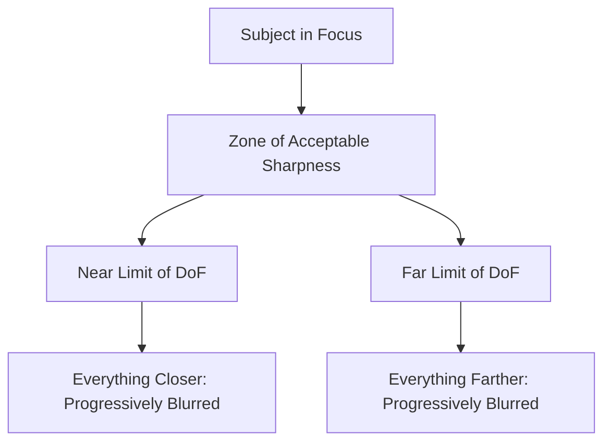
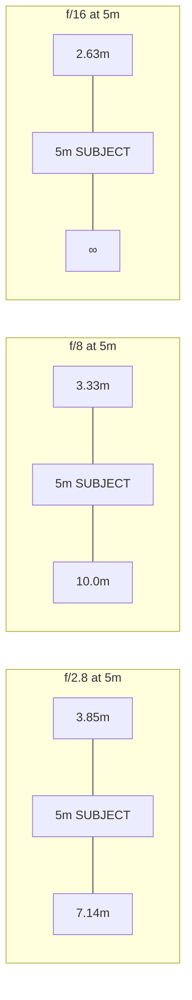
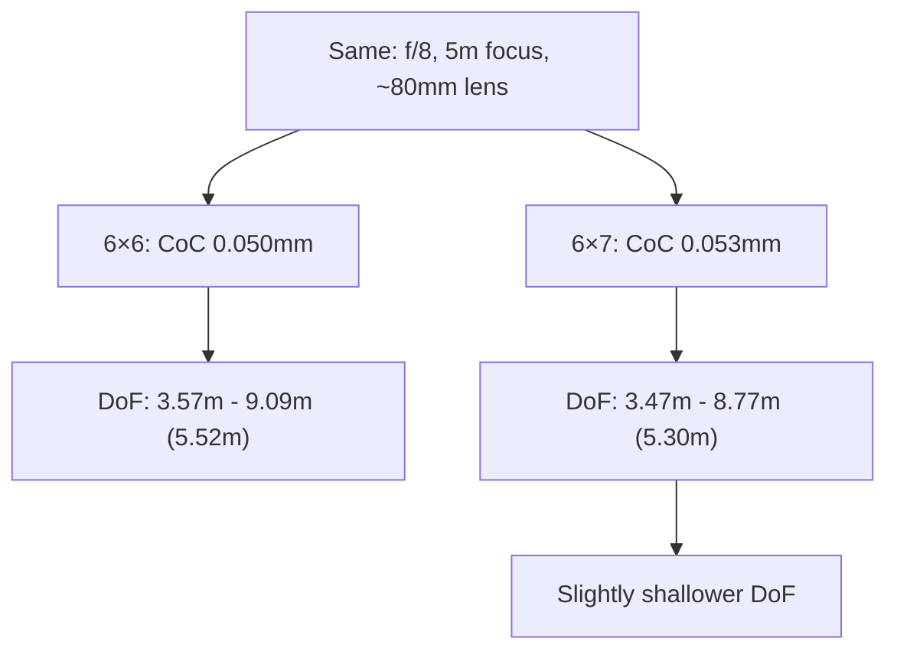
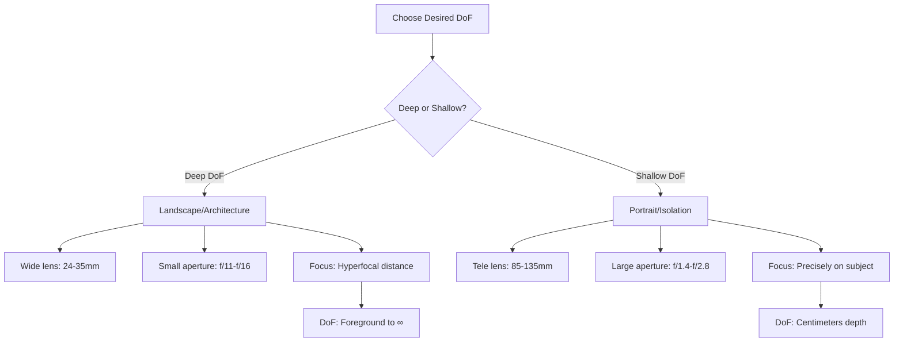
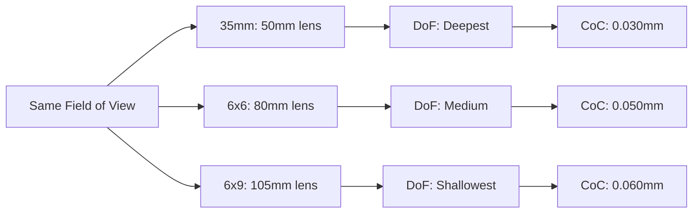

# Depth of Field Field Guide - Practical Reference for Film Photography

**Purpose:** Quick reference for calculating and estimating depth of field in the field  
**Film Formats:** 35mm (24×36mm) and 120 Medium Format (6×6, 6×7, 6×9)  
**Updated:** 2026-05-23

---

## What is Depth of Field?

**Depth of Field (DoF):** The zone of acceptable sharpness in front of and behind the focused subject.

### Three Controlling Factors

1. **Aperture (f-stop)** - Smaller aperture (higher f-number) = Greater DoF
2. **Focal Length** - Shorter lens = Greater DoF
3. **Focus Distance** - Greater distance = Greater DoF

### The Physics



### DoF Distribution Rule

**Approximate ratio (subject at moderate distance):**
- 1/3 of DoF falls in front of the focus point
- 2/3 of DoF falls behind the focus point

**Exception:** At very close focus distances (macro range), the distribution approaches 1:1 (equal in front and behind).

---

## The Mathematics

### Circle of Confusion (CoC)

**Definition:** The maximum blur spot diameter that still appears sharp to the human eye at standard viewing distance.

**Standard CoC values:**

| Format | Frame Size | Standard CoC |
|--------|-----------|--------------|
| **35mm Full Frame** | 24 × 36 mm | 0.030 mm |
| **120 - 6×6** | 56 × 56 mm | 0.050 mm |
| **120 - 6×7** | 56 × 70 mm | 0.053 mm |
| **120 - 6×9** | 56 × 84 mm | 0.060 mm |

**Derivation:** CoC ≈ diagonal / 1500  
*Example (35mm):* √(24² + 36²) / 1500 = 43.3 / 1500 ≈ 0.029 mm

### Simplified DoF Formula (Field Use)

For quick mental calculation:

```
Near Limit ≈ D / (1 + D·A·C / f²)
Far Limit  ≈ D / (1 - D·A·C / f²)

Where:
D = Focus distance (meters)
A = Aperture (f-number, e.g., 8 for f/8)
C = Circle of Confusion (mm)
f = Focal length (mm)
```

### Total Depth of Field

```
Total DoF = Far Limit - Near Limit
```

### Hyperfocal Distance

**Definition:** The focus distance where DoF extends from half that distance to infinity.

```
H = f² / (A × C) + f

Where:
H = Hyperfocal distance (mm, convert to meters)
f = Focal length (mm)
A = f-number
C = Circle of Confusion (mm)
```

**Simplified (for field use, f is small compared to H):**

```
H ≈ f² / (A × C)
```

**Practical use:** Focus at hyperfocal distance for maximum DoF in landscape photography.

---

## 35mm Format (24×36mm) Quick Reference

**Standard CoC:** 0.030 mm

### Hyperfocal Distance Tables

#### 50mm Lens (Normal)

| f-stop | Hyperfocal Distance | DoF at 3m | DoF at 10m |
|--------|---------------------|-----------|------------|
| f/2.8 | 29.8 m | 2.73 - 3.32 m (0.59 m) | 6.43 - 20.0 m (13.6 m) |
| f/4 | 20.8 m | 2.60 - 3.50 m (0.90 m) | 5.56 - ∞ |
| f/5.6 | 14.9 m | 2.45 - 3.75 m (1.30 m) | 4.76 - ∞ |
| f/8 | 10.4 m | 2.27 - 4.17 m (1.90 m) | 4.00 - ∞ |
| f/11 | 7.6 m | 2.11 - 4.76 m (2.65 m) | 3.45 - ∞ |
| f/16 | 5.2 m | 1.88 - 6.25 m (4.37 m) | 2.86 - ∞ |

#### 35mm Lens (Wide)

| f-stop | Hyperfocal Distance | DoF at 2m | DoF at 5m |
|--------|---------------------|-----------|-----------|
| f/2.8 | 14.6 m | 1.59 - 2.67 m (1.08 m) | 2.78 - ∞ |
| f/4 | 10.2 m | 1.49 - 3.03 m (1.54 m) | 2.50 - ∞ |
| f/5.6 | 7.3 m | 1.39 - 3.70 m (2.31 m) | 2.27 - ∞ |
| f/8 | 5.1 m | 1.27 - 5.88 m (4.61 m) | 2.04 - ∞ |
| f/11 | 3.7 m | 1.16 - ∞ | 1.85 - ∞ |
| f/16 | 2.6 m | 1.04 - ∞ | 1.64 - ∞ |

#### 85mm Lens (Portrait)

| f-stop | Hyperfocal Distance | DoF at 3m | DoF at 10m |
|--------|---------------------|-----------|------------|
| f/2 | 120.4 m | 2.93 - 3.07 m (0.14 m) | 9.20 - 11.1 m (1.9 m) |
| f/2.8 | 86.0 m | 2.90 - 3.10 m (0.20 m) | 8.93 - 11.6 m (2.7 m) |
| f/4 | 60.2 m | 2.86 - 3.15 m (0.29 m) | 8.57 - 12.4 m (3.8 m) |
| f/5.6 | 43.0 m | 2.81 - 3.22 m (0.41 m) | 8.16 - 13.6 m (5.4 m) |
| f/8 | 30.1 m | 2.75 - 3.30 m (0.55 m) | 7.69 - 16.0 m (8.3 m) |
| f/11 | 21.8 m | 2.68 - 3.41 m (0.73 m) | 7.23 - 20.0 m (12.8 m) |

### DoF Visualization (35mm, 50mm lens)



---

## 120 Medium Format Quick Reference

### Format Dimensions

| Format | Frame Size | Aspect Ratio | CoC |
|--------|-----------|--------------|-----|
| **6×6** | 56 × 56 mm | 1:1 (square) | 0.050 mm |
| **6×7** | 56 × 70 mm | 1:1.25 | 0.053 mm |
| **6×9** | 56 × 84 mm | 1:1.5 | 0.060 mm |

### Focal Length Equivalents to 35mm

**Rule of Thumb:** Medium format lenses are ~1.5-2× longer for equivalent field of view.

| 35mm Lens | 6×6 Equivalent | 6×7 Equivalent | 6×9 Equivalent |
|-----------|----------------|----------------|----------------|
| 28mm (wide) | 50mm | 55mm | 65mm |
| 35mm (wide) | 60mm | 65mm | 75mm |
| 50mm (normal) | 80mm | 90mm | 105mm |
| 85mm (portrait) | 135mm | 150mm | 180mm |
| 135mm (tele) | 220mm | 240mm | 280mm |

### Hyperfocal Distance Tables - 6×6 Format

**CoC:** 0.050 mm

#### 80mm Lens (Normal for 6×6)

| f-stop | Hyperfocal Distance | DoF at 3m | DoF at 10m |
|--------|---------------------|-----------|------------|
| f/2.8 | 25.6 m | 2.78 - 3.26 m (0.48 m) | 7.14 - 16.7 m (9.6 m) |
| f/4 | 17.9 m | 2.67 - 3.41 m (0.74 m) | 6.25 - 25.0 m (18.8 m) |
| f/5.6 | 12.8 m | 2.54 - 3.61 m (1.07 m) | 5.45 - ∞ |
| f/8 | 8.9 m | 2.38 - 3.95 m (1.57 m) | 4.65 - ∞ |
| f/11 | 6.5 m | 2.22 - 4.44 m (2.22 m) | 4.00 - ∞ |
| f/16 | 4.5 m | 1.96 - 5.88 m (3.92 m) | 3.23 - ∞ |

#### 150mm Lens (Portrait for 6×6)

| f-stop | Hyperfocal Distance | DoF at 3m | DoF at 10m |
|--------|---------------------|-----------|------------|
| f/2.8 | 90.0 m | 2.93 - 3.08 m (0.15 m) | 9.09 - 11.3 m (2.2 m) |
| f/4 | 63.0 m | 2.90 - 3.11 m (0.21 m) | 8.77 - 11.9 m (3.1 m) |
| f/5.6 | 45.0 m | 2.87 - 3.15 m (0.28 m) | 8.40 - 12.9 m (4.5 m) |
| f/8 | 31.5 m | 2.83 - 3.20 m (0.37 m) | 7.94 - 14.7 m (6.8 m) |
| f/11 | 22.9 m | 2.78 - 3.26 m (0.48 m) | 7.46 - 17.9 m (10.4 m) |
| f/16 | 15.8 m | 2.71 - 3.36 m (0.65 m) | 6.90 - 25.0 m (18.1 m) |

### 6×7 vs 6×6 DoF Comparison

**Same aperture and focus distance:**



**Practical takeaway:** 6×7 and 6×9 have marginally shallower DoF than 6×6 at the same settings, but difference is small (< 5%).

---

## Field Calculation Methods

### Method 1: Mental Math (Hyperfocal Distance)

**Step-by-step:**

1. **Know your hyperfocal distance** for common f-stops (memorize or carry table)
2. **Focus at hyperfocal distance** - DoF extends from H/2 to infinity
3. **Example:** 35mm, 50mm lens, f/11
   - Hyperfocal = 7.6m
   - Focus at 7.6m → DoF from 3.8m to ∞

### Method 2: Lens Distance Scales

**Traditional lens markings:**

```
       ∞    30  10  5  3  2  1.5  1  0.7m
        |    |   |  |  |  |   |   |   |
f/16   [=====================================]
f/11    [===================================]
f/8      [=================================]
f/5.6     [==============================]
f/4        [===========================]
f/2.8       [========================]
```

**How to read:**
1. Focus on subject (e.g., 5m)
2. Find aperture marks (e.g., f/11)
3. Read DoF limits where f/11 marks intersect distance scale
4. Result: ~3.5m to ~8m

### Method 3: The "Rule of Thumb" (Portrait)

**For portraits (shallow DoF desired):**

- **Aperture:** f/2 - f/4
- **Focal length:** 85-135mm (35mm) or 150-250mm (120)
- **Distance:** 2-4 meters
- **Expected DoF:** 10-30cm (very shallow)

**Quick check:** At f/2.8, portrait lens, 3m distance → DoF ≈ face depth (nose to ears).

### Method 4: Zone Focusing (Street Photography)

**Pre-set for continuous action:**

1. **Choose aperture:** f/8 or f/11 (deep DoF)
2. **Choose focal length:** 28-35mm (wide)
3. **Focus at hyperfocal or slightly beyond**
4. **Effective DoF:** 2m to infinity
5. **Shoot without refocusing** - everything in range is sharp

**Example (35mm, 35mm lens, f/11):**
- Focus at 3.7m (hyperfocal)
- DoF: 1.85m to ∞
- Never miss focus for subjects > 2m away

---

## Practical Field Scenarios

### Scenario 1: Landscape (Maximum DoF)

**Goal:** Sharp from foreground to infinity

**Settings (35mm):**
- Lens: 24-35mm
- Aperture: f/11 - f/16
- Focus: Hyperfocal distance

**Calculation:**
1. Find hyperfocal distance (e.g., 35mm @ f/11 = 3.7m)
2. Focus at 3.7m
3. DoF: 1.85m to ∞

**120 format adjustment:**
- Use 50-65mm lens (equivalent FOV)
- Same aperture (f/11-f/16)
- Hyperfocal distance is longer, but DoF distribution similar

### Scenario 2: Portrait (Shallow DoF)

**Goal:** Subject sharp, background blurred

**Settings (35mm):**
- Lens: 85-135mm
- Aperture: f/1.4 - f/2.8
- Focus: Precise on eyes

**Calculation:**
1. At 3m, 85mm, f/2.8 → DoF ≈ 20cm
2. Critical focus on nearest eye
3. Check far limit covers back of head

**120 format (6×6):**
- Use 150-180mm lens
- Same aperture
- DoF will be similar (slightly shallower due to larger CoC)

### Scenario 3: Street Photography

**Goal:** Ready for candid moments, no refocus needed

**Settings (35mm):**
- Lens: 28-35mm
- Aperture: f/8
- Focus: 5m (or hyperfocal)

**Pre-calculated DoF:**
- 35mm @ f/8, focus 5m → DoF: 2.5m to ∞
- Keep subjects between 2.5m-10m for optimal sharpness

**120 format (6×6):**
- Use 60-80mm lens
- f/8-f/11
- Zone focus similarly effective

### Scenario 4: Macro (Close-Up)

**Goal:** Sharp detail, manage extremely shallow DoF

**Settings (35mm):**
- Lens: 50-105mm macro
- Aperture: f/8 - f/16 (despite shallow DoF at close distance)
- Focus: 1:1 magnification (life-size)

**At 1:1 magnification:**
- DoF is extremely shallow (millimeters)
- Even at f/16, DoF ≈ 2-3mm
- Distribution: 1:1 (equal in front/behind)

**Calculation:**
```
Effective f-stop = f × (magnification + 1)
Example: f/11 at 1:1 → effective f/22 (for exposure)
```

---

## Quick Reference Decision Tree



---

## Advanced Considerations

### Diffraction Limit

**Physics:** At very small apertures (f/22+), diffraction reduces sharpness.

**Optimal aperture range:**
- **35mm:** f/5.6 - f/11 (sharpest)
- **120:** f/8 - f/16 (sharpest)

**Beyond optimal:**
- f/16: slight softening, acceptable
- f/22: noticeable softening, use only when necessary
- f/32+: significant softening, avoid unless DoF critical

### Tilt-Shift Lenses (Scheimpflug Principle)

**Effect:** Tilting lens plane changes DoF plane without changing f-stop.

**Use case:** Landscape with slanted foreground (e.g., beach receding to horizon).

**Calculation:** Complex, beyond field calculation (use camera movements iteratively).

### Format Comparison Summary



**Key insight:** Larger format = shallower DoF for same framing and aperture.

---

## Emergency Field Tables (Memorize)

### 35mm Critical Values

| Lens | f/8 Hyperfocal | f/11 Hyperfocal | f/16 Hyperfocal |
|------|----------------|-----------------|-----------------|
| 28mm | 6.5m | 4.7m | 3.3m |
| 35mm | 10.2m | 7.4m | 5.1m |
| 50mm | 20.8m | 15.2m | 10.4m |
| 85mm | 60.2m | 43.9m | 30.1m |

**Rule:** Focus at hyperfocal → DoF from H/2 to ∞

### 120 (6×6) Critical Values

| Lens | f/8 Hyperfocal | f/11 Hyperfocal | f/16 Hyperfocal |
|------|----------------|-----------------|-----------------|
| 50mm | 5.0m | 3.6m | 2.5m |
| 80mm | 12.8m | 9.3m | 6.4m |
| 150mm | 45.0m | 32.7m | 22.5m |

### DoF at Common Portrait Distance (3m)

**35mm format, 85mm lens:**

| f-stop | DoF Range | Total DoF |
|--------|-----------|-----------|
| f/2 | 2.93 - 3.07m | 0.14m (14cm) |
| f/2.8 | 2.90 - 3.10m | 0.20m (20cm) |
| f/4 | 2.86 - 3.15m | 0.29m (29cm) |

**120 (6×6), 150mm lens:**

| f-stop | DoF Range | Total DoF |
|--------|-----------|-----------|
| f/2.8 | 2.93 - 3.08m | 0.15m (15cm) |
| f/4 | 2.90 - 3.11m | 0.21m (21cm) |
| f/5.6 | 2.87 - 3.15m | 0.28m (28cm) |

---

## Field Notes Section

**Print this page and laminate for field use.**

### Your Lens Kit

Fill in your specific lenses and preferred apertures:

| Lens | Format | Preferred f-stop | Hyperfocal @ f-stop | Notes |
|------|--------|------------------|---------------------|-------|
| ___mm | 35mm / 120 | f/___ | ___m | ________________ |
| ___mm | 35mm / 120 | f/___ | ___m | ________________ |
| ___mm | 35mm / 120 | f/___ | ___m | ________________ |
| ___mm | 35mm / 120 | f/___ | ___m | ________________ |

### Quick Calculation Worksheet

**Given:**
- Focal length (f): _____ mm
- Aperture (A): f/_____
- Focus distance (D): _____ m
- Circle of Confusion (C): _____ mm

**Calculate Hyperfocal Distance:**
```
H = f² / (A × C) = _____² / (_____ × _____) = _____ mm = _____ m
```

**Calculate DoF at Distance D:**
```
Near = D / (1 + D·A·C / f²) = _____ / (1 + _____) = _____ m
Far  = D / (1 - D·A·C / f²) = _____ / (1 - _____) = _____ m
Total DoF = _____ m
```

---

## Online Calculators (Cross-Check)

**When in doubt, verify with:**
- DOFMaster: www.dofmaster.com
- PhotoPills: photopills.com/calculators/dof
- Cambridge in Colour: cambridgeincolour.com/tutorials/dof-calculator.htm

**Best practice:** Calculate critical shots before the field, note results in this guide.

---

## Sources and Further Reading

**Books:**
- "View Camera Technique" - Leslie Stroebel (1999) - mathematical foundation
- "The Camera" (LIFE Library of Photography, 1970) - DoF principles
- "Large Format Nature Photography" - Jack Dykinga (2001) - field techniques

**Standards:**
- ISO 1233:1992 - Photography — Depth of field
- Circle of Confusion standards (various manufacturers)

---

**Compiled:** 2026-05-23  
**Formats:** 35mm (24×36mm), 120 (6×6, 6×7, 6×9)  
**For:** Field use with film cameras
