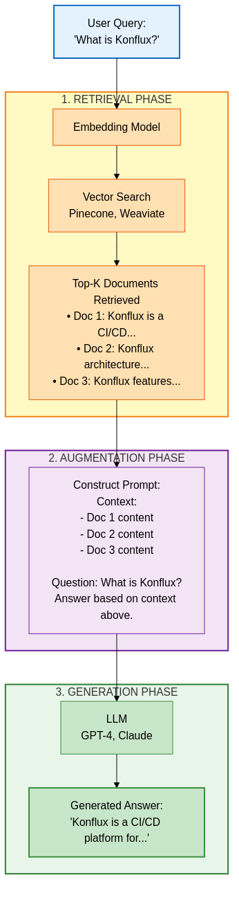

# AI Technologies - Technical Deep Dive & Architecture

**Version:** 1.0
**Last Updated:** 2026-03-10
**Goal:** Understand the technical architecture, operational principles, and limitations behind AI technologies (LLM, RAG, MCP, Agents).

---

## Table of Contents

1. [What is AI/LLM? - Core Concepts](#what-is-aillm---core-concepts)
2. [Transformer Architecture](#transformer-architecture)
3. [Large Language Models (LLM)](#large-language-models-llm)
4. [Tokens and Context Window](#tokens-and-context-window)
5. [Training, Fine-tuning, Prompting](#training-fine-tuning-prompting)
6. [RAG (Retrieval-Augmented Generation)](#rag-retrieval-augmented-generation)
7. [MCP (Model Context Protocol)](#mcp-model-context-protocol)
8. [AI Agents and Tool Use](#ai-agents-and-tool-use)
9. [Limitations and Errors](#limitations-and-errors)
10. [AI Stack: Practical Architecture](#ai-stack-practical-architecture)
11. [Future: What to Expect?](#future-what-to-expect)

---

## What is AI/LLM? - Core Concepts

### AI vs. ML vs. DL vs. LLM

```
AI (Artificial Intelligence)
  └─> ML (Machine Learning)
       └─> DL (Deep Learning)
            └─> LLM (Large Language Models)
```

| Term | Definition | Example |
|------|------------|---------|
| **AI** | Machines exhibiting intelligent behavior | Chess engine, recommendation systems |
| **ML** | Algorithms learning from data | Linear regression, decision trees |
| **DL** | Neural networks with deep layers | Image recognition (CNN), NLP (RNN) |
| **LLM** | Massive text-based neural networks | GPT-4, Claude, Gemini |

### What is an LLM?

**Large Language Model = Massive language model**

**Core Idea:**
- Train a massive neural network on enormous amounts of text
- Learns patterns in language usage
- Can generate new text based on learned patterns

**Analogy:**
```
Human: Reads "The cat sat on the ___" billions of times
       → Probably expects "mat"
LLM: Sees "The cat sat on the ___" billions of times
     → Statistically "mat" is most probable (but could be "table", "floor")
```

**IMPORTANT:** LLMs **DO NOT** understand text like humans do. They follow statistical patterns.

---

## Transformer Architecture

### What is a Transformer?

**Transformer** = Foundation of modern LLMs, published in 2017 ("Attention Is All You Need" paper)

**Before Transformers:**
- RNN (Recurrent Neural Network) - slow, sequential
- LSTM (Long Short-Term Memory) - better, but still limited

**Transformer Advantages:**
- Parallel processing (fast!)
- Handles long-range dependencies (context)
- Scalable (more parameters = better performance)

### Transformer Structure

```
Input Text: "The cat sat on the mat"
    ↓
[Tokenization]
    ↓
[Embedding Layer] - Words → vectors
    ↓
[Positional Encoding] - Sequence information
    ↓
[Encoder Stack] (BERT-type models)
    ├─> Self-Attention
    ├─> Feed-Forward Network
    └─> Normalization + Residual Connection
    ↓
[Decoder Stack] (GPT-type models)
    ├─> Masked Self-Attention
    ├─> Cross-Attention (Encoder output)
    ├─> Feed-Forward Network
    └─> Normalization + Residual Connection
    ↓
[Output Layer]
```

### Attention Mechanism - The Key

**What is Attention?**
- Model "pays attention" to different parts of a sentence
- Understands relationships between words

**Example:**
```
"The animal didn't cross the street because it was too tired."

Question: What was tired?
  - "it" → "animal" (high attention weight)
  - "it" → "street" (low attention weight)

Attention score:
  it → animal = 0.89
  it → street = 0.02
  it → cross = 0.05
```

**Self-Attention Formula (simplified):**
```
Attention(Q, K, V) = softmax(Q × K^T / sqrt(d)) × V

Q = Query (what are we looking for?)
K = Key (what information is available?)
V = Value (what is the value?)
d = dimension (scaling factor)
```

**Multi-Head Attention:**
- Not just 1 attention layer, but multiple parallel heads
- Each "head" focuses on different aspects
- Example: 1 head focuses on subject, another on object, third on time

---

## Large Language Models (LLM)

### LLM Types

| Type | Architecture | Examples | Best For |
|------|-------------|---------|----------|
| **Encoder-only** | Encoder only (BERT-like) | BERT, RoBERTa | Classification, NER, Q&A |
| **Decoder-only** | Decoder only (GPT-like) | GPT-4, Claude, Llama | Text generation, chat |
| **Encoder-Decoder** | Both | T5, BART | Translation, summarization |

### GPT (Generative Pre-trained Transformer)

**GPT = Decoder-only Transformer**

**How it works:**
1. Given prompt: "The cat sat on the"
2. Model predicts next token: "mat" (highest probability)
3. Adds it: "The cat sat on the mat"
4. Predicts next: "." or "and" etc.
5. Repeat

**Autoregressive generation:**
```
Input:  "The cat"
Output: "sat" (p=0.65)

Input:  "The cat sat"
Output: "on" (p=0.78)

Input:  "The cat sat on"
Output: "the" (p=0.82)
```

### Claude (Anthropic)

**Claude = Constitutional AI + RLHF**

**Differences vs. GPT:**
1. **Constitutional AI**: Values embedded in training (safety, helpfulness, honesty)
2. **RLHF** (Reinforcement Learning from Human Feedback): Learns from human feedback
3. **Larger Context Window**: Claude 3.5 = 200K tokens (vs. GPT-4 128K)
4. **Multimodal**: Understands images (Vision)

**Architecture (estimated, not official):**
- Transformer decoder-based
- 100B+ parameters (Sonnet/Opus models)
- Constitutional AI training methodology
- Tool use capability (function calling)

### Model Sizes (Parameters)

| Model | Parameters | RAM needed (FP16) | Use Case |
|-------|-----------|------------------|----------|
| GPT-2 | 1.5B | ~3 GB | Small, can run locally |
| LLaMA-2 7B | 7B | ~14 GB | Local, good quality |
| LLaMA-2 13B | 13B | ~26 GB | Local, better quality |
| GPT-3.5 | ~175B | ~350 GB | API only |
| GPT-4 | ~1.7T (estimate) | ~3.5 TB | API only |
| Claude 3.5 Sonnet | ~100B+ (estimate) | ~200+ GB | API only |

**Why do parameters matter?**
- More parameters = more "knowledge" stored
- More parameters = better reasoning
- But: More GPU, more cost, slower inference

---

## Tokens and Context Window

### What is a Token?

**Token** = Smallest unit of text the LLM sees

**Tokenization example:**
```
Input: "The cat sat on the mat."

Token split:
["The", " cat", " sat", " on", " the", " mat", "."]
                ^space is part of token!

Token IDs:
[464, 3857, 3332, 319, 262, 2603, 13]

Total: 7 tokens
```

**Not always = word!**
```
"unbelievable" → ["un", "believ", "able"]  (3 tokens)
"AI" → ["AI"]  (1 token)
"🤖" → [<emoji_token>]  (1 token, could be 2-3!)
```

**Why important?**
- API cost: $/token
- Context limit: max X tokens
- Speed: more tokens = slower

### Context Window

**Context Window** = How many tokens the model can "see" at once

```
Context Window = Input + Output

Example: Claude 3.5 Sonnet = 200,000 tokens

If Input = 150,000 tokens
→ Output max = 50,000 tokens
```

**Context Window Sizes:**

| Model | Context Window | ~Characters | ~Pages |
|-------|---------------|-------------|--------|
| GPT-3.5 | 4K tokens | ~3,000 chars | ~2 pages |
| GPT-4 | 8K / 32K | ~6,000 / ~24,000 | ~4-16 pages |
| GPT-4 Turbo | 128K | ~96,000 | ~64 pages |
| Claude 3 Opus | 200K | ~150,000 | ~100 pages |
| Gemini 1.5 Pro | 1M (!) | ~750,000 | ~500 pages |

**Why limited?**
- Computational cost: Attention = O(n²) complexity
- Memory: More tokens = more GPU RAM
- Quality: Very long context → "lost in the middle" problem

### "Lost in the Middle" Problem

```
[Beginning of context] - Model remembers WELL
        ...
[Middle of context] - Model FORGETS (!)
        ...
[End of context] - Model remembers WELL

Example:
Context: 100,000 token document
Question: "What was mentioned on page 50?" (middle)
→ Model often fails to recall!
```

**Solutions:**
- RAG (Retrieval-Augmented Generation) - see below
- Chunking + summarization
- Long-context fine-tuning

---

## Training, Fine-tuning, Prompting

### 1. Pre-training (Foundation)

**What happens:**
- Model trains on massive amounts of text (internet, books, code, etc.)
- Goal: Learn language patterns
- Cost: Millions/billions of dollars, multiple GPU clusters, months

**Training data (estimated GPT-4):**
- CommonCrawl (web scraping): ~800 GB
- Books: ~100 GB
- Wikipedia: ~60 GB
- Code (GitHub): ~500 GB
- Scientific papers: ~200 GB
- **Total: ~2-10 TB cleaned text**

**Training objective:**
```
Next token prediction:
Input:  "The cat sat on the ___"
Target: "mat"

Loss = CrossEntropyLoss(predicted, target)
Backpropagation → Update weights
Repeat on billions of examples
```

### 2. Fine-tuning (Refinement)

**What happens:**
- Take a pre-trained model
- Additional training on specific task
- Much less data needed (1K-1M examples)

**Types:**

| Type | Data | Example | Best For |
|------|------|---------|----------|
| **Supervised Fine-tuning** | Labeled data (input-output pairs) | 10K Q&A pairs | Specific task (chatbot, code) |
| **RLHF** | Human feedback (ranking) | "Which answer is better? A or B?" | Safety, helpfulness |
| **LoRA** (Low-Rank Adaptation) | Same as supervised, but fewer params | Fine-tune only 0.1% of parameters | Efficient, cost-effective |

**RLHF Workflow (Reinforcement Learning from Human Feedback):**
```
1. Pre-trained Model
     ↓
2. Supervised Fine-tuning (SFT)
     ↓
3. Reward Model Training
     - Humans rank: "This answer is better than that"
     - Reward model learns what humans prefer
     ↓
4. Reinforcement Learning (PPO)
     - Model generates answers
     - Reward model scores them
     - Model optimizes for reward
     ↓
5. Final Model (ChatGPT, Claude)
```

### 3. Prompting (Prompt Engineering)

**What is a prompt?**
- The input you give to the AI
- **NOT training, but "steering"**

**Zero-shot Prompting:**
```
Prompt: "Translate to French: Hello world"
Output: "Bonjour le monde"

No examples given, model knows task from training
```

**Few-shot Prompting:**
```
Prompt:
"Translate to French:
Hello → Bonjour
Goodbye → Au revoir
Thank you → Merci
Good morning → ???"

Output: "Bonjour"

Examples given, model learns in-context
```

**Chain-of-Thought (CoT) Prompting:**
```
Prompt:
"Q: Roger has 5 tennis balls. He buys 2 more cans of tennis balls.
    Each can has 3 balls. How many tennis balls does he have now?
A: Let's think step by step.
   Roger started with 5 balls.
   2 cans × 3 balls/can = 6 balls
   5 + 6 = 11 balls."

Better results on reasoning tasks!
```

**System Prompts (Claude, GPT):**
```
System: "You are a helpful Python expert. Answer concisely."
User: "How to sort a list?"
Assistant: "Use .sort() or sorted(). Example: sorted([3,1,2]) → [1,2,3]"
```

---

## RAG (Retrieval-Augmented Generation)

### What is RAG?

**RAG = Retrieval + Generation**

**Problem:**
- LLM knowledge is limited (training data cutoff)
- Context window is limited
- Hallucination (makes up things)

**Solution:**
```
1. User question: "What's the latest platform version?"
2. Retrieval: Search in relevant documents
3. Found: "MyPlatform 2.5.3 released on 2026-03-01"
4. Augment: Add to prompt
5. Generate: LLM answers based on context
```

### RAG Architecture




### Embedding Models

**What is Embedding?**
- Text → Vector (list of numbers)
- Similar meaning → similar vector

**Example:**
```
"Kubernetes pod" → [0.23, 0.89, 0.12, ..., 0.45]  (768 dimensions)
"K8s container" → [0.24, 0.88, 0.13, ..., 0.46]  (similar!)
"Pizza recipe" → [0.01, 0.02, 0.99, ..., 0.12]  (very different!)

Cosine similarity:
  "Kubernetes pod" vs "K8s container" = 0.95 (high!)
  "Kubernetes pod" vs "Pizza recipe" = 0.12 (low!)
```

**Popular Embedding Models:**

| Model | Dimensions | Vendor | Use Case |
|-------|----------|--------|----------|
| text-embedding-ada-002 | 1536 | OpenAI | General purpose |
| text-embedding-3-small | 512-1536 | OpenAI | Cheaper, faster |
| voyage-02 | 1024 | Voyage AI | Code, technical docs |
| e5-mistral-7b | 4096 | Mistral | Long documents |

### Vector Databases

**Popular choices:**

| Database | Type | Best For |
|----------|------|----------|
| **Pinecone** | Cloud | Managed, easy to use |
| **Weaviate** | Open-source | Self-hosted, flexible |
| **Chroma** | Embedded | Local development |
| **FAISS** | Library | High performance, Meta |
| **Milvus** | Open-source | Large scale |

---

## MCP (Model Context Protocol)

### What is MCP?

**MCP** = Anthropic's protocol for communication between AI and external tools

**Problem:**
- LLMs are isolated (can't read files, call APIs, etc.)
- Every vendor uses different tool calling formats

**MCP Solution:**
- Standard protocol
- AI ↔ MCP Server ↔ External Tools
- JSON-RPC based

### MCP Architecture

```
┌─────────────────────┐
│  Claude Code        │  (MCP Client)
│  or other AI tool   │
└──────────┬──────────┘
           │ MCP Protocol (JSON-RPC over stdio/HTTP)
           ↓
┌─────────────────────┐
│  MCP Server         │  (e.g., lumino-mcp-server)
│  - Tools            │
│  - Resources        │
│  - Prompts          │
└──────────┬──────────┘
           │ Kubernetes API, Prometheus, etc.
           ↓
┌─────────────────────┐
│  External Systems   │
│  - Kubernetes       │
│  - Prometheus       │
│  - Jira             │
│  - GitHub           │
└─────────────────────┘
```

### MCP Components

**1. Tools**
- Function-like capabilities
- AI can call them with arguments
- Example: `get_pod_logs(namespace, pod_name)`

**2. Resources**
- Static or dynamic content
- Example: Kubernetes YAML, logs, docs

**3. Prompts**
- Pre-defined prompt templates
- Example: "Debug pod in namespace X"

### MCP Example (Python)

```python
from mcp import MCPServer

mcp = MCPServer("lumino-mcp-server")

@mcp.tool()
async def get_pod_logs(namespace: str, pod_name: str) -> str:
    """Get logs from a Kubernetes pod."""
    # Call Kubernetes API
    logs = await k8s_api.read_namespaced_pod_log(pod_name, namespace)
    return logs

# AI calls this:
# User: "Get logs from pod my-app in namespace production"
# AI: Calls get_pod_logs(namespace="production", pod_name="my-app")
# Returns: [actual logs]
```

### MCP vs. Function Calling

| Feature | MCP | OpenAI Function Calling |
|---------|-----|-------------------------|
| **Protocol** | JSON-RPC | JSON in API request |
| **Transport** | stdio, HTTP, SSE | HTTP only |
| **Discovery** | Dynamic (list tools) | Static (pre-defined) |
| **Standard** | Open (Anthropic) | Proprietary (OpenAI) |
| **Streaming** | Yes (SSE) | Limited |

---

## AI Agents and Tool Use

### What is an AI Agent?

**Agent** = AI + Autonomy + Tools

**Non-Agent:**
```
User: "What's the weather?"
AI: "I don't have real-time data."
```

**Agent:**
```
User: "What's the weather?"
AI Agent:
  1. Calls tool: get_weather(location="Budapest")
  2. Receives: {"temp": 15, "condition": "cloudy"}
  3. Responds: "It's 15°C and cloudy in Budapest."
```

### Agent Loop (ReAct Pattern)

**ReAct = Reason + Act**

```
User: "Find the latest Kubernetes vulnerability and check if our cluster is affected"

Agent Loop:
┌────────────────────────────────────────┐
│ 1. REASON                              │
│   "I need to search for K8s CVEs"     │
└──────────┬─────────────────────────────┘
           ↓
┌────────────────────────────────────────┐
│ 2. ACT                                 │
│   Call: search_cve("Kubernetes")       │
└──────────┬─────────────────────────────┘
           ↓
┌────────────────────────────────────────┐
│ 3. OBSERVE                             │
│   Result: CVE-2024-1234 (v1.28.0)     │
└──────────┬─────────────────────────────┘
           ↓
┌────────────────────────────────────────┐
│ 4. REASON                              │
│   "Now check our cluster version"      │
└──────────┬─────────────────────────────┘
           ↓
┌────────────────────────────────────────┐
│ 5. ACT                                 │
│   Call: get_k8s_version()              │
└──────────┬─────────────────────────────┘
           ↓
┌────────────────────────────────────────┐
│ 6. OBSERVE                             │
│   Result: v1.28.0                      │
└──────────┬─────────────────────────────┘
           ↓
┌────────────────────────────────────────┐
│ 7. REASON                              │
│   "Versions match! Vulnerable!"        │
└──────────┬─────────────────────────────┘
           ↓
┌────────────────────────────────────────┐
│ 8. RESPOND                             │
│   "Your cluster v1.28.0 is affected    │
│    by CVE-2024-1234. Upgrade to       │
│    v1.28.1 recommended."               │
└────────────────────────────────────────┘
```

### Agent Frameworks

| Framework | Language | Features |
|-----------|----------|----------|
| **LangChain** | Python/JS | Most popular, many integrations |
| **LlamaIndex** | Python | Focus on RAG and indexing |
| **AutoGPT** | Python | Autonomous agent |
| **BabyAGI** | Python | Task-driven autonomous agent |
| **Anthropic SDK** | Python/TS | Claude-native, tool use |

---

## Limitations and Errors

### 1. Hallucination

**What is it?**
- AI "invents" facts, code, references
- Confidently lies

**Example:**
```
User: "What's the capital of Atlantis?"
AI: "The capital of Atlantis is Poseidonis, located in the central district."
     ^^^^ Made up, but sounds confident!
```

**Why does it happen?**
- Model training: Always generates something (can't say "I don't know")
- Probability-based: Doesn't "know" the answer, just predicts

**How to defend:**
- RAG (controlled sources)
- Citation (ask for sources)
- Fact-checking (verify critical info)

### 2. Context Window Limitations

**Problem:**
- Can't "remember" all previous conversations
- When context window fills → "forgets" the beginning

**Solutions:**
- Summarization (summarize, shorten)
- RAG (store important info separately)
- Stateful systems (store important info in DB)

### 3. Reasoning Limitations

**Weak areas:**
- Complex math (multiplying large numbers)
- Multi-step logic (many-step reasoning)
- Spatial reasoning (3D geometry)

**Example error:**
```
User: "What's 123,456 × 789,012?"
AI: "97,408,265,472"   (Could be right or wrong!)

Solution: Use calculator tool!
```

### 4. Outdated Knowledge

**Training cutoff:**
- GPT-4: September 2023
- Claude 3: August 2023
- Gemini: varies

**Doesn't know:**
- Today's news
- New library versions
- Fresh CVEs

**Solutions:**
- RAG (real-time data)
- Web search integration
- API calls

### 5. Bias

**Training data bias:**
- Internet ≠ objective
- Over-represented: English, Western culture
- Under-represented: Minority languages, cultures

**Example:**
```
Implicit bias: "Doctor" → assumes male
Stereotype: Programming → assumes certain demographics
```

**Mitigation:**
- RLHF (human feedback)
- Diverse training data
- Red-teaming (test for biases)

---

## AI Stack: Practical Architecture

### DevOps/SRE AI Stack

```
┌─────────────────────────────────────────────────┐
│             USER INTERFACE                      │
│  - CLI (Claude Code, Cursor)                   │
│  - Web UI (ChatGPT, Claude.ai)                 │
│  - IDE Plugin (GitHub Copilot, Tabnine)        │
└────────────────┬────────────────────────────────┘
                 │
┌────────────────▼────────────────────────────────┐
│         AI ORCHESTRATION LAYER                  │
│  - LangChain / LlamaIndex                      │
│  - MCP Servers (lumino, jira, github)          │
│  - Agent Framework                              │
└────────────────┬────────────────────────────────┘
                 │
┌────────────────▼────────────────────────────────┐
│         LLM MODELS (API)                        │
│  - OpenAI GPT-4 / GPT-3.5                      │
│  - Anthropic Claude 3.5                         │
│  - Google Gemini                                │
│  - (or Self-hosted: LLaMA, Mistral)            │
└────────────────┬────────────────────────────────┘
                 │
┌────────────────▼────────────────────────────────┐
│         KNOWLEDGE LAYER (RAG)                   │
│  - Vector DB (Pinecone, Weaviate, Chroma)      │
│  - Embedding Models (OpenAI, Voyage)           │
│  - Document Store (S3, Postgres)               │
└────────────────┬────────────────────────────────┘
                 │
┌────────────────▼────────────────────────────────┐
│         TOOLS & INTEGRATIONS                    │
│  - Kubernetes API                               │
│  - Prometheus / Grafana                         │
│  - Jira / GitHub / GitLab                       │
│  - PagerDuty / Slack                            │
│  - SSH / Bash                                   │
└─────────────────────────────────────────────────┘
```

---

## Future: What to Expect?

### 1. Multimodal Models (Already Here!)

**Current:**
- GPT-4 Vision (images)
- Claude 3 Opus (images)
- Gemini 1.5 (images, videos, audio)

**Future:**
- Video generation (Sora, already announced)
- Real-time audio conversation (GPT-4o)
- 3D understanding (CAD, architectural plans)

### 2. Agentic AI (Autonomous AI Agents)

**Current:**
- Simple tools (get weather, search)
- Human-in-the-loop

**Future:**
- Autonomous debugging (find bug → fix → test → deploy)
- Self-healing infrastructure (detect issue → root cause → remediate)
- Multi-step complex tasks (plan → execute → verify)

### 3. Longer Context Windows

**Current:**
- Claude 3: 200K tokens
- Gemini 1.5: 1M tokens

**Future:**
- 10M+ tokens (entire codebase in context)
- Unlimited context (via hierarchical memory)

### 4. Cheaper and Faster

**Trend:**
```
2020: GPT-3 → $0.06 / 1K tokens
2023: GPT-3.5 → $0.002 / 1K tokens (30x cheaper!)
2024: GPT-4o mini → $0.00015 / 1K tokens (400x cheaper!)

Inference speed:
2020: 10 tokens/sec
2024: 100+ tokens/sec (10x faster!)
```

**Future:**
- Near-instant responses
- Sub-cent per query
- Local models (Llama 4, Mistral) rivaling GPT-4

### 5. Specialized Models

**Trend:**
- Code-specific: GitHub Copilot, Cursor
- Medical: Med-PaLM
- Legal: Harvey AI
- DevOps/SRE: ???

**Future:**
- Platform-specific AI (trained on platform docs, code, logs)
- Kubernetes expert AI (certified!)
- Security-focused AI (CVE detection, patch suggestion)

### 6. Improved Reasoning

**Current:**
- Chain-of-Thought helps
- Still struggles with complex logic

**Future (GPT-5, Claude 4?):**
- Better math/logic reasoning
- Multi-step planning
- Formal verification (prove code correctness)

### 7. Privacy and Security

**Current:**
- Cloud-only (privacy concerns)
- Prompt injection vulnerabilities

**Future:**
- On-premise models (local deployment)
- Federated learning (no data leaves org)
- Hardened against attacks (jailbreaks, injections)

---

## Key Takeaways

### 1. LLM ≠ Database

**LLM:**
- Statistical model, not database
- Doesn't "know" the answer, predicts it
- Hallucination possible

**Use:**
- Generation, summarization, reasoning
- NOT for: fact retrieval (use RAG!)

### 2. Context is King

**The more context you provide:**
- Better answers
- Less hallucination
- More specific output

**But:**
- Token limit exists
- Cost increases

### 3. Tools Make AI Useful

**Pure LLM:**
- Only text in/out
- Isolated

**LLM + Tools (MCP, Function Calling):**
- Real-time data
- Action execution
- Practical value

### 4. Verify Everything

**AI output:**
- Not 100% reliable
- Test, verify, review
- Especially for critical systems (production, security)

### 5. AI Improves, But Fundamentals Matter

**AI helps:**
- Faster coding
- Better troubleshooting
- Accelerated learning

**But:**
- Fundamentals needed (networking, Linux, Kubernetes)
- Debugging skills needed
- Critical thinking needed

---

## Further Learning

### Papers (Fundamentals)

1. **"Attention Is All You Need" (2017)**
   - Original Transformer paper
   - https://arxiv.org/abs/1706.03762

2. **"Language Models are Few-Shot Learners" (GPT-3, 2020)**
   - https://arxiv.org/abs/2005.14165

3. **"Constitutional AI" (Anthropic, 2022)**
   - https://arxiv.org/abs/2212.08073

4. **"Retrieval-Augmented Generation for Knowledge-Intensive NLP Tasks" (2020)**
   - https://arxiv.org/abs/2005.11401

### Courses

1. **"CS324: Large Language Models" (Stanford)**
   - https://stanford-cs324.github.io/winter2022/

2. **"Practical Deep Learning for Coders" (fast.ai)**
   - https://course.fast.ai/

3. **"LangChain for LLM Application Development" (DeepLearning.AI)**
   - https://www.deeplearning.ai/short-courses/

### Hands-On

1. **Build a RAG system:**
   - LangChain + Chroma + OpenAI API
   - Index your platform docs, ask questions

2. **Create MCP server:**
   - Follow lumino-mcp-server example
   - Add your own tools

3. **Fine-tune a model:**
   - Use OpenAI fine-tuning API
   - Fine-tune on your org's data (if allowed)

---

**Version History:**
- v1.0 (2026-03-10) - First version: Transformer, LLM, RAG, MCP, Agents

**Next Topics (Future Versions):**
- Prompt Engineering Advanced Techniques
- AI Security: Jailbreaks, Prompt Injection, Defenses
- Model Training: Pre-training, Fine-tuning, RLHF Deep Dive
- Local LLM Deployment: Ollama, vLLM, TGI
