# Mermaid Diagrams - Comprehensive Learning Plan

##  Table of Contents

1. [Introduction](#1-introduction)
2. [Flowchart](#2-flowchart)
3. [Sequence Diagram](#3-sequence-diagram)
4. [Class Diagram](#4-class-diagram)
5. [State Diagram](#5-state-diagram)
6. [Entity Relationship Diagram](#6-entity-relationship-diagram)
7. [Gantt Chart](#7-gantt-chart)
8. [Pie Chart](#8-pie-chart)
9. [Git Graph](#9-git-graph)
10. [User Journey](#10-user-journey)
11. [Mindmap](#11-mindmap)
12. [Timeline](#12-timeline)

---

## 1. Introduction

### What is Mermaid?

Mermaid is a Markdown-like text syntax that allows you to create diagrams and visualizations using simple text code. Most modern markdown renderers (GitHub, GitLab, VS Code, Obsidian, etc.) support it natively.

### Why is it useful?

-  **Version control friendly**: Text format, trackable in git
-  **Fast documentation**: Instant diagrams alongside code
-  **Simple syntax**: Low learning curve
-  **Wide support**: GitHub, GitLab, Confluence, VS Code, etc.
-  **Automatic rendering**: Displays automatically in markdown files

### Basic Syntax

Every Mermaid diagram starts like this in a markdown file:

````markdown
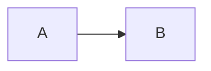
````

### Where to try it?

1. **Online Editor**: https://mermaid.live/
2. **VS Code**: Mermaid Preview extension
3. **GitHub/GitLab**: In any markdown file
4. **Obsidian**: Native support

---

## 2. Flowchart

### When to use?

For visualizing processes, decision trees, algorithms, business logic.

### Basics

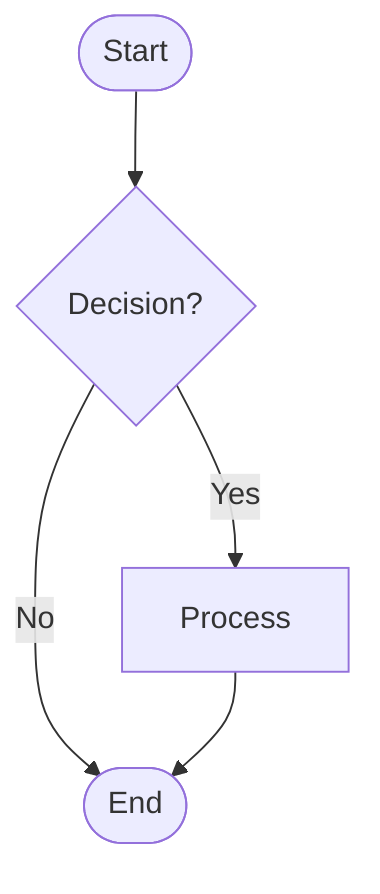

### Syntax Elements

| Element | Code | Appearance |
|---------|------|------------|
| Rectangle | `A[Text]` | Process |
| Rounded | `A([Text])` | Start/Stop |
| Rhombus | `A{Decision?}` | Condition |
| Circle | `A((Text))` | Connector |
| Asymmetric | `A>Text]` | Flag |
| Hexagon | `A{{Text}}` | Preparation |
| Parallelogram | `A[/Input/]` | Input/Output |

### Connections

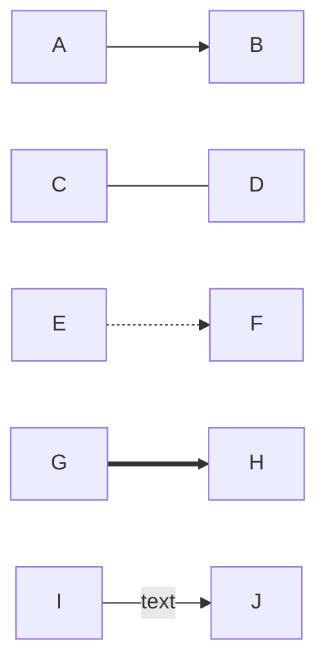

- `-->` normal arrow
- `---` line without arrow
- `-.->` dashed arrow
- `==>` thick arrow
- `-->|text|` labeled arrow

### Directions

- `TD` / `TB` - Top Down
- `BT` - Bottom to Top
- `LR` - Left to Right
- `RL` - Right to Left

###  Exercise 1: Login Flow

**Task**: Create a flowchart for web login!

**Steps**:
1. User enters email + password
2. System validates credentials
3. If valid → Dashboard
4. If invalid → Error message → back to login

<details>
<summary> Solution</summary>

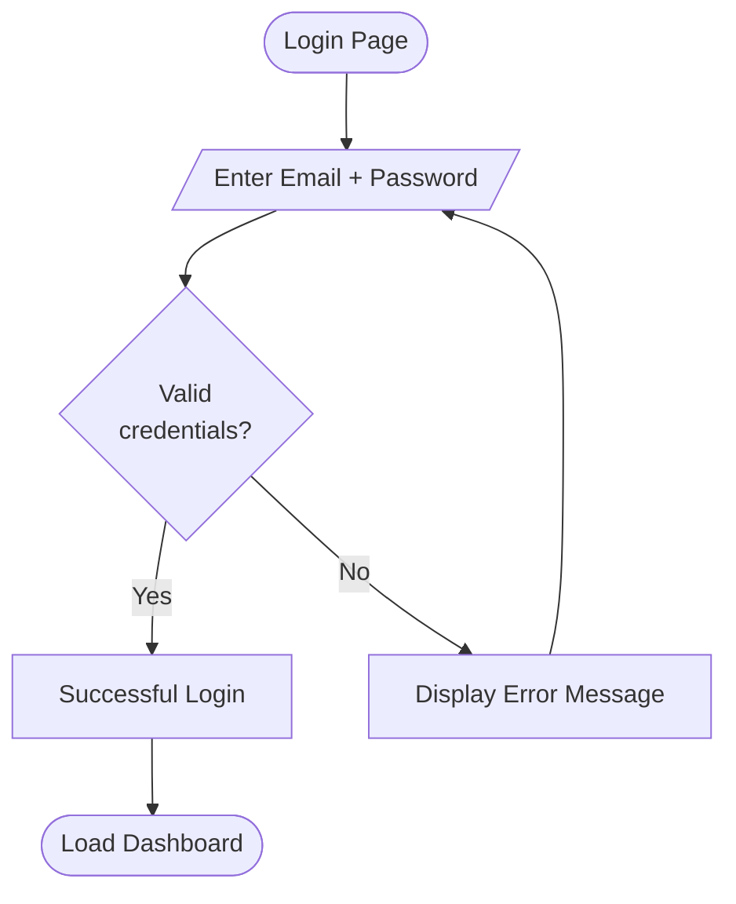
</details>

###  Exercise 2: CI/CD Pipeline

**Task**: Visualize a simple CI/CD pipeline!

**Elements**: Code Push → Tests → Build → Deploy to Staging → Manual Approval → Deploy to Production

<details>
<summary> Solution</summary>

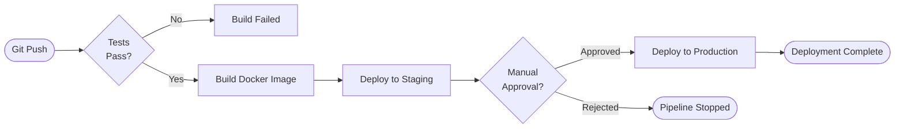
</details>

###  Exercise 3: E-commerce Order

**Task**: Create a flowchart for online shopping (add to cart → checkout → payment → confirmation).

<details>
<summary> Solution</summary>

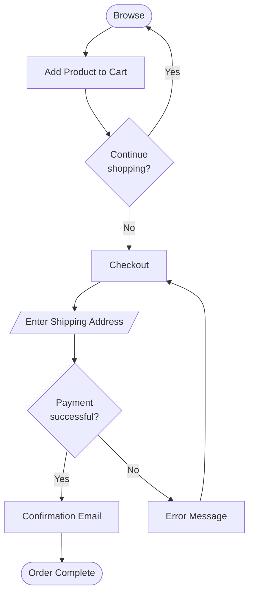
</details>

---

## 3. Sequence Diagram

### When to use?

API calls, inter-system communication, time-ordered events.

### Basics

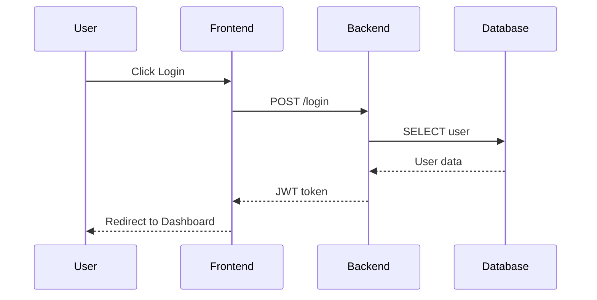

### Syntax Elements

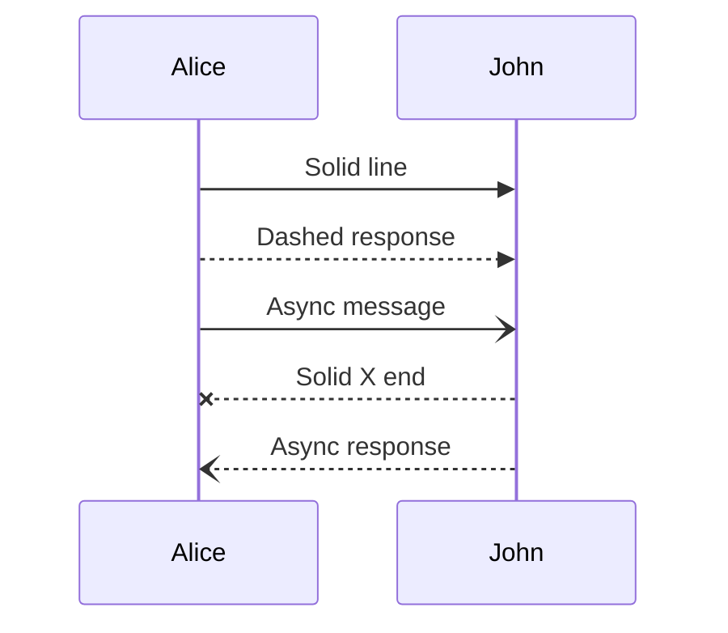

- `->>` solid message (sync)
- `-->>` dashed response
- `-)` async message
- `--x` terminated message
- `--)` async response

### Activation Boxes

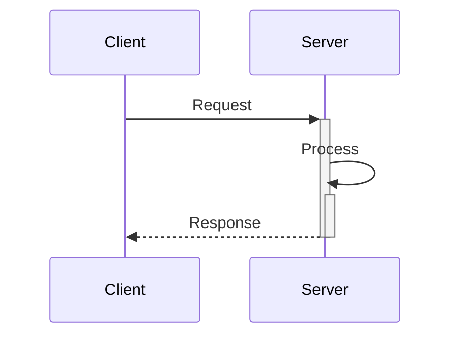

### Loops and Conditions

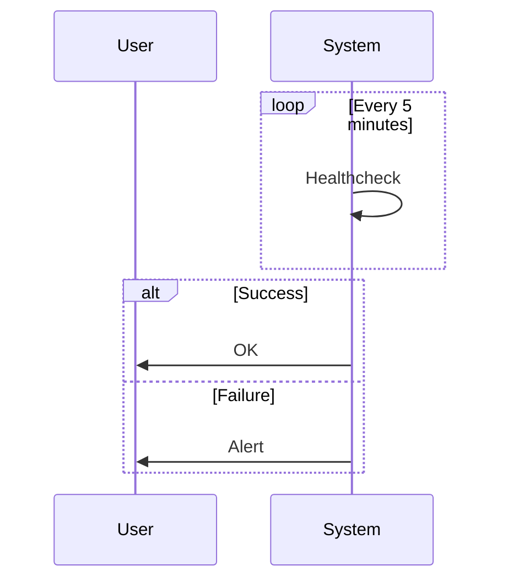

### Notes and Background

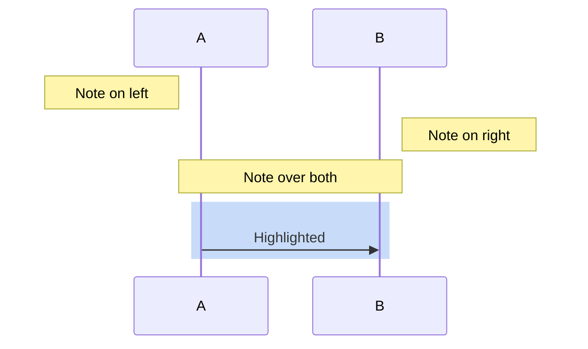

###  Exercise 4: REST API Call

**Task**: Visualize a REST API GET request with authentication!

**Participants**: Client, API Gateway, Auth Service, Database, Cache

<details>
<summary> Solution</summary>

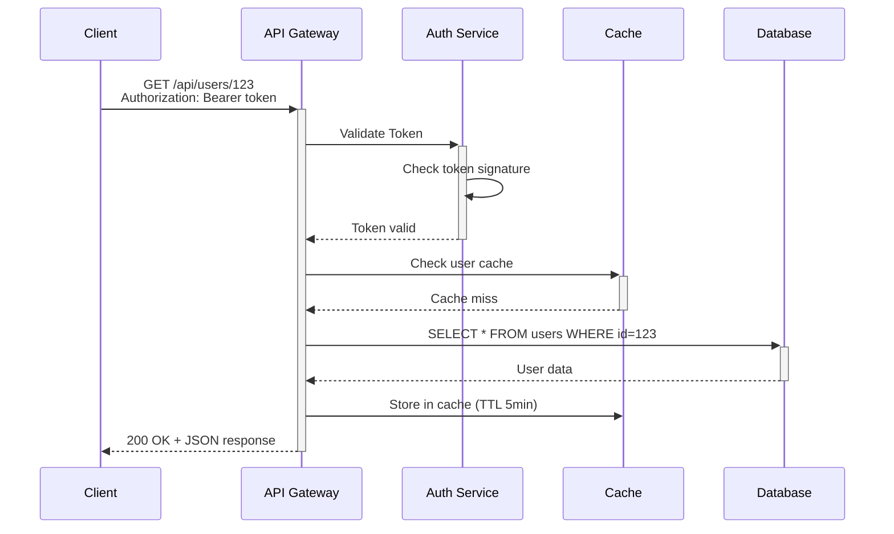
</details>

###  Exercise 5: Microservices Communication

**Task**: Order Service creates an order, calls Payment Service, then Notification Service.

<details>
<summary> Solution</summary>

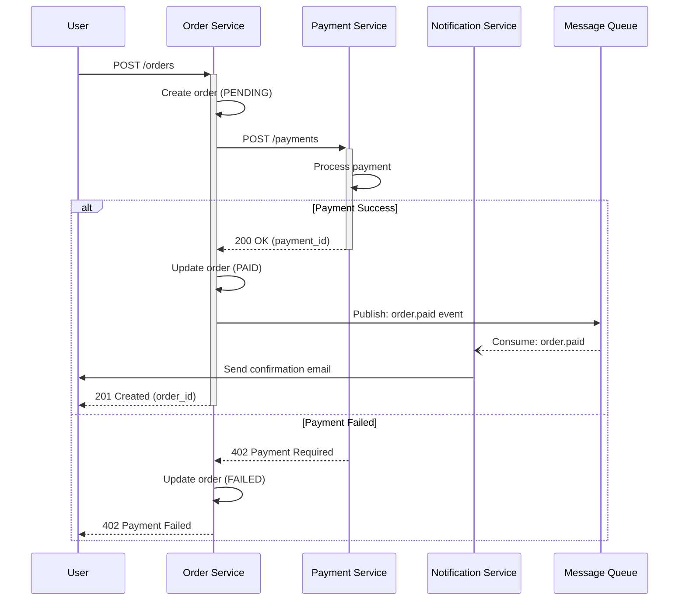
</details>

---

## 4. Class Diagram

### When to use?

OOP class structure, inheritance, relationships.

### Basics

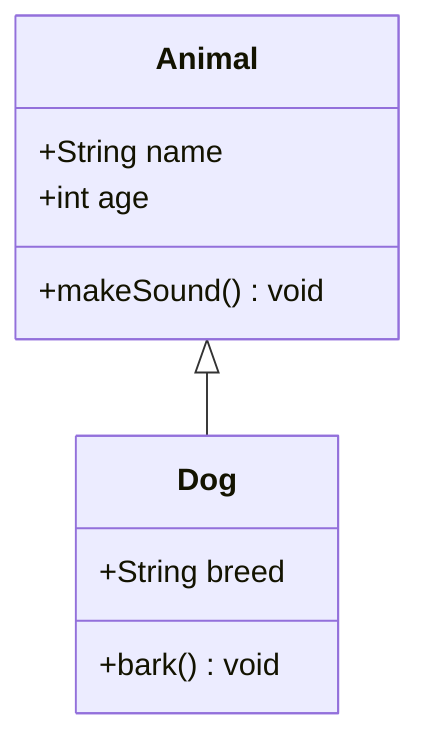

### Visibility

- `+` public
- `-` private
- `#` protected
- `~` package/internal

### Relationships

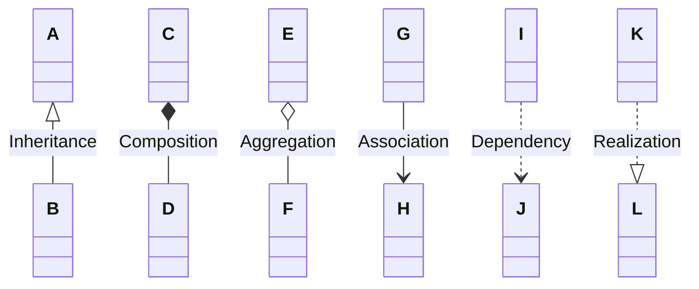

- `<|--` inheritance
- `*--` composition (strong ownership)
- `o--` aggregation (weak ownership)
- `-->` association
- `..>` dependency
- `..|>` interface implementation

###  Exercise 6: E-commerce Domain Model

**Task**: Create a class diagram: User, Order, Product, ShoppingCart with relationships!

<details>
<summary> Solution</summary>

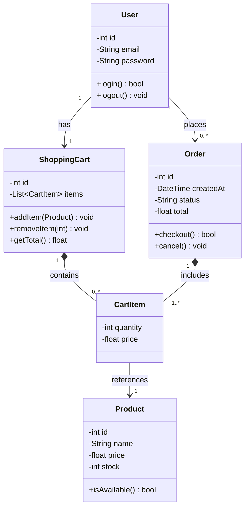
</details>

###  Exercise 7: Authentication System

**Task**: User, Role, Permission classes with relationships (many-to-many).

<details>
<summary> Solution</summary>

```mermaid
classDiagram
    class User {
        -int id
        -String username
        -String email
        -String passwordHash
        +hasPermission(String) bool
        +getRoles() List~Role~
    }

    class Role {
        -int id
        -String name
        -String description
        +getPermissions() List~Permission~
    }

    class Permission {
        -int id
        -String name
        -String resource
        -String action
    }

    class UserRole {
        -int userId
        -int roleId
        -DateTime assignedAt
    }

    class RolePermission {
        -int roleId
        -int permissionId
    }

    User "0..*" --> "0..*" Role : has
    (User, Role) .. UserRole

    Role "0..*" --> "0..*" Permission : grants
    (Role, Permission) .. RolePermission
```
</details>

---

## 5. State Diagram

### When to use?

Object lifecycle, state machines, workflow states.

### Basics

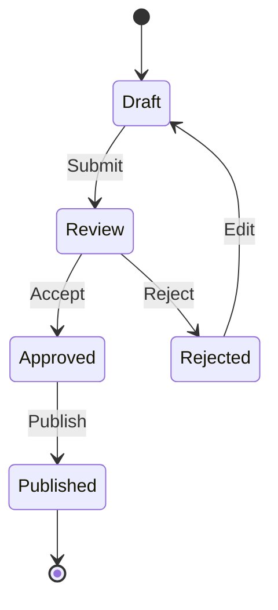

### Composite States

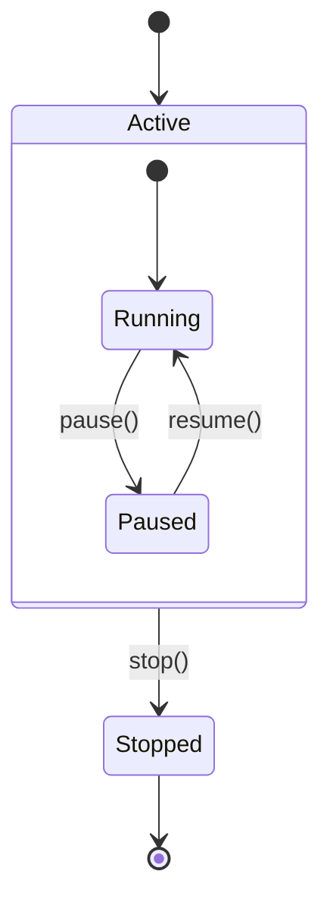

### Choice

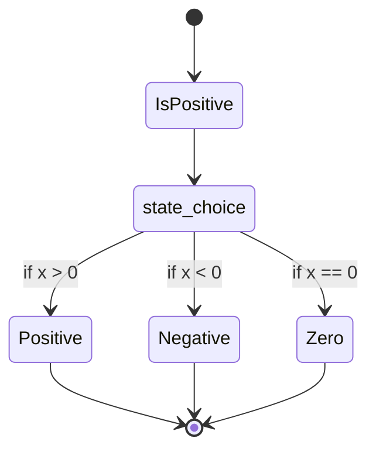

###  Exercise 8: Jira Ticket Lifecycle

**Task**: To Do → In Progress → Code Review → QA → Done (+ Blocked state)

<details>
<summary> Solution</summary>

```mermaid
stateDiagram-v2
    [*] --> Backlog
    Backlog --> Todo : Sprint Planning
    Todo --> InProgress : Start Work
    InProgress --> CodeReview : Create PR
    CodeReview --> InProgress : Changes Requested
    CodeReview --> QA : PR Approved
    QA --> InProgress : Bug Found
    QA --> Done : QA Passed
    Done --> [*]

    InProgress --> Blocked : Dependency Issue
    Blocked --> InProgress : Unblocked

    note right of Blocked
        Waiting for external dependency
        or clarification needed
    end note
```
</details>

###  Exercise 9: CI/CD Pipeline States

**Task**: Pipeline states: Queued → Running → Success/Failed/Cancelled

<details>
<summary> Solution</summary>

```mermaid
stateDiagram-v2
    [*] --> Queued
    Queued --> Running : Worker Available
    Queued --> Cancelled : User Cancels

    state Running {
        [*] --> Build
        Build --> Test : Build Success
        Build --> Failed : Build Failed
        Test --> Deploy : Tests Pass
        Test --> Failed : Tests Fail
    }

    Running --> Success : All Steps Pass
    Running --> Failed : Any Step Fails
    Running --> Cancelled : User Cancels

    Success --> [*]
    Failed --> [*]
    Cancelled --> [*]

    note right of Failed
        Logs are archived
        Notifications sent
    end note
```
</details>

---

## 6. Entity Relationship Diagram

### When to use?

Database schema, table relationships.

### Basics

```mermaid
erDiagram
    CUSTOMER ||--o{ ORDER : places
    ORDER ||--|{ LINE-ITEM : contains
    CUSTOMER }|..|{ DELIVERY-ADDRESS : uses

    CUSTOMER {
        int id PK
        string name
        string email UK
    }

    ORDER {
        int id PK
        int customer_id FK
        datetime created_at
        string status
    }
```

### Relationship Types

- `||--||` one to one
- `||--o{` one to many
- `}o--o{` many to many
- `||..|{` one to many (dashed)

### Cardinality

- `||` exactly one
- `|o` zero or one
- `}o` zero or more
- `}|` one or more

###  Exercise 10: Blog Platform Database

**Task**: User, Post, Comment, Tag tables with relationships.

<details>
<summary> Solution</summary>

```mermaid
erDiagram
    USER ||--o{ POST : writes
    USER ||--o{ COMMENT : writes
    POST ||--o{ COMMENT : has
    POST }o--o{ TAG : tagged_with

    USER {
        int id PK
        string username UK
        string email UK
        string password_hash
        datetime created_at
        datetime last_login
    }

    POST {
        int id PK
        int author_id FK
        string title
        text content
        string slug UK
        datetime published_at
        string status
    }

    COMMENT {
        int id PK
        int post_id FK
        int user_id FK
        int parent_comment_id FK "NULL for top-level"
        text content
        datetime created_at
    }

    TAG {
        int id PK
        string name UK
        string slug UK
    }

    POST_TAG {
        int post_id FK
        int tag_id FK
    }
```
</details>

---

## 7. Gantt Chart

### When to use?

Project schedules, task timelines.

### Basics

```mermaid
gantt
    title Project Schedule
    dateFormat YYYY-MM-DD
    section Design
        Requirements       :done, des1, 2024-01-01, 2024-01-10
        UI mockup          :active, des2, 2024-01-08, 7d
    section Development
        Backend API        :dev1, 2024-01-15, 14d
        Frontend           :dev2, after dev1, 10d
    section Testing
        QA Testing         :test1, after dev2, 5d
```

### Syntax

```
task_name : status, task_id, start_date, duration/end_date
```

**Status values:**
- `done` - completed (green)
- `active` - active (blue)
- `crit` - critical (red)
- none - planned (grey)

###  Exercise 11: Software Development Sprint

**Task**: 2-week sprint Gantt chart (Planning → Dev → Review → Retro)

<details>
<summary> Solution</summary>

```mermaid
gantt
    title Sprint 42 - User Authentication Feature
    dateFormat YYYY-MM-DD

    section Sprint Planning
        Sprint Planning Meeting    :done, plan1, 2024-03-01, 1d
        Story Point Estimation     :done, plan2, 2024-03-01, 1d

    section Development
        Database Schema            :done, dev1, 2024-03-02, 2d
        Backend API Endpoints      :active, dev2, 2024-03-04, 4d
        Frontend Login Form        :dev3, 2024-03-06, 3d
        JWT Token Implementation   :crit, dev4, 2024-03-08, 3d
        Integration Tests          :dev5, 2024-03-11, 2d

    section Code Review
        PR Review & Merge          :review1, after dev5, 2d

    section QA
        Manual Testing             :qa1, after review1, 2d
        Bug Fixes                  :qa2, after qa1, 1d

    section Sprint Closure
        Sprint Review              :close1, 2024-03-14, 1d
        Sprint Retrospective       :close2, 2024-03-14, 1d
```
</details>

---

## 8. Pie Chart

### When to use?

Percentage distributions, proportions.

### Basics

```mermaid
pie title Programming Language Usage
    "Python" : 35
    "JavaScript" : 25
    "Java" : 20
    "Go" : 12
    "Rust" : 8
```

###  Exercise 12: Cloud Cost Distribution

**Task**: AWS service cost breakdown (EC2, RDS, S3, Lambda, CloudFront)

<details>
<summary> Solution</summary>

```mermaid
pie title AWS Monthly Costs ($10,000)
    "EC2 (Compute)" : 3500
    "RDS (Database)" : 2200
    "S3 (Storage)" : 1500
    "CloudFront (CDN)" : 1200
    "Lambda (Serverless)" : 800
    "Data Transfer" : 500
    "Other Services" : 300
```
</details>

---

## 9. Git Graph

### When to use?

Git branch structure, merge strategy visualization.

### Basics

```mermaid
gitGraph
    commit id: "Initial commit"
    branch develop
    checkout develop
    commit id: "Add feature 1"
    checkout main
    merge develop
    commit id: "Release v1.0"
```

###  Exercise 13: Git Flow Workflow

**Task**: Main, develop, feature, hotfix branches in git flow

<details>
<summary> Solution</summary>

```mermaid
gitGraph
    commit id: "Initial"
    branch develop
    checkout develop
    commit id: "Setup project"

    branch feature/login
    checkout feature/login
    commit id: "Add login form"
    commit id: "Add validation"
    checkout develop
    merge feature/login

    branch feature/dashboard
    checkout feature/dashboard
    commit id: "Create dashboard"
    checkout develop
    merge feature/dashboard

    checkout main
    merge develop tag: "v1.0.0"

    branch hotfix/security
    checkout hotfix/security
    commit id: "Fix CVE-2024-1234"
    checkout main
    merge hotfix/security tag: "v1.0.1"
    checkout develop
    merge hotfix/security
```
</details>

---

## 10. User Journey

### When to use?

UX/UI design, user experience mapping.

### Basics

```mermaid
journey
    title Shopping Experience
    section Browsing
        Search products: 5: User
        Apply filters: 4: User
    section Ordering
        Add to cart: 5: User
        Checkout: 3: User
        Payment: 2: User, Payment System
    section Follow-up
        Email confirmation: 5: System
        Track shipping: 4: User
```

**Rating scale:** 1 (bad) - 5 (excellent)

###  Exercise 14: Mobile App Onboarding

**Task**: New user onboarding journey (download → registration → first use)

<details>
<summary> Solution</summary>

```mermaid
journey
    title Mobile App Onboarding Flow
    section Discovery
        Browse App Store: 3: User
        Read description: 4: User
        Download: 5: User
    section First Launch
        Splash screen: 5: App
        Permission requests: 2: User, App
        Welcome screen: 4: User
    section Registration
        Enter email: 3: User
        Create password: 2: User
        Email verification: 3: User, Email
    section Setup
        Create profile: 4: User
        Select interests: 5: User
        Configure notifications: 3: User
    section First Use
        Tutorial: 5: App
        First action: 5: User
        Congratulations message: 5: App
```
</details>

---

## 11. Mindmap

### When to use?

Brainstorming, hierarchical structures, knowledge organization.

### Basics

```mermaid
mindmap
    root((Project))
        Frontend
            React
            Vue
            Angular
        Backend
            Node.js
            Python
            Go
        Database
            PostgreSQL
            MongoDB
```

###  Exercise 15: Web Application Tech Stack

**Task**: Create a mindmap for a full-stack web app (Frontend, Backend, Database, DevOps, Tools)

<details>
<summary> Solution</summary>

```mermaid
mindmap
    root((Full Stack Web App))
        Frontend
            Framework
                React
                TypeScript
            UI Library
                Tailwind CSS
                Material UI
            State Management
                Redux Toolkit
                React Query
            Testing
                Jest
                React Testing Library
        Backend
            Runtime
                Node.js
            Framework
                Express
                NestJS
            API
                REST
                GraphQL
            Authentication
                JWT
                OAuth 2.0
        Database
            Relational
                PostgreSQL
                Prisma ORM
            Cache
                Redis
            Search
                Elasticsearch
        DevOps
            CI/CD
                GitHub Actions
                ArgoCD
            Container
                Docker
                Kubernetes
            Monitoring
                Prometheus
                Grafana
            Cloud
                AWS
                Terraform
        Development Tools
            Version Control
                Git
                GitHub
            IDE
                VS Code
            API Testing
                Postman
                Insomnia
```
</details>

---

## 12. Timeline

### When to use?

Chronological events, historical overview, project milestones.

### Basics

```mermaid
timeline
    title Project Milestones
    2024-01 : Project Kickoff
             : Team Assembly
    2024-02 : Alpha Release
    2024-03 : Beta Release
             : Testing Begins
    2024-04 : Production Launch
```

###  Exercise 16: Startup Growth Timeline

**Task**: Startup development stages (Idea → MVP → Series A → Scale)

<details>
<summary> Solution</summary>

```mermaid
timeline
    title SaaS Startup Growth Journey
    Q1 2023 : Idea Validation
            : Market Research
            : 3-person founding team
    Q2 2023 : MVP Development
            : First 10 beta users
            : Landing page launch
    Q3 2023 : Product-Market Fit
            : 100 paying customers
            : $10K MRR reached
    Q4 2023 : Seed Funding ($500K)
            : Team grows to 8
            : Marketing campaign launch
    Q1 2024 : 500 customers
            : $50K MRR
            : New features: API, Integrations
    Q2 2024 : Series A ($3M)
            : 20-person team
            : International expansion
    Q3 2024 : 2000 customers
            : $200K MRR
            : Enterprise tier launch
    Q4 2024 : Profitability reached
            : 5000 customers
            : $500K MRR
```
</details>

---

##  Advanced Exercises

###  Exercise 17: Kubernetes Deployment Flow

**Task**: Combine Flowchart + Sequence Diagram for a K8s deployment!

<details>
<summary> Solution - Flowchart</summary>

```mermaid
flowchart TD
    Start([kubectl apply]) --> Validate{YAML<br/>valid?}
    Validate -->|No| Error1[Validation Error]
    Validate -->|Yes| API[API Server]
    API --> Scheduler{Schedulable?}
    Scheduler -->|No resources| Error2[Pending]
    Scheduler -->|Yes| Node[Assign to Node]
    Node --> Kubelet[Kubelet pulls image]
    Kubelet --> Container{Container<br/>starts?}
    Container -->|CrashLoop| Error3[Pod Failed]
    Container -->|Yes| Probe{Health<br/>check pass?}
    Probe -->|No| Error3
    Probe -->|Yes| Running([Pod Running])
```
</details>

<details>
<summary> Solution - Sequence</summary>

```mermaid
sequenceDiagram
    participant Dev as Developer
    participant kubectl
    participant API as API Server
    participant etcd
    participant Sched as Scheduler
    participant Kubelet
    participant Docker

    Dev->>+kubectl: kubectl apply -f deployment.yaml
    kubectl->>+API: POST /apis/apps/v1/deployments
    API->>API: Validate YAML
    API->>+etcd: Store deployment spec
    etcd-->>-API: Stored
    API-->>-kubectl: Deployment created
    kubectl-->>-Dev: deployment "myapp" created

    Sched->>+API: Watch for unscheduled pods
    API-->>-Sched: New pod detected
    Sched->>Sched: Find suitable node
    Sched->>+API: Bind pod to node-1
    API-->>-Sched: Binding confirmed

    Kubelet->>+API: Watch assigned pods
    API-->>-Kubelet: Pod assigned to this node
    Kubelet->>+Docker: Pull image
    Docker-->>-Kubelet: Image pulled
    Kubelet->>Docker: Create container
    Kubelet->>Kubelet: Start health probes
    Kubelet->>API: Update pod status: Running
```
</details>

###  Exercise 18: OAuth 2.0 Authorization Code Flow

**Task**: Complete OAuth flow (User → App → Auth Server → Resource Server)

<details>
<summary> Solution</summary>

```mermaid
sequenceDiagram
    participant User
    participant App as Client App
    participant Auth as Authorization Server
    participant Resource as Resource Server

    User->>App: Click "Login with Google"
    App->>User: Redirect to Google Login
    User->>Auth: GET /authorize?client_id&redirect_uri&scope
    Auth->>User: Show login page
    User->>Auth: Enter credentials
    Auth->>Auth: Validate credentials
    Auth->>User: Show consent screen
    User->>Auth: Grant permissions
    Auth->>App: Redirect: /callback?code=ABC123

    App->>+Auth: POST /token<br/>code=ABC123<br/>client_id&client_secret
    Auth->>Auth: Validate authorization code
    Auth-->>-App: access_token + refresh_token

    App->>+Resource: GET /api/user<br/>Authorization: Bearer {access_token}
    Resource->>Auth: Validate token (introspection)
    Auth-->>Resource: Token valid
    Resource-->>-App: User profile data

    App->>User: Login successful, show dashboard
```
</details>

###  Exercise 19: Microservices Architecture

**Task**: Class diagram for microservices (Service, Gateway, Database per service pattern)

<details>
<summary> Solution</summary>

```mermaid
classDiagram
    class APIGateway {
        +route(request) Response
        +authenticate() bool
        +rateLimit() bool
    }

    class ServiceRegistry {
        +register(service) void
        +discover(serviceName) ServiceInstance
        +healthCheck() void
    }

    class UserService {
        -UserRepository repo
        +createUser() User
        +getUser(id) User
        +updateUser(id) User
    }

    class OrderService {
        -OrderRepository repo
        +createOrder() Order
        +getOrder(id) Order
        +cancelOrder(id) void
    }

    class PaymentService {
        -PaymentRepository repo
        +processPayment() Payment
        +refund(id) void
    }

    class NotificationService {
        -MessageQueue queue
        +sendEmail(to, subject) void
        +sendSMS(to, message) void
    }

    class MessageQueue {
        +publish(topic, message) void
        +subscribe(topic) Message
    }

    class UserRepository {
        +save(user) void
        +findById(id) User
    }

    class OrderRepository {
        +save(order) void
        +findById(id) Order
    }

    APIGateway --> UserService : routes to
    APIGateway --> OrderService : routes to
    APIGateway --> PaymentService : routes to

    UserService --> ServiceRegistry : registers
    OrderService --> ServiceRegistry : registers
    PaymentService --> ServiceRegistry : registers

    UserService --> UserRepository : uses
    OrderService --> OrderRepository : uses

    OrderService ..> PaymentService : calls (HTTP)
    OrderService --> MessageQueue : publishes events
    PaymentService --> MessageQueue : publishes events
    NotificationService --> MessageQueue : subscribes to
```
</details>

---

##  Learning Tips

### 1. Practice Regularly
- Create at least 3 diagrams every week
- Document your own projects with Mermaid
- Refactor existing PNG diagrams to Mermaid

### 2. Use in Production
- GitHub READMEs
- Jira/Confluence documentation
- Tech design docs
- Presentations (export as PNG)

### 3. Combine Diagram Types
- Flowchart + Sequence = complete process description
- Class + ER Diagram = domain model + persistence
- State + Sequence = state changes over time

### 4. Version Control
- Diagram code in git = changes trackable
- PR reviews show diagram modifications
- History = evolution documented

### 5. Online Tools
- **Mermaid Live Editor**: https://mermaid.live/
- **VS Code extensions**: Mermaid Preview, Markdown Preview Mermaid Support
- **GitHub**: Native rendering in .md files
- **Obsidian**: Native Mermaid support

---

## 📖 Additional Resources

### Official Documentation
- https://mermaid.js.org/
- https://mermaid.js.org/ecosystem/integrations.html

### Tutorial Videos
- "Mermaid JS Crash Course" (YouTube)
- "GitHub Mermaid Diagrams Tutorial"

### Community
- GitHub Discussions: https://github.com/mermaid-js/mermaid/discussions
- Stack Overflow: `[mermaid]` tag

---

##  Checklist

You've completed the learning plan when you've:

- [ ] Created at least 1 diagram of each type
- [ ] Tried the Mermaid Live Editor
- [ ] Created a GitHub repo with Mermaid diagrams
- [ ] Documented a personal project with diagrams
- [ ] Combined at least 2 diagram types in one document
- [ ] Created a complete system design document with Mermaid
- [ ] Shared a Mermaid diagram with team/community

---

**Created by**: Claude Code
**Version**: 1.0
**Last Updated**: 2026-03-25
