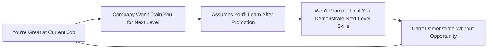
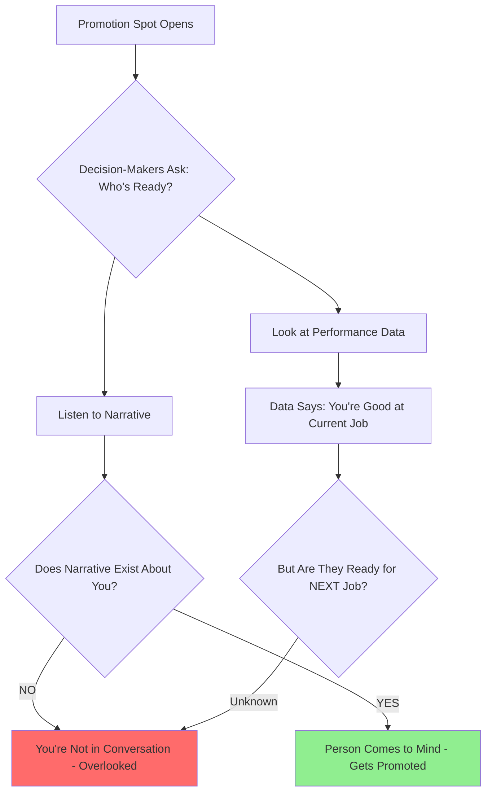
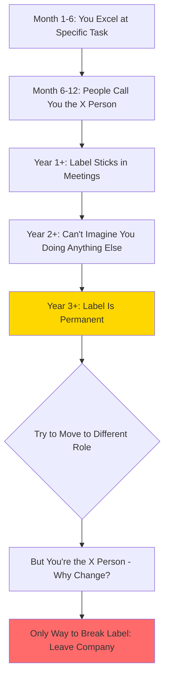
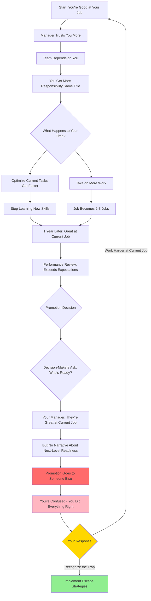

# The Competence Trap: Strategy Guide

**Purpose:** Understand why being excellent at your current job can block career growth, and develop strategies to advance despite (or alongside) competence.

**Audience:** High-performing individual contributors wondering why promotions aren't happening despite consistently exceeding expectations.

---

## The Core Problem

You get good at your job. You show up on time. You hit deadlines. You solve problems quietly. Your manager starts trusting you. Your co-workers start depending on you.

**And you think this is progress.**

**It isn't.**

**What you've actually done is build a trap.**

This trap costs **years**, not money. Years you can't get back.

---

## The Paradox

**Being excellent at your current job can block your career growth.**

**Why?** Five interconnected mechanisms:

---

### Problem 1: Too Expensive to Move

**What happens:**

You become valuable in a specific way: **the person who gets things done.** The person who doesn't need to be managed. The person who makes everyone else's life easier.

**This sounds good. But here's what it actually means:**

**You become expensive to REPLACE, not to promote.**

**Manager's calculation when promotion opens:**

| If I Promote You | Manager's Pain |
|-----------------|---------------|
| Must replace you | Hiring process (painful, time-consuming) |
| Train replacement | 3-6 months productivity loss |
| New person might fail | Reflects badly on manager |
| Creates immediate gap | Manager's workload increases |
| Risk and disruption | Uncertain outcome |

**vs.**

| If I Keep You Where You Are | Manager's Benefit |
|----------------------------|------------------|
| Zero disruption | Everything continues smoothly |
| Known quantity | No risk |
| No replacement pain | No additional work for manager |
| Safe choice | Easy decision |

**Result:** Keeping you where you are is the **safer choice** for your manager.

**Quote:**
> "They'll pay to keep you. They won't pay the pain to replace you."

**Critical insight:**
> "Managers don't avoid promoting you because they're cruel. They avoid it because the replacement process is genuinely painful. And if the new person doesn't work out, it reflects badly on them."

---

### Problem 2: Scope Creep Without Promotion

**Pattern:**

You're doing exactly what they asked. You're delivering results. You're making their life easier.

**And somehow that's the problem.**

**What happens instead of promotion:**

| What You Expect | What Actually Happens |
|----------------|---------------------|
| Great work → Promotion | Great work → MORE work (same title) |
| Prove capability → Move up | Prove capability → Become "the person who handles X" |
| Recognition → Advancement | Recognition → Harder problems (no promotion) |
| Excel → Rewarded with next level | Excel → Rewarded with expanded current level |

**Examples of scope creep:**

| Month | What Gets Added |
|-------|----------------|
| 1 | You deliver project successfully |
| 2 | "Can you also own the monthly report?" |
| 3 | System breaks, people ping you to fix it (now you're the fixer) |
| 4 | New hire joins, "Can you train them?" (now you're the trainer) |
| 6 | Difficult client nobody wants, "You handle them" (now you're the escalation person) |

**Result after 1 year:**

Your job is now **2-3 jobs**, but:
- Same title
- Same salary (maybe 3% raise)
- Same level
- **None of it is promotion**

**Quote:**
> "They keep you where you are. They give you more responsibility. They give you harder problems. They tell you you're doing a great job, but they don't promote you. They don't move you up. They just make your current job bigger."

---

### Problem 3: Skill Ceiling - Repetition vs. Growth

**When you're really good at your job, you stop learning.**

Not because you're lazy. Because you've **optimized.**

**What optimization feels like:**

| You Think | What's Actually Happening |
|-----------|-------------------------|
| "I'm getting better" | You're getting FASTER at same things |
| "I've mastered this" | You've optimized repetition |
| "I'm efficient now" | You're not learning new skills |
| "This proves I'm ready" | This proves you're great at CURRENT job |

**The skills gap nobody talks about:**

| Skills That Make You Good at Current Job | Skills Required One Level Up |
|----------------------------------------|----------------------------|
| Execution | Strategy |
| Delivery speed | Vision, planning |
| Reliability | Delegation |
| Process mastery | Managing ambiguity |
| Task completion | Decision-making under uncertainty |
| Following systems | Building systems |

**The catch-22:**



**Quote:**
> "A year from now, you'll be better at the job you already have, but you won't be ready for the job above you."

**Why this matters:**
- Performance reviews praise you for **current job skills**
- Promotion decisions evaluate **next job readiness**
- You're being scored on the wrong rubric

---

### Problem 4: The Visibility Problem

**Who actually makes promotion decisions?**

**NOT your manager** (in most cases).

**Promotion decisions happen in:**
- Succession planning meetings
- Skip-level conversations
- Calibration sessions
- Hallway discussions about "who's ready"

**People in those rooms:**

| Level | Do They See Your Work? | Do They Make Promotion Decisions? |
|-------|---------------------|--------------------------------|
| Your manager | YES (direct observation) | MAYBE (recommends, doesn't decide) |
| Manager's manager | NO (only hears summaries) | YES (usually decides) |
| Two levels up | DEFINITELY NO | YES (approves) |

**How decisions actually work:**



**Critical distinction:**

| Performance Data | Narrative |
|-----------------|-----------|
| Tells them you're GOOD | Tells them you're READY |
| "Exceeds expectations" | "Has been doing next-level work" |
| Backward-looking | Forward-looking |
| Proves past competence | Suggests future potential |

**Quote:**
> "Performance data tells them you're good. Narrative tells them you're ready. And if no one's telling your story, you don't have a narrative."

**The silence trap:**
> "If you're not talking about what you want, leadership assumes you're happy where you are. And if they think you're happy, there's no reason to move you."

**Result:** You're quietly excellent in the background. **You're not in front of them.**

---

### Problem 5: The Label (Permanent Identity)

**Organizations label people quickly.**

Not formally. Not in writing. **But in the way people talk about you in meetings you're not in.**

**How labels form:**



**Examples of labels:**

| Label | How It Formed | How It Traps You |
|-------|--------------|-----------------|
| "The Excel person" | You built great spreadsheets | Can't get non-Excel projects |
| "The operations person" | You're reliable at operations work | Can't move to strategy role |
| "The person who handles escalations" | You're good with difficult clients | Only get difficult clients |
| "The [technology] expert" | You know specific tool well | Stuck on that tool, can't broaden |

**Why labels stick:**

| Reason | Impact |
|--------|--------|
| Tenure = evidence | Longer you stay, more "proof" you're that person |
| Mental shorthand | Easier to categorize than reassess |
| Risk aversion | "They're great at X, why risk moving them to Y?" |
| Confirmation bias | New evidence interpreted through lens of label |

**Quote:**
> "Being the go-to person feels like recognition. And at first, it is. But 'go-to' eventually becomes 'can't do anything else.'"

**The identity problem:**
> "You're not a person with potential. You're the person who handles that specific thing. And once people see you that way, it's very hard to change their minds."

**Why people leave to grow:**
> "Not always because the company is bad, but because the company has already decided who you are. And sometimes the only way to become someone new is to go somewhere where no one knows you yet."

---

## Pattern Recognition: The Competence Trap Cycle



**Key insight:** The loop reinforces itself. Working harder at current job makes trap WORSE, not better.

---

## Diagnostic Framework: Are You in the Trap?

### Warning Signs Checklist

**Check how many apply to you:**

#### Scope Creep Indicators

- Your job responsibilities have doubled in the past year (same title)
- You're training new hires (not in your job description)
- You handle "special cases" nobody else wants
- You're the backup for 3+ different roles
- "We couldn't do this without you" is common feedback

#### Skill Stagnation Indicators

- You're significantly faster at your job than 1 year ago
- You can do most tasks "without thinking"
- You haven't learned a major new skill in 6+ months
- You're optimizing processes, not learning new ones
- Most of your learning is "how to do X faster" not "how to do Y"

#### Visibility Problem Indicators

- Your manager's manager doesn't know your name
- You've never presented work outside your immediate team
- Leadership doesn't know what projects you're working on
- Performance reviews praise reliability, not strategic impact
- You're invited to execute, not to plan or decide

#### Label Formation Indicators

- People call you "the [X] person" regularly
- When someone needs X done, they automatically come to you
- You're not considered for projects outside your specialty
- 2+ years in same role with same type of work
- Attempts to work on different topics are redirected back to X

#### Promotion Blockers

- "We can't lose you in this role" response to promotion talk
- Performance reviews: "Exceeds expectations" but no promotion
- Told "you're not ready" without specific skill gaps identified
- Others with less tenure/skill got promoted (different specialty)
- Promotions happen around you, not to you

### Scoring

| Count | Diagnosis | Urgency |
|-------|-----------|---------|
| 0-5 | Low risk - early in career or well-managed growth | Monitor |
| 6-10 | Moderate risk - competence trap forming | Act within 6 months |
| 11-15 | High risk - actively trapped | Act within 3 months |
| 16+ | Critical - deep in trap, label likely permanent | Consider external move |

---

## Who Gets Promoted Instead (And Why)

**The people who move up are NOT always the best at their current job.**

**They are the people who:**

| What They Do | Why It Works | Example |
|-------------|-------------|---------|
| Make themselves VISIBLE | Decision-makers know who they are | Present at all-hands, speak in leadership forums |
| Talk about their work | Narrative exists beyond immediate manager | Share project updates in broader channels |
| Build relationships outside team | Cross-functional visibility | Coffee chats with other teams' leaders |
| Make goals known | No ambiguity about aspirations | "I'm interested in moving toward X role" |
| Ask for things | Creates urgency (risk of losing them) | "What would it take for me to be considered for Y?" |
| Signal they're growing | With or without this role | "I'm developing skills in Z area" |

**Critical insight:**
> "They didn't just do good work. They made sure people knew they were doing good work. And that's not about bragging. It's about context."

**The urgency factor:**
> "They make it clear they're not going to stay in the same spot forever. Not drama, not being difficult, just clarity that they're growing with or without this role. And that makes leadership think about them differently. It makes them a priority because now there's a clock. Now there's a risk of losing them."

---

## Survival Strategies

### Strategy 1: Build Strategic Visibility (Not Bragging)

**The difference:**

| Bragging (Ineffective) | Strategic Visibility (Effective) |
|---------------------|-------------------------------|
| "I'm amazing at X" | "Here's what I learned solving X" |
| "Look how much I did" | "Here's the impact of this project" |
| Self-focused | Context-focused, team-focused |
| Sounds defensive | Sounds collaborative |

**How to build narrative without bragging:**

#### Tactic 1: Share Project Retrospectives

**Where:** Team meetings, Slack channels, internal wiki

**Format:**

```markdown
Project: [Name]
Problem: [What we were solving]
Approach: [What we tried]
Result: [Impact - metrics, user feedback]
Lessons: [What I/we learned]
```

**Why this works:**
- Documents impact (not just effort)
- Shows learning (next-level skill: reflection)
- Visible to others (creates narrative)
- Helpful to team (not self-serving)

---

#### Tactic 2: Present Outside Your Immediate Team

**Opportunities:**

| Venue | Frequency | Visibility Level |
|-------|-----------|-----------------|
| All-hands meeting | Quarterly | High (leadership present) |
| Cross-team demo days | Monthly | Medium-high (peer leadership) |
| Engineering guild/community | Monthly | Medium (specialists) |
| Lunch & learn | Bi-weekly | Medium (cross-functional) |

**Script for proposing:**

```
Hi [Meeting Organizer],

I recently worked on [project] and think the lessons might be interesting to 
[audience]. Would there be a slot in [venue] to share a 10-15 minute overview?

Happy to sync first to make sure it's relevant.

Thanks,
[Your Name]
```

---

#### Tactic 3: Write (Don't Just Code/Execute)

**What to write:**

| Type | Where | Audience |
|------|-------|----------|
| Technical blog posts (internal) | Engineering blog, wiki | Peers, leadership |
| Design docs | Shared drive, Confluence | Cross-functional |
| Post-mortems | Incident channel, wiki | SRE, leadership |
| Tutorials | Team wiki | New hires, future you |

**Why writing matters:**
- Demonstrates communication skill (next-level requirement)
- Creates artifacts people reference (you're associated with solution)
- Shows strategic thinking (not just execution)

---

#### Tactic 4: Build Relationships Outside Your Team

**Not networking - strategic relationship building.**

**Who to connect with:**

| Role | Why | How |
|------|-----|-----|
| Peers in other teams | Cross-team visibility | Coffee chat, collaborate on shared problem |
| Your manager's peers | They talk to your manager's manager | Ask about their team's work, offer help |
| Skip-level leaders | Direct visibility to decision-makers | Office hours, company events |
| People who left and succeeded | Learn what they did differently | LinkedIn, alumni network |

**Script for coffee chat:**

```
Hi [Name],

I've been hearing about [their team's project] and would love to learn more about 
[specific aspect]. Would you be open to a quick coffee chat sometime?

No agenda - just curious about your approach to [problem].

Thanks,
[Your Name]
```

---

### Strategy 2: Reallocate from Execution to Growth

**The hard truth:** You can't optimize both current job AND next job simultaneously.

**You must reallocate.**

**Current allocation (competence trap):**

| Activity | Time Spent | Result |
|----------|-----------|--------|
| Current job execution | 90% | Get better at current job |
| Learning next-level skills | 5% | Negligible growth |
| Visibility building | 5% | No narrative |

**Target allocation (escape strategy):**

| Activity | Time Spent | Result |
|----------|-----------|--------|
| Current job execution | 70% | Still deliver (slightly less perfect) |
| Learning next-level skills | 20% | Demonstrate readiness |
| Visibility building | 10% | Build narrative |

**How to reallocate without "slacking":**

#### Accept "Good Enough" on Current Tasks

| Old Standard | New Standard | Time Saved |
|-------------|-------------|-----------|
| Perfect documentation | Clear documentation | 2 hours/week |
| Optimized to 100% | Optimized to 90% | 3 hours/week |
| Handle every edge case | Handle common cases | 4 hours/week |
| Available for all questions | Point to documentation, batch office hours | 3 hours/week |

**Total time freed:** ~12 hours/week for growth activities

---

#### Learn Next-Level Skills Deliberately

**What are next-level skills for YOUR path?**

**Ask your manager:**

```
"I'm interested in growing toward [role]. What skills should I be developing? 
Can you point me to examples of people who made that transition successfully?"
```

**Common next-level skills:**

| Current Level | Next Level Needs |
|--------------|-----------------|
| Individual contributor | Delegation, mentoring, technical leadership |
| Executor | Strategy, prioritization, saying no |
| Specialist | Breadth, cross-functional collaboration |
| Tactical | Vision, long-term planning |

**How to learn them:**

| Skill | How to Learn |
|-------|-------------|
| Delegation | Mentor junior engineer, let them own pieces |
| Strategy | Write design docs, propose solutions (not just implement) |
| Cross-functional work | Volunteer for project with product/design |
| Communication | Present, write, run meetings |

---

### Strategy 3: Make Your Goals Known (Without Ultimatums)

**The silence trap:** If you don't say what you want, they assume you're happy.

**How to signal growth intent:**

#### In 1-on-1s (Every 2-3 Months)

**Script:**

```
"I'm really enjoying [current work], and I'm also thinking about long-term growth. 
I'm interested in moving toward [role/direction] over the next 12-18 months.

What would I need to demonstrate to be considered for that path?"
```

**Why this works:**
- Not demanding immediate promotion
- Shows intention (creates clock)
- Asks for specific feedback (actionable)
- Signals you're growing (with or without them)

---

#### In Performance Reviews

**Script for self-review:**

```
CURRENT ROLE ACCOMPLISHMENTS:
[Standard list of achievements]

GROWTH AREAS I'M DEVELOPING:
- [Next-level skill 1] - Example: [project where you used it]
- [Next-level skill 2] - Example: [how you practiced]

CAREER GOALS (12-18 MONTHS):
I'm interested in growing toward [role]. I've been developing [skills] and would 
appreciate guidance on what else I should focus on.
```

**Why this works:**
- Documents your growth intent (in writing)
- Shows proactive development (not waiting to be told)
- Creates accountability (manager can't say "I didn't know")

---

#### When Promotion Doesn't Happen (Despite Promises)

**Script (calm, factual):**

```
"In our last 1-on-1 [date], we discussed promotion to [role] and you mentioned 
[criteria]. I've been working on [those things] and would like to understand what's 
needed to make progress.

Can we create a specific plan with milestones?"
```

**If still vague after 2-3 attempts:**

**This is a signal.** They're not planning to promote you. Start exit planning.

---

### Strategy 4: Create Forcing Functions (Stretch Projects)

**Don't wait to be assigned next-level work. Create it.**

#### Propose Projects That Require Next-Level Skills

**Script to manager:**

```
"I've been thinking about [problem area]. I'd like to propose [solution] - 
it would require [next-level skill like strategy/delegation/cross-team work].

Would you be open to me exploring this? Happy to start small and share progress 
in 2 weeks."
```

**Examples:**

| Current Role | Stretch Project | Next-Level Skill Demonstrated |
|-------------|----------------|----------------------------|
| Individual engineer | Propose system redesign | Strategic thinking, architecture |
| Solo contributor | Mentor 2 junior engineers | Delegation, leadership |
| Team-focused | Lead cross-team initiative | Influence, collaboration |
| Executor | Write decision doc for leadership | Communication, business thinking |

---

### Strategy 5: Track Market Value (External Calibration)

**Internal promotion is ONE path. External market is another.**

**Every 6-12 months:**

| Activity | Why | What You Learn |
|----------|-----|---------------|
| Update resume/LinkedIn | Forces you to articulate impact | Are you growing or repeating? |
| Talk to recruiters | See what market values | Is your comp competitive? |
| Interview elsewhere | Test your narrative | Can you sell next-level story? |
| Get competing offer | Creates leverage OR exit | What's your market worth? |

**This is not disloyal. It's professional.**

**Quote from related research:**
> "The system rewards LEAVING, not STAYING. New hires get 20-40% higher salaries than loyal employees for the same role."

**Use market data strategically:**

**If you get external offer:**

| Situation | Action |
|-----------|--------|
| Current company matches + promotion path clear | Stay (they needed pressure) |
| Current company matches but no growth path | Leave (they're buying time) |
| Current company can't/won't match | Leave (you're underpaid) |

---

## Documentation Templates

### Template 1: Career Development 1-on-1 Agenda

**Send before 1-on-1:**

```
Subject: 1-on-1 Agenda - [Date]

Hi [Manager],

For our 1-on-1, I'd like to discuss:

CURRENT WORK:
- [Project status update]
- [Blocker if any]

CAREER DEVELOPMENT:
I'm thinking about growth toward [role/direction] over the next 12-18 months.

QUESTIONS:
- What skills should I be developing for that path?
- Are there upcoming projects that would give me exposure to that work?
- Who in the org has made a similar transition I could learn from?

Thanks,
[Your Name]
```

---

### Template 2: Performance Review Self-Assessment (Growth-Focused)

```
PERFORMANCE REVIEW SELF-ASSESSMENT

CURRENT ROLE ACHIEVEMENTS:

1. [Project/Goal]: [Impact - metrics, outcomes]
2. [Project/Goal]: [Impact - metrics, outcomes]
3. [Project/Goal]: [Impact - metrics, outcomes]

NEXT-LEVEL SKILLS I'M DEVELOPING:

1. [Skill - e.g., Strategic Thinking]
   - Example: [Wrote design doc for X, proposed Y solution]
   - Feedback: [Shared with Z, incorporated input]

2. [Skill - e.g., Mentorship/Delegation]
   - Example: [Mentored junior engineer on X project]
   - Result: [They delivered Y independently]

VISIBILITY ACTIVITIES:

- Presented [topic] at [venue] ([date])
- Wrote [document] shared with [audience]
- Collaborated with [team] on [project]

CAREER GOALS (12-18 MONTHS):

I'm interested in growing toward [role]. I've been developing [skills] and would 
appreciate specific feedback on:
- What I'm doing well that supports this direction
- What gaps I should focus on closing
- Whether there are opportunities in the next 6 months to demonstrate readiness

FEEDBACK REQUESTED:

- [Specific question about skill gap]
- [Specific question about visibility]
- [Specific question about promotion timeline]
```

---

### Template 3: Requesting Promotion (After Demonstrated Readiness)

**Send only after you've:**
- Had 2-3 conversations about growth goals
- Demonstrated next-level skills on real projects
- Built visibility beyond immediate team

**Email:**

```
Subject: Request for Promotion Discussion

Hi [Manager],

I'd like to request a meeting to discuss promotion to [role].

CONTEXT:

Over the past [X months], I've been working toward this goal based on our 
conversations on [date 1], [date 2].

READINESS EVIDENCE:

1. [Next-level skill]: [Project where demonstrated]
2. [Next-level skill]: [Project where demonstrated]
3. [Next-level skill]: [Project where demonstrated]

IMPACT:

[Metrics/outcomes that demonstrate strategic contribution, not just execution]

NEXT STEPS:

I'd appreciate discussing:
- Whether you agree I've demonstrated readiness
- What the timeline/process looks like
- Whether there's anything else I should focus on

Available times: [3 options]

Thanks,
[Your Name]
```

---

### Template 4: Private Career Log (For Your Eyes Only)

**Store in personal email/cloud, NOT company systems:**

```
CAREER DEVELOPMENT LOG

GOAL: Promotion to [role] by [date]

MONTH 1:
Date: 2026-06-01
- Conversation with manager about growth → Response: [notes]
- Next-level skill development: [what I worked on]
- Visibility activity: [what I did]
- Observations: [patterns noticed]

MONTH 2:
[...]

PROMOTION CONVERSATIONS:
Date: 2026-06-15
- Asked about promotion timeline
- Manager response: [exact quote]
- Action items: [what they said to do]
- My assessment: [realistic timeline? specific criteria? vague?]

MARKET CALIBRATION:
Date: 2026-07-01
- Recruiter conversation: [what roles they're seeing for people like me]
- Comp data: [market rate for target role]
- Gap analysis: [am I underpaid? under-leveled?]

DECISION POINT:
Month X: If no clear promotion path by [date], start external search
```

---

## Boundary Scripts

### Script 1: Manager Says "You're Not Ready" (Ask for Specifics)

**They say:** "You're not ready for promotion yet."

**You say:**

```
"I want to make sure I understand the gap. Can you help me identify:

1. Which specific skills or experiences I'm missing?
2. What would demonstrate I've developed those?
3. What's a realistic timeline if I focus on those areas?

I'm committed to growth and want to make sure I'm focusing on the right things."
```

**Why this works:**
- Forces specificity (vague = they don't have a plan)
- Creates accountability (timeline)
- Shows commitment (not defensive)

**If response is still vague after 2 attempts:** They don't plan to promote you. Act accordingly.

---

### Script 2: When Told "We Can't Lose You in This Role"

**They say:** "You're too valuable in your current role. We can't afford to move you."

**You say:**

```
"I appreciate that, and I'm glad the work is valuable. At the same time, I'm looking 
to grow my career. 

If this role isn't a path to [next role], can we discuss:
1. Internal transfer to a team where that path exists?
2. What timeline you'd need to backfill this role so I can move?

I want to grow here, but I also need to keep developing."
```

**Why this works:**
- Acknowledges their concern (not combative)
- Makes clear growth is non-negotiable (with or without them)
- Offers solutions (transfer, timeline)
- Signals: If no path, you'll leave

**If they block both transfer AND promotion:** Start external search immediately.

---

### Script 3: Asking for Compensation Without Promotion

**Context:** You're doing 2-3 jobs, market rate for your level is higher, but promotion isn't happening yet.

**Email:**

```
Subject: Request to Discuss Compensation

Hi [Manager],

I'd like to request a meeting to discuss compensation.

CONTEXT:

My role has expanded significantly over the past [X months]:
- [Responsibility 1 - was not in original job description]
- [Responsibility 2 - was not in original job description]
- [Responsibility 3 - was not in original job description]

MARKET DATA:

Based on [source - e.g., Levels.fyi, Glassdoor, recruiter conversations], 
the market rate for [my role + expanded scope] is [range].

My current compensation is [amount], which is [X%] below market.

REQUEST:

I'd like to discuss adjusting compensation to reflect both market rate and expanded 
scope, separate from promotion timeline discussions.

Available times: [3 options]

Thanks,
[Your Name]
```

**Why this works:**
- Separates comp from promotion (different levers)
- Provides market data (not opinion)
- Documents scope creep (evidence)

---

### Script 4: Exiting on Good Terms (When Trap Is Permanent)

**Context:** You've decided to leave, have external offer, want to preserve relationship.

**In-person or video call:**

```
"I wanted to let you know I've accepted a position at [company] as [role].

This was a hard decision. I've really valued [specific things you appreciated], 
and I'm grateful for [specific support].

At the same time, I'm at a point where I need to make a move to grow toward 
[career goal], and this opportunity gives me [specific thing current role couldn't].

My last day will be [date - usually 2 weeks]. I'll make sure [transition items] 
are documented and handed off smoothly.

Thank you for everything."
```

**Why this works:**
- Respects relationship (burns no bridges)
- Explains decision without blaming (growth-focused)
- Offers clean transition (professional)

**What NOT to say:**
- "You should have promoted me" (blame)
- "I was trapped here" (accusatory)
- "I'm so glad to leave" (burns bridge)

---

## Exit Criteria: When to Leave vs. Try to Break Trap

### Timeline-Based Decision Matrix

| Time in Current Role | Action | Why |
|-------------------|--------|-----|
| 0-1 year | Build competence + visibility simultaneously | Too early to judge trap |
| 1-2 years | Start growth conversations, demonstrate next-level skills | Optimal promotion window |
| 2-3 years | If no promotion path clear, START external search | Label forming, harder to break |
| 3+ years | Strong bias toward leaving | Label likely permanent, internal mobility hard |

---

### Stay and Try to Break Trap IF:

**All of these are true:**

- Company has clear promotion paths (others promoted internally)
- Manager supportive of growth conversations (not defensive)
- You've been there less than 2 years
- Specific skill gaps identified (actionable feedback)
- You can build visibility (culture allows it)
- Compensation competitive with market
- You're learning new things (not just repeating)

---

### Exit (External Move) IF:

**3+ of these are true:**

- Label has stuck (3+ years as "the [X] person")
- Manager defensive about promotion ("you're not ready" with no specifics)
- "We can't lose you in this role" response to growth talk
- No one promoted internally in your area (pattern)
- Scope expanded significantly, no title/comp adjustment
- Salary 15%+ below market rate
- You're optimizing, not learning
- Visibility-building seen as "not your job"
- Skip-level leaders don't know who you are
- You're the backup for 3+ roles (irreplaceable syndrome)

---

### The 2-3 Year Rule

**Why 2-3 years is the decision point:**

| Timeline | Market Perception | Internal Reality |
|----------|------------------|-----------------|
| 0-1 year | Still ramping | Building competence |
| 1-2 years | Proved competence, growing | Optimal promotion window |
| 2-3 years | Growth trajectory visible | Label forming, last chance to break |
| 3+ years | "Why didn't you grow there?" | Label permanent, very hard to change |

**Quote:**
> "Sometimes the only way to become someone new is to go somewhere where no one knows you yet."

**Market reality:**
- Job-hopping stigma has faded (especially in tech)
- 2-3 years per role = normal, healthy growth
- 5+ years same role = "why?" (perceived stagnation)
- External moves average 20-40% salary increases
- Internal promotions average 3-8% increases

---

## Key Takeaways

### 1. Competence Alone Is Not a Strategy

**Baseline (necessary but not sufficient):**
- Be good at your job
- Deliver results
- Be reliable

**Strategy (what actually advances you):**
- Visibility beyond immediate manager
- Narrative about next-level readiness
- Clarity about growth goals
- Willingness to reallocate from execution to growth

**Quote:**
> "Competence is not a strategy. It's a baseline. The strategy is what you do after you're competent."

---

### 2. The Trap Has Five Mechanisms

**Understand them to recognize when you're in it:**

| Mechanism | Warning Sign |
|-----------|-------------|
| Too expensive to move | "We can't lose you here" |
| Scope creep without promotion | Job is now 2-3 jobs, same title |
| Skill ceiling | You're faster, not broader |
| Visibility problem | Skip-level leaders don't know you |
| The label | You're "the [X] person" |

---

### 3. Most Promotions Go to Visible People, Not Best Performers

**Performance data tells them you're good.**

**Narrative tells them you're ready.**

**Promotion decisions happen based on narrative, not just data.**

**Build narrative through:**
- Presenting outside your team
- Writing (internal blog, design docs)
- Cross-functional relationships
- Making goals known

---

### 4. Reallocate from Execution to Growth

**You cannot optimize both current job AND next job simultaneously.**

**Accept "good enough" on current tasks (70% time).**

**Invest freed time in:**
- Learning next-level skills (20% time)
- Building visibility (10% time)

**Quote:**
> "The people who move forward are willing to become less good at their current job so they can start learning the next one. Not by slacking, by reallocating."

---

### 5. Make Your Goals Known (Or They'll Assume You're Happy)

**Silence = satisfaction in organizational dynamics.**

**In 1-on-1s every 2-3 months:**
> "I'm interested in growing toward [role] over the next 12-18 months. What would I need to demonstrate?"

**This creates:**
- Awareness (they know your intent)
- Urgency (clock is ticking)
- Accountability (they can't later say "I didn't know")

---

### 6. The 2-3 Year Decision Point

**Timeline for breaking the trap internally:**

| Year | Action |
|------|--------|
| 1 | Build competence + visibility |
| 2 | Demonstrate next-level skills, ask for promotion |
| 3 | If no clear path, leave |

**Why 3 years is the limit:**
- Label forming/permanent
- Market starts questioning lack of growth
- Harder to break perception internally
- External move averages 20-40% comp increase

---

### 7. Scope Creep Is Not Promotion

**Red flag pattern:**

| What Happens | What It Means |
|-------------|--------------|
| More responsibility, same title | Exploitation, not advancement |
| "Great job, now can you also..." | Scope creep |
| Training others, same level | You're doing manager work unpaid |
| 2-3 jobs, one salary | Time to negotiate or leave |

**Response:** Ask for comp adjustment or promotion. If refused, start exit planning.

---

### 8. External Market Is Always an Option

**Internal promotion is ONE path.**

**External move often:**
- Breaks the label (fresh start)
- Pays 20-40% more
- Provides title bump
- Forces skills growth (new environment)

**Track market value every 6-12 months:**
- Update resume/LinkedIn
- Talk to recruiters
- Interview occasionally
- Know your worth

---

### 9. Organizations Label You - Fight It or Leave

**Once labeled "the [X] person":**
- Very hard to change internally
- Easier to get new label at new company

**Fight the label IF:**
- Less than 2 years in role
- Culture supports internal mobility
- You can demonstrate breadth

**Leave IF:**
- 3+ years same label
- Culture doesn't support lateral moves
- Attempts to broaden are rejected

---

### 10. Years Lost to Trap Are Unrecoverable

**The real cost isn't money - it's time.**

**Quote:**
> "You spent years becoming incredible at something that doesn't move you forward. Years you can't get back. Not because you failed, but because you succeeded at the wrong level."

**Don't wait until:**
- 5 years same role (market questions stagnation)
- Label is permanent (can't break internally)
- Skills are obsolete (optimized old tech/processes)

**Act at 2-3 years if no clear promotion path.**

**Comfort and progress are not the same thing.**

---

## Related Guides

- **[HR Interaction Strategy Guide](../hr-interaction-strategy-guide/)** - Why HR won't force your promotion
- **[Onboarding Without Support Guide](../onboarding-without-support-guide/)** - Related skill development problems
- **[Boundary Setting Guide](../boundary-setting-guide/)** - How to set career boundaries
- **[Work Acceptance Checklist](../work-acceptance-checklist/)** - Red flags during hiring

---

## Validation & Research

**Career mobility research:**
- Internal promotions average 3-8% salary increase
- External moves average 20-40% salary increase (LinkedIn, 2022)
- Average tenure per role: 2-4 years (decreasing trend)
- 5+ years same role correlates with salary stagnation

**Promotion decision-making:**
- 70% of promotions influenced by visibility, not just performance (Harvard Business Review)
- Skip-level leaders make promotion decisions in 60% of orgs (unclear who's "ready")
- "Potential" assessments more subjective than performance assessments

**Skills gap:**
- Technical skills != leadership skills (different competencies)
- Companies rarely train for next level before promotion
- "Demonstrate before promote" common policy

**For deeper reading:**
- "The Expertise Trap" - research on over-specialization
- "Quiet Quitting" - responding to scope creep without comp
- Organizational behavior research on labeling and categorization

---

**Last Updated:** 2026-05-28  
**Status:** Complete  
**Feedback:** [Open an issue](https://github.com/angelus-h/angelus-h.github.io/issues)
