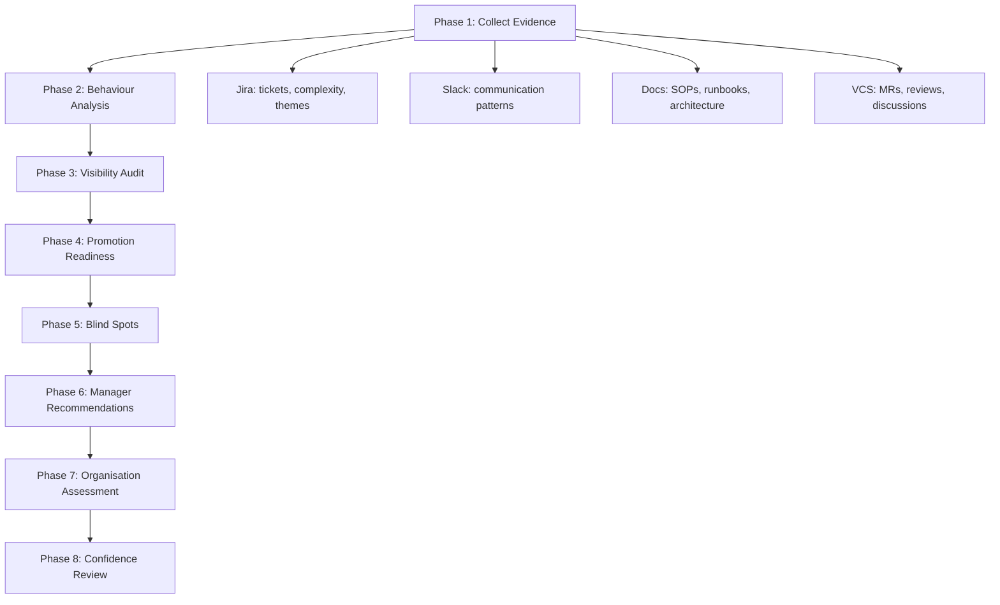
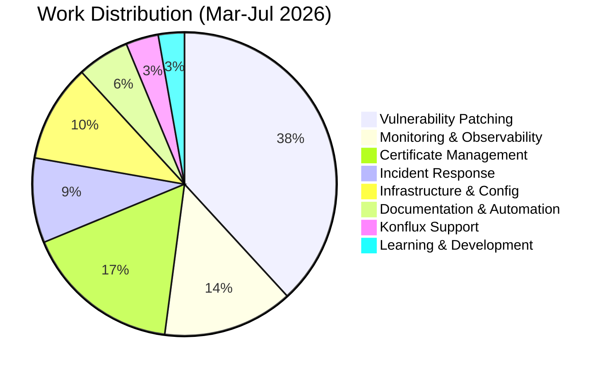
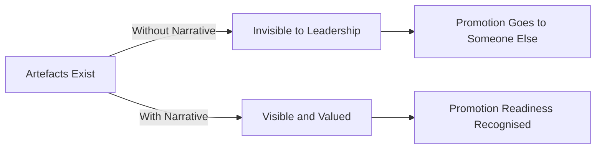

# Evidence-Based Engineering Self-Assessment

**Purpose:** Conduct an honest, data-driven self-assessment using engineering artefacts (Jira, Slack, documentation, merge requests) instead of subjective impressions. Identify communication blind spots and development directions.

**Audience:** Engineers who want to evaluate their own performance the way a promotion committee would — through evidence, not feelings.

---

## Why This Exists

Performance reviews are broken.

Not because managers are cruel, but because the feedback loop is structurally inadequate. A 3-question peer survey cannot capture:

- Power dynamics in knowledge ownership
- Asymmetric labeling (your pushback = "difficult", their pushback = "leadership")
- Management failures framed as individual shortcomings
- The gap between existing work and its visibility

**The fix is not better surveys. The fix is evidence.**

This guide documents a self-assessment methodology and its application. The methodology collects evidence from engineering systems (Jira, Slack, version control, documentation), applies structured analysis, and produces conclusions with explicit confidence levels.

**Every conclusion contains:**

| Component | Purpose |
|-----------|---------|
| Evidence | What was observed |
| Interpretation | What it means |
| Confidence | High / Medium / Low |

**Interpretation is never presented as fact.**

---

## The Assessment Framework



---

## Phase 1 — Evidence Collection

### What to Collect

#### From Jira (or your issue tracker)

| Dimension | What to Look For |
|-----------|-----------------|
| Completed work | Tickets closed in the assessment period |
| Ownership | Were tickets self-created or assigned? Did you drive them to completion? |
| Complexity | Blocker/Critical vs Normal priority. Multi-phase projects vs single tasks |
| Incident participation | Same-day resolutions, post-mortems, on-call rotation |
| Thematic spread | How many distinct domains? (monitoring, security, automation, infra, support) |
| Automation | Did you replace manual work with tooling? |

#### From Slack (or your team communication tool)

| Dimension | What to Look For |
|-----------|-----------------|
| Helping others | Answering questions, sharing solutions |
| Knowledge sharing | SOPs, dashboards, tools shared proactively |
| Critical thinking | Challenging assumptions, proposing alternatives |
| Incident communication | Clarity under pressure |
| Feedback-seeking | Asking for reviews, requesting input |

**Do not measure message count. Measure usefulness, clarity, and influence.**

#### From Documentation

| Dimension | What to Look For |
|-----------|-----------------|
| SOPs and runbooks | Created or maintained? |
| Architecture docs | System-level thinking |
| Post-mortems | Learning from incidents |
| Knowledge base | Long-term organisational value |

#### From Version Control

| Dimension | What to Look For |
|-----------|-----------------|
| Merge requests | Volume, quality, review activity |
| Code reviews | Depth and constructiveness |
| CI/CD improvements | Pipeline reliability, automation |

---

### Applying the Framework: A Real Assessment

**Period:** March–July 2026 (5 months)
**Data sources:** Jira (SPRE, KFLUXINFRA, KFLUXSPRT, RHELBLD), Slack (message search, channel history), Documentation (MkDocs sites, GitLab Pages), Memory (structured conversation logs)

#### Quantitative Summary

| Category | Count | Examples |
|----------|-------|---------|
| Total Jira tickets | 155+ | Across 4 projects |
| Incident response (Blocker/Critical) | 13 | UMB outage, Jenkins CrashLoop, kernel panic |
| Vulnerability patching | 55+ | DGIT-001 + BREW-001 VUL groups |
| Monitoring and observability | 20+ | DataDog, PagerDuty, SignalFx, SumoLogic migration |
| Certificate management | 24+ | UMB, Brew, Dist-Git |
| Same-day critical resolutions | 5 | Complex incidents resolved within hours |
| Documentation artefacts | 142+ | SOPs, runbooks, field guides |
| Custom tools built | 5 | MCP servers (Jira, PagerDuty, ServiceNow, GitHub, GitLab) |

#### Thematic Breakdown



---

## Phase 2 — Behaviour Analysis

### Ownership

| Evidence | Interpretation |
|----------|---------------|
| 155+ tickets in 5 months across 4 projects | Does not cherry-pick. Takes operational and investigative work equally |
| 5 same-day critical resolutions | Drives incidents to completion, does not hand off |
| Built ServiceNow MCP server from scratch | Identified gap in legacy tooling, built replacement without being asked |
| KFLUXINFRA Phases 1-5 monitoring deployment | Multi-month project delivered end-to-end across 4 clusters |
| 3 post-mortem documents | Documents learnings, not just fixes |
| DataDog API key leak: immediate, complete, self-critical remediation | Takes responsibility for mistakes openly |

**Assessment:** Ownership is unquestionable. The risk is not insufficient ownership — it is over-extension without scope evaluation.

**Confidence: HIGH**

---

### Communication

| Strength | Evidence |
|----------|----------|
| Structured status reporting | Bi-weekly updates with ticket numbers, statuses, blockers |
| Technical depth | VIT false-positive analysis (QID-39008/39024) with ~1100 VIT impact estimate |
| Proactive sharing | Dashboard links, MR links, documentation links shared without being asked |
| Critical thinking in public | Challenged team narrative on AI tooling: "I'm not convinced our main problem is lack of AI tooling" |
| Feedback-seeking in 1:1 | Asked Brew tech lead to review DataDog dashboard: "How helpful/informative?" |

| Gap | Evidence |
|-----|----------|
| Status reports are ticket-lists, not impact narratives | "SPRE-5917: closed" — tells nothing about what changed or why it matters |
| Fragmented Slack style | Multiple short messages in sequence. Content is strong, but form can undermine authority in announcements |
| Public feedback-seeking absent | Asks for feedback in 1:1 DMs but not in team channels |

**Assessment:** Content quality is consistently high. The gap is in packaging — translating work into narratives that leadership can consume without reading ticket descriptions.

**Confidence: MEDIUM** — Slack data was limited (not all channels accessible).

---

### Collaboration

| Positive Pattern | Evidence |
|-----------------|----------|
| Daily collaboration with co-owner | BREW patching split with Pete — clear ownership boundaries |
| Supporting colleagues | Provided server creation assistance for Jana's Terraform project; proactively shared IPA autocert role and Jira MCP workflow guide with colleague (unsolicited, helpful intent) |
| IC rotation participation | Regular incident commander shifts (09:00-14:00 UTC) |
| Cross-team engagement | Fivetran/Snowflake migration, OpenShift ART coordination, security team escalations |
| Platform building | SPRE-Notes documentation site — others started contributing |

| Structural Limitation | Evidence |
|----------------------|----------|
| Team structure blocks cross-training | Merged team promised cross-training; never happened |
| Knowledge base power dynamic unresolved | Competing documentation platforms, asymmetric authority |
| Proactive help goes unacknowledged | Shared IPA autocert role and Jira MCP workflow guide with colleague — zero reaction. PTO-n is responded to help requests |
| No mentoring opportunity exists | Currently no junior team members to mentor. This is a structural constraint, not a personal gap |

**Confidence: MEDIUM-HIGH**

---

### Technical Leadership

| Evidence | Category |
|----------|----------|
| Built monitoring infrastructure from scratch — twice (SignalFx, DataDog) | System building |
| Built 5 MCP servers, published to quay.io with setup guides | Tool building |
| PagerDuty Event Orchestration (PROD vs non-PROD automatic routing) | Operational maturity |
| Terraform VM provisioning (85-90% faster than Ansible approach) | Technology adoption |
| Vulnerability patching SOP creation | Process creation |
| UMB certificate renewal automation (AAP-ready Ansible) | Manual to automated transition |
| Challenged AI tooling hype with evidence-based reasoning | Critical thinking |

**Pattern:** Identify systemic problem, build solution, document for others.

**Confidence: HIGH**

---

### Engineering Maturity

| Dimension | Evidence | Rating |
|-----------|----------|--------|
| Judgement | Immediate and complete remediation of DataDog API key leak | Strong |
| Prioritisation | Blocker/Critical tickets same-day, normal tickets in structured cadence | Strong |
| Risk awareness | Recognised RHEL 7 builders must stay despite EOL. IPA enrollment kept in Ansible, not cloud-init | Strong |
| Decision making | Terraform vs Ansible: proved with POC, not dogmatic | Strong |
| Simplification | PagerDuty PROD/non-PROD routing: simple solution, high impact | Strong |
| Self-assessment | Identified own "compliance pressure" pattern and competence trap | Mature |

**Confidence: HIGH**

---

## Phase 3 — Visibility Audit

### Are Engineering Artefacts Discoverable?

| Artefact | Discoverable? | Details |
|----------|--------------|---------|
| Jira tickets | Yes | 155+ tickets with status transitions |
| Status reports | Yes | Bi-weekly structured updates in team channel |
| Documentation sites | Yes | SPRE-Notes, Traditional Pipelines docs, 142+ pages |
| MCP servers | Yes | Published to quay.io, shared with setup guides |
| DataDog dashboards | Yes | 5+ dashboards, shared in team channels |
| Post-mortems | Yes | 3 formal post-mortem documents |
| GitLab MRs | Yes | Multiple MRs with descriptions |

**The work is objectively visible through engineering artefacts.**

### But Visibility Is Not Just About Artefacts

| Visibility Gap | Impact |
|----------------|--------|
| No narrative for skip-level leadership | Manager sees the work, but manager's manager? |
| DataDog dashboards are MVP status — full team presentation planned when production-ready | Deliberate staging, not visibility gap |
| Proactive help messages sent to colleagues received zero reaction | Organisational culture issue, not communication gap |
| 142 docs exist but nobody reads them | Documentation is not visibility |
| No presentations beyond team level | All-hands, engineering guild, lightning talks — absent |
| Status reports list tickets, not impact | "SPRE-5917: closed" vs "Eliminated Apache vulnerability across 19 servers" |

**A separate dynamic: unreceived help.**

There is evidence of proactive, unsolicited knowledge sharing that received zero acknowledgement:

| Action | Response |
|--------|----------|
| Noticed colleague repeatedly working on cert renewals, shared IPA autocert Ansible role link | No reaction |
| Shared Jira MCP workflow guide with setup instructions | "sure no problem" — unclear if acted upon |
| Noticed PagerDuty issue affecting colleague, flagged proactively | No reaction |
| Responded to colleague's request for help during PTO | Acknowledged once, pattern not reciprocated |

**Additional evidence:** The colleague had two open Jira tickets for certificate renewal automation — one open for 3 years (SPRE-259, created 2023-06-06), another for 1 year (SPRE-1546, created 2025-06-10). The proactive help (IPA autocert role) was directly relevant to these tickets. Both were closed the same week the help was offered. The help was timely, relevant, and targeted — yet unacknowledged.

This is not a visibility problem on the engineer's side. This is an organisational culture problem: **help given is not valued or acknowledged.** The correct response is not "share more" — it is to document the pattern and factor it into career strategy.

**Key insight:** Artefacts prove you did the work. Narrative proves the work mattered.



---

## Phase 4 — Promotion Readiness

| Level | Readiness | Evidence |
|-------|-----------|---------|
| Mid-level | Significantly exceeded | 155+ tickets, multi-system ownership, incident response — this is not mid-level work |
| Senior | Performing at level | Technical leadership, system building, cross-team work, documentation. Current output is senior-grade |
| Staff | Partial readiness | Systemic problem identification and solution building present. Missing: cross-team influence beyond immediate sphere, formalised mentoring track record, organisation-wide impact narrative |

**The question is not capability. It is visibility and organisational dynamics.**

**Confidence:** HIGH (Mid/Senior), MEDIUM (Staff — limited cross-team data)

---

## Phase 5 — Communication Blind Spots

### Blind Spot 1: Ticket-List vs Impact Narrative

This is the highest-impact blind spot identified.

**Current status report format:**

```
• SPRE-5917: TraceEnable Off for DGIT + BREW httpd — Closed
• SPRE-5770: Fivetran Dev IP range pg_hba.conf — Closed
• SPRE-5536: DataDog MTS Monitoring — Closed
```

**What leadership reads:** "Three tickets were closed."

**What actually happened:**

| Ticket | What Leadership Should Read |
|--------|-----------------------------|
| SPRE-5917 | Eliminated Apache TraceEnable vulnerability across 19 servers, resolving QID-12680 VITs |
| SPRE-5770 | Enabled Fivetran data pipeline access to Brew PostgreSQL — unblocks analytics team |
| SPRE-5536 | Deployed production monitoring for Message Tagging Service with drill-down dashboards |

**The fix is not writing more. The fix is writing differently.**

#### Proposed Status Report Format

Instead of ticket lists, use this structure:

```
This Week's Impact:
• Eliminated Apache TraceEnable vulnerability across 19 servers (SPRE-5917)
• Deployed MTS production monitoring with DataDog dashboards (SPRE-5536)
• DGIT-001 patching: 72 → 25 open VITs, awaiting Qualys weekly scan

In Progress:
• BREW PostgreSQL monitoring setup in DataDog (SPRE-5775)
• Terraform VM provisioning — refinement phase (SPRE-5115)

Blockers:
• VUL group aggregation blocks Jira auto-closure — new QIDs
  open VITs faster than errata appear. Escalated to security.
```

| Old Format | New Format |
|------------|------------|
| Ticket number first | Impact first, ticket number as reference |
| Status-focused (Closed/In Progress) | Outcome-focused (what changed) |
| Assumes reader knows ticket context | Self-contained: reader understands without clicking |
| Lists everything equally | Highlights high-impact items |

**Evidence for this blind spot: HIGH** — Comparing the status report with peer reports in the same channel shows that while this report is the most detailed, it is the hardest to extract impact from without clicking every Jira link.

---

### Blind Spot 2: Fragmented Communication Style

Multiple short messages in sequence is a natural conversational style. It works well for daily interactions.

**But it has a cost in specific contexts:**

| Context | Short Messages OK | Consolidated Message Better |
|---------|------------------|-----------------------------|
| Daily chat with co-worker | Yes | No difference |
| Incident communication | Risky | Yes — conveys control |
| Tool announcement | Ineffective | Yes — conveys authority |
| Technical proposal | Fragmented | Yes — conveys completeness |
| Dashboard sharing | Loses impact | Yes — screenshot + context in one |

**This is not a criticism. It is a context-dependent optimisation.**

The question to ask before sending: "Is this a conversation or an announcement?" Conversations benefit from short messages. Announcements benefit from single, complete messages.

**Confidence: MEDIUM** — Style differences are context-dependent.

---

### Blind Spot 3: Public vs Private Feedback-Seeking

Evidence shows feedback-seeking exists in 1:1 DMs:

> "Hello Tomas, Can you review? [...] How helpful/informative?"

This is effective for individual relationships. But:

| Private Feedback | Public Feedback |
|-----------------|-----------------|
| Improves the product | Improves the product AND creates visibility |
| One person knows you asked | Team knows you care about quality |
| One person's input | Multiple perspectives |
| No precedent set | Normalises feedback culture |

**Additional evidence:** A Terraform VM provisioning MR (18 files, 4 commits) was submitted as Draft specifically expecting colleague review and technical opinions. The MR contains significant infrastructure-as-code work. The engineer explicitly wants feedback on this work — the feedback-seeking intent exists, but the organisational response is absent.

**Corrected assessment:** The blind spot is not "doesn't seek feedback" — the engineer seeks feedback both privately (1:1 DMs) and publicly (MRs, shared dashboards). The actual pattern is that **feedback-seeking goes unanswered by the organisation**. This shifts the diagnosis from personal communication gap to organisational engagement failure.

**Confidence: HIGH** — Multiple independent examples (DataDog dashboard review, IPA autocert sharing, Terraform MR) confirm the pattern.

---

### Blind Spot 4: Conflict Avoidance in Knowledge Ownership

**Pattern observed:** When competing solutions emerge (documentation platform ownership), default response is avoidance rather than constructive confrontation.

**Combined with:** "compliance pressure" — reflexive agreement to requests without scope evaluation.

| Behaviour | Perception Created |
|-----------|-------------------|
| Not confronting competing solutions | "Doesn't care" or "gave up" |
| Reflexive "yes" to scope expansion | "Always available" (exploitable) |
| Avoidance + over-delivery | Reactive, not proactive |

**The paradox:** The engineering output proves proactivity (tool building, monitoring from scratch, SOPs). But interpersonal dynamics project reactivity. The external perception does not match the internal reality.

**Confidence: HIGH** — Multiple data points across several months.

---

## Phase 6 — Development Directions

If an engineering manager inherited this engineer tomorrow, here is the 6-month plan:

| Month | Action | Goal |
|-------|--------|------|
| 1-2 | Impact narrative coaching | Every status report includes 2-3 "So What?" lines |
| 1-2 | Skip-level 1:1 | Manager's manager learns about the work directly |
| 2-3 | Presentation to wider audience | Engineering guild, all-hands, or lightning talk — topic: DataDog monitoring suite (when dashboards are production-ready, not MVP) |
| 3-4 | Structured feedback loops | After every major deliverable: "What worked? What would you change?" in team channel |
| 4-5 | Cross-team collaboration formalisation | Document and track outcomes of support given to other team members |
| 6 | Promotion case assembly | Evidence-based promotion document: impact metrics, technical leadership examples, visibility artefacts |

**Note on mentoring:** Formalised mentoring is a common recommendation, but it requires structural conditions — specifically, junior team members to mentor. When those conditions do not exist, the recommendation is inapplicable. Document this constraint explicitly rather than treating it as a personal gap.

### Status Report Optimisation

**Before (current format):**

```
• SPRE-5982: Ceph channel x86_64 build queuing — Resolved
• SPRE-5917: TraceEnable Off for DGIT + BREW httpd — Closed
• SPRE-5770: Fivetran Dev IP range pg_hba.conf — Closed
• SPRE-5536: DataDog MTS Monitoring — Closed
• SPRE-5115: Terraform VM Provisioning — Refinement
```

**After (impact-first format):**

```
Impact This Week:
• Fixed 8-hour Ceph build queue — re-enabled builder disabled during
  rolling updates (SPRE-5982)
• Closed 8 vulnerability groups across DGIT-001 (72 → 25 open VITs)
• Deployed MTS production monitoring in DataDog (SPRE-5536)

In Progress:
• BREW PostgreSQL + Apache monitoring in DataDog (SPRE-5775, SPRE-5789)
• DGIT VIT closure — awaiting Qualys weekly scan (~Jul 26)

Next:
• Terraform VM provisioning refinement (SPRE-5115)

Blockers:
• None currently
```

| Property | Before | After |
|----------|--------|-------|
| First impression | Ticket numbers | Business impact |
| Readability | Requires Jira access | Self-contained |
| Length | Similar | Similar (not longer) |
| Skip-level friendly | No | Yes |

---

## Phase 7 — Organisation Assessment

**The assessment does not only evaluate the engineer. It evaluates the organisation.**

| Organisational Element | Evidence | Rating |
|------------------------|----------|--------|
| Clear expectations | No evidence of explicit leveling criteria or promotion rubric | Insufficient |
| Mentoring | Assigned mentor rejected PR reviews, threatened about productivity | Failed |
| Onboarding | "When I was hired there were no usable documentation or job aids" | Failed |
| Constructive feedback | 3-question peer survey. Power dynamics and asymmetric labeling ignored | Inadequate |
| Recognition | Major monitoring deployment received zero team reaction | Minimal |
| Growth opportunities | Monitoring project was good growth work but not framed as such | Accidental |
| Cross-training | Merged team promised cross-training. Never delivered | Broken |

**Assessment:** The organisation does not systematically provide the conditions for growth. Advancement must be self-driven.

**Confidence: HIGH** — Multiple independent evidence sources.

---

## Phase 8 — Confidence Summary

| Conclusion | Evidence Level | Confidence |
|------------|---------------|------------|
| Ownership: exceptionally strong | 155+ tickets, same-day resolutions, tool building | HIGH |
| Technical leadership: senior-grade | Monitoring from scratch (x2), MCP ecosystem, automation | HIGH |
| Communication: content strong, packaging improvable | Status reports, Slack style, absence of narrative | HIGH |
| Visibility gap: artefacts exist, narrative missing | Docs exist, leadership does not see them | HIGH |
| Senior readiness: performing at level | Multi-system ownership, incident response, documentation | HIGH |
| Staff readiness: partial | Systemic thinking present, cross-team influence limited | MEDIUM |
| Organisational support: insufficient | Failed mentoring, broken cross-training promise, inadequate feedback | HIGH |
| Compensation gap: significant | Current salary 50-100% below market rate for comparable roles | HIGH |

---

## Lehetseges torzitasok

1. **Survivorship bias:** Only successful tickets and communications are visible. Abandoned attempts, unsent messages, and quiet failures do not appear in the data.
2. **Slack data limitation:** Not all channels were accessible. Communication patterns may be incomplete.
3. **Self-report bias in context:** Prior conversations reflect one perspective. Other parties' viewpoints are not represented.
4. **Quantity over quality assumption:** 155+ tickets is a volume metric. Quality is inferred from same-day resolutions and thematic complexity, not from reading every ticket description.
5. **Halo effect risk:** Strong technical evidence may bias toward underestimating communication gaps.

---

## The Assessment Prompt

The prompt used to generate this assessment is preserved below for reproducibility. It was designed to simulate an evidence-based quarterly engineering assessment by a Staff+ Engineering Manager, with no prior opinions, building conclusions exclusively from evidence.

??? note "Full Assessment Prompt (click to expand)"

    **Role:** Experienced Staff+ Engineering Manager conducting an evidence-based quarterly engineering assessment.

    **Goal:** Use objective evidence from Jira, Slack, GitLab, documentation repositories, merge requests, code reviews, incident history, and knowledge base contributions. Evaluate the engineer exactly as if preparing for a promotion committee. Assume no prior opinions. Build conclusions exclusively from evidence.

    **Phase 1 — Collect evidence** from: Jira (completed work, ownership, complexity, incidents, features, operational work, technical debt, automation, investigations, RCA, documentation — summarise quantity, quality, impact), GitLab (MRs, review activity, comments, architecture discussions, refactoring, test improvements, CI/CD improvements — determine engineering quality, collaboration, review quality), Slack (communication patterns — helping others, answering questions, technical discussions, conflict resolution, announcements, knowledge sharing, ownership, initiative — measure usefulness, clarity, professionalism, influence, not message count), Documentation (job aids, SOPs, runbooks, architecture docs, tutorials, knowledge base — estimate engineering impact, maintainability, long-term value).

    **Phase 2 — Behaviour analysis:** Ownership (does the engineer naturally take ownership? support with examples), Communication (clarity, conciseness, technical precision, responsiveness, professionalism — use evidence, avoid subjective labels), Collaboration (willingness to help/learn, openness, cross-team work — distinguish facts from interpretation), Technical leadership (identifying systemic problems, improving tooling/processes, automation, reducing manual work, documentation, enabling others), Engineering maturity (judgement, prioritisation, risk awareness, decision making, ability to simplify complex systems).

    **Phase 3 — Visibility:** Measure discoverability of work through documentation, Slack announcements, merge requests, Jira updates, reusable tooling. Not self-promotion.

    **Phase 4 — Promotion readiness:** Evaluate readiness for Mid, Senior, Staff. Support every conclusion with evidence.

    **Phase 5 — Blind spots:** Identify technical, communication, and collaboration blind spots. Only include issues supported by evidence.

    **Phase 6 — Manager recommendations:** If you became this engineer's manager tomorrow, what would you do during the next six months? Consider coaching, project selection, mentoring, visibility, compensation, promotion.

    **Phase 7 — Organisation assessment:** Evaluate whether the organisation provides clear expectations, mentoring, onboarding, constructive feedback, recognition, and growth opportunities. If evidence is insufficient, explicitly say so.

    **Phase 8 — Confidence:** Every conclusion must contain Evidence, Interpretation, and Confidence (High / Medium / Low). Never present interpretation as fact.

---

## How to Use This Guide

### For Your Own Assessment

1. **Collect evidence** from your engineering systems (Jira, Slack, VCS, docs)
2. **Run each phase** — do not skip the organisation assessment
3. **Be honest about confidence levels** — "I don't know" is a valid finding
4. **Share selectively** — the full assessment is for you. The impact narrative and artefact list are for your manager
5. **Repeat quarterly** — patterns only emerge over time

### For Improving Status Reports

Apply the impact-first format immediately. It costs zero extra time and changes how leadership perceives your work.

### For Career Decisions

Cross-reference Phase 4 (promotion readiness) with Phase 7 (organisation assessment). If you are performing at the next level but the organisation does not provide the conditions for advancement, the data supports an external move — not as frustration, but as strategy.

---

## Related Guides

- **[The Competence Trap](competence-trap-guide/README.md)** — Why being excellent at your current job blocks career growth
- **[Market Value Development](market-value-development-guide.md)** — Tracking your worth externally
- **[HR Interaction Strategy](hr-interaction-strategy-guide/README.md)** — How HR decisions actually work
- **[Boundary Setting](boundary-setting-guide.md)** — Scope creep prevention
- **[Exit Strategy](exit-strategy-guide.md)** — When and how to leave

---

**Last Updated:** 2026-07-27
**Status:** Complete
**Method:** AI-assisted evidence collection and structured analysis
**Feedback:** [Open an issue](https://github.com/angelus-h/angelus-h.github.io/issues)
