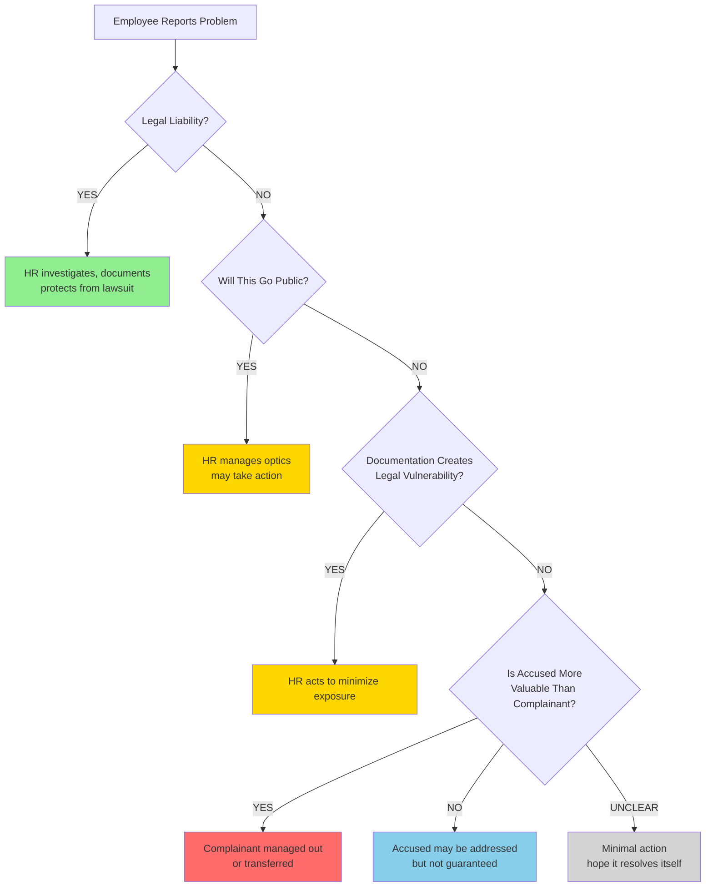
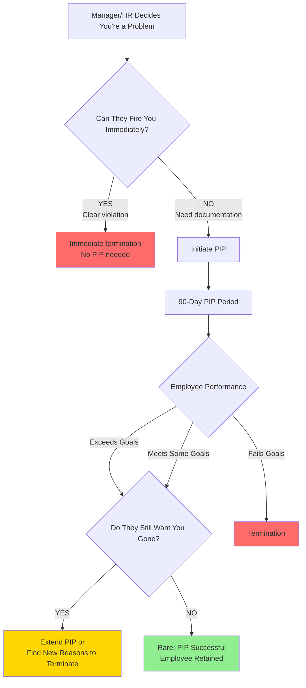

# HR Interaction Strategy Guide

**Purpose:** Understand how HR functions institutionally, when escalation works, and how to protect yourself when it doesn't.

**Audience:** Individual contributors navigating workplace conflicts, performance issues, or toxic dynamics.

---

## The Core Problem

You believe HR exists to help you solve workplace problems.

**The reality:** HR exists to minimize risk to the organization.

This isn't malice. It's institutional design.

When you bring a problem to HR, they're not asking:
- NO: "How do we help this person?"
- NO: "Is this manager/colleague failing their responsibilities?"

They're asking:
- YES: "Is this person likely to sue?"
- YES: "Will this become a public problem?"
- YES: "Is there documentation that makes the company look bad?"
- YES: "Can we contain this quietly?"
- YES: "How much will it cost to make this go away?"

**Then they act accordingly.**

---

## Pattern Recognition: HR Response Decision Tree



**Key insight:** Your wellbeing is not a variable in this decision tree. Risk to the organization is.

**Color Legend:**

| Color | Meaning |
|-------|---------|
| Green | HR acts (legal protection) |
| Yellow | HR may act (optics/liability management) |
| Blue | Uncertain outcome |
| Red | You lose |
| Gray | Nothing happens |

---

## Understanding the System

### HR is Risk Management, Not Support

**What HR protects:**
- The company from lawsuits
- The company from bad press
- The company from regulatory violations
- The company from losing "valuable" employees

**What HR does NOT protect:**
- Your psychological safety
- Your career progression
- Fair treatment when unfairness isn't illegal
- Your relationship with your manager

**This is not personal. It's how institutions behave when self-preservation is the priority.**

---

### The Record That Follows You

**Critical truth:**

When you go to HR, you create a **permanent record**.

Even if:
- You're right
- You're the victim
- The investigation clears you completely

**You're now labeled:** "Someone who escalated."

**This label means:**
- "Someone who caused disruption"
- "Someone who might do it again"
- "A known variable"

**Known variables get quietly sidelined:**
- Not immediately
- Not obviously
- But it happens

**The system rewards:**

| Valued Behavior | Penalized Behavior |
|----------------|-------------------|
| Smooth operation | Escalation |
| Absorbing problems quietly | Creating "drama" |
| Leaving before becoming expensive | Demanding accountability |
| Not making waves | Speaking up |

---

### Why "Valuable" People Are Protected

**Example scenario:**

- **You:** Junior engineer, 1 year tenure, replaceable
- **Toxic manager:** 5 years tenure, technically skilled, manages critical project

**HR calculation:**
```
Cost of losing you:        Minimal (hire replacement in 3 months)
Cost of losing manager:    High (project delay, knowledge loss, team disruption)

Decision: Move you, keep manager
```

**This is math, not justice.**

---

## When to Escalate (and When Not To)

### Escalation MIGHT Work When:

**1. Clear Legal Violation**
- Discrimination based on protected class (race, gender, age, disability, religion)
- Sexual harassment with documentation
- Retaliation for whistleblowing
- Wage/hour violations
- Safety violations

**Why:** Legal liability creates institutional urgency.

**2. Well-Documented Pattern**
- Dates, times, witnesses
- Written communications (emails, chats)
- Multiple people affected
- Business impact measurable

**Why:** Documentation shifts burden of proof and creates paper trail.

**3. Low-Value Perpetrator**
- Accused is junior, replaceable, or already on thin ice
- No special protection (not a "rockstar", not critical project owner)

**Why:** Low cost to remove them.

**4. Public/Viral Risk**
- Issue could go viral on social media
- Press might pick it up
- Industry reputation at stake

**Why:** Optics management becomes priority.

---

### Escalation Will LIKELY FAIL When:

**1. No Legal Liability**
- "My manager is a jerk" (not illegal)
- "Inadequate mentorship" (not illegal)
- "Toxic team culture" (not illegal unless discriminatory)

**2. High-Value Perpetrator**
- Senior engineer with specialized knowledge
- Manager of critical project
- Executive favorite
- Revenue generator

**3. No Documentation**
- Verbal complaints only
- "He said / she said" scenarios
- No witnesses
- No written evidence

**4. You're the Only One**
- No pattern of multiple complaints
- Isolated incident
- First time speaking up

---

## Diagnostic Framework: Should You Escalate?

**Use this checklist BEFORE going to HR:**

### Escalate if 3+ are TRUE:

- Clear legal violation (discrimination, harassment, retaliation)
- Written documentation (emails, chats, dates, witnesses)
- Multiple people affected (you're not alone)
- Business impact measurable (project delays, turnover)
- Low-value perpetrator (junior, replaceable)
- You have external options (other job offers, savings)
- You're prepared to leave if nothing changes

### ✗ DO NOT Escalate if:

- No legal liability
- High-value perpetrator (senior, critical, protected)
- No documentation
- You're the only complainant
- You can't afford to lose this job
- You're not ready to leave if nothing changes

**If escalation fails, you need an exit strategy - not hope.**

---

## Documentation Strategy

**If you decide to escalate, document EVERYTHING.**

### What to Document:

**1. Incidents**
- **Date and time** (exact: "2026-05-28, 2:30 PM")
- **What happened** (observable behavior, not interpretation)
- **Witnesses** (names, roles)
- **Impact** (missed deadline, emotional distress, project delay)

**Example:**
```
Date: 2026-05-28, 2:30 PM
Incident: Manager yelled "You're incompetent" in team meeting
Witnesses: John Smith (engineer), Jane Doe (PM)
Impact: Unable to focus for rest of day, missed sprint commitment
```

**2. Communications**
- Save emails, Slack/Teams messages
- Screenshot chats before they're deleted
- Forward to personal email (if legal in your jurisdiction)

**3. Patterns**
- Track frequency (how many times per week/month)
- Note escalation (verbal → written → public)
- Document any retaliation after reporting

---

### Documentation Template

```
INCIDENT LOG

Employee: [Your Name]
Manager/Colleague: [Their Name]
Period Covered: [Date Range]

INCIDENT #1
Date/Time: 
Location: 
What Happened: 
Witnesses: 
Impact: 
Supporting Evidence: [email subject line, chat timestamp]

INCIDENT #2
[...]

PATTERN SUMMARY:
Frequency: [X incidents over Y weeks]
Escalation: [Severity increasing/stable/decreasing]
Business Impact: [Measurable: missed deadlines, turnover, etc.]
```

**Store this:**
- Personal email (NOT company email)
- Personal cloud storage
- Local backup

---

## Interaction Scripts

### Script 1: Initial Report to HR (Email)

**Subject:** Request for Guidance - Workplace Concern

```
Hi [HR Contact],

I'm experiencing a workplace issue and would like guidance on how to proceed.

SITUATION:
[1-2 sentence summary - factual, not emotional]

IMPACT:
[Business impact - missed deadlines, productivity, team morale]

DOCUMENTATION:
I've documented [X] incidents over [Y] time period with dates, times, and witnesses.

REQUEST:
I'd like to schedule a confidential meeting to discuss next steps.

Available times: [provide 3 options]

Thank you,
[Your Name]
```

**Why this works:**
- Professional tone
- Factual, not emotional
- Business impact framed
- Documentation mentioned (shows seriousness)

---

### Script 2: HR Meeting - What to Say

**DO:**
- YES: Stick to observable facts
- YES: Cite specific dates, times, witnesses
- YES: Frame as productivity/business concern
- YES: Request specific action ("I need X by Y date")
- YES: Ask for timeline ("When can I expect update?")

**DON'T:**
- NO: Use emotional language ("I feel attacked")
- NO: Attack character ("They're a terrible person")
- NO: Demand someone be fired
- NO: Threaten to quit (unless you mean it)
- NO: Assume HR is on your side

**Example phrasing:**

| Emotional/Vague | Factual/Specific |
|-------------------|-------------------|
| "They're always mean to me" | "On May 15, 22, and 28, they publicly criticized my work in team meetings" |
| "I can't work with them anymore" | "This pattern is impacting my ability to deliver on sprint commitments" |
| "They should be fired" | "I need a plan to address this pattern within 2 weeks" |

---

### Script 3: Follow-Up (if Nothing Happens)

**2 weeks after initial report, send email:**

**Subject:** Follow-Up - Workplace Concern Reported on [Date]

```
Hi [HR Contact],

On [Date], I reported [brief summary of issue].

You mentioned [action/timeline HR promised].

STATUS CHECK:
- Has an investigation started?
- What is the expected timeline for resolution?
- What are next steps?

I'm requesting an update by [specific date - 3 business days].

If no action is planned, I need to understand what options are available to me.

Thank you,
[Your Name]
```

**Why this works:**
- Holds HR accountable to timeline
- Creates paper trail
- Signals you're tracking their response

---

## Managing Expectations

### What to Expect After Escalating:

**Week 1-2:**
- HR schedules meeting
- You submit documentation
- HR says "We're investigating"

**Week 3-4:**
- HR interviews witnesses (maybe)
- HR talks to accused (maybe)
- You hear nothing

**Week 5-8:**
- HR concludes "investigation"
- Possible outcomes:
  - "We found no wrongdoing" (most common)
  - "We've addressed it" (vague, no details)
  - "We're transferring you to another team" (you get moved, not them)
  - "We're putting you on a PIP" (if they want you gone)

**Months later:**
- You're labeled "difficult"
- Passed over for promotions
- Pushed out slowly

**This is the pattern. Expect it.**

---

### Performance Improvement Plans (PIPs): The Reality

---

#### What They Tell You

"We want to help you succeed. This is a structured plan to address performance gaps and support your growth."

#### What It Actually Is

**The company has already decided to let you go.**

The PIP is not a chance to improve. **It's a legal countdown to termination.**

---

#### The Real Purpose of a PIP

**What HR says:**

| Stated Purpose |
|---------------|
| Help you improve performance |
| Provide clear expectations |
| Support your development |
| Give you time to course-correct |

**What it actually does:**

| Real Purpose |
|-------------|
| Build documented paper trail for termination |
| Prove company "tried to help" (legal protection) |
| Shift blame to you ("You failed to meet goals") |
| Protect company from wrongful termination lawsuit |
| Make you quit voluntarily (cheaper than firing) |

---

#### PIP Decision Flow



**Color Legend:**

| Color | Outcome |
|-------|---------|
| Red | You're terminated |
| Yellow | You're still at risk |
| Green | Rare: You survive |

**Key insight:** The decision to remove you was made BEFORE the PIP started.

---

#### Warning Signs You're About to Get a PIP

**Immediate red flags (1-2 weeks before PIP):**

| Warning Sign | What It Means |
|-------------|---------------|
| Sudden increase in 1-on-1 meetings | Manager building documentation |
| Written criticism of previously acceptable work | Creating paper trail |
| Manager starts CC'ing HR on emails | Formal record creation |
| Micromanagement where there was none | Setting you up to fail |
| Vague or constantly shifting goals | Impossible to meet expectations |
| Excluded from important meetings | Being phased out |
| "Concerns about your performance" language | PIP prep |

**Medium-term patterns (1-3 months):**

| Pattern | Interpretation |
|---------|---------------|
| No positive feedback, only criticism | Building case against you |
| Bypassed for projects you'd normally lead | Reducing your visibility |
| Your ideas consistently rejected | Marginalizing you |
| Team members stop including you | Manager has signaled you're "out" |

---

#### PIP Survival Strategy

**Week 1: Assess and Decide**

**Ask yourself:**

| Question | If YES | If NO |
|----------|--------|-------|
| Do I have external job options? | Start interviewing immediately | Build options ASAP |
| Can I afford to lose this job? | Negotiate exit terms | Complete PIP while job searching |
| Is my manager supportive (rare)? | There's a 10% chance you survive | 90% chance you're terminated |
| Do I want to stay even if I survive? | Comply with PIP | Leave on your terms |

**Decision Matrix:**

| Your Situation | Strategy |
|---------------|----------|
| Have job offers + savings | Negotiate severance, leave on your terms |
| No offers yet + savings | Complete PIP minimally, focus on job search |
| No offers + no savings | Complete PIP fully, aggressively job search |
| Manager supportive + you want to stay | Rare case: fight for survival |

---

#### If You Decide to Fight: Compliance Checklist

**Meeting Every PIP Goal:**

**Week 1-2:**
- Read PIP document 3 times
- Identify EVERY measurable goal
- Create tracking spreadsheet (dates, deliverables, evidence)
- Request clarification on vague goals (via email for paper trail)
- Schedule weekly check-ins with manager (document everything)

**Weekly during PIP:**
- Document every completed task
- Send weekly status email to manager (create paper trail)
- Request feedback in writing
- If goals are vague, ask for specific metrics (in writing)
- Save all emails, Slack messages, work artifacts

**Red flags during PIP:**

| Manager Behavior | What It Means | Your Response |
|-----------------|---------------|---------------|
| Moves goalpost ("Now I need X too") | Setting you up to fail | Document in email: "To clarify, the new expectation is..." |
| Gives vague feedback | Impossible to satisfy | Request specific metrics in writing |
| Delays check-in meetings | Avoiding creating positive record | Send status updates anyway, request meeting in writing |
| Criticizes completed work retroactively | Building termination case | Document completion dates, get sign-off in writing |

---

#### Real Example: Pyxis Team Near-PIP

**Context:** Junior engineer, new complex project, inadequate mentorship.

**Warning signs that appeared:**

| Timeline | What Happened | What It Meant |
|----------|--------------|---------------|
| Month 1-3 | No clear documentation, contradictory guidance | Setup for failure |
| Month 4 | First production incidents (ISV-3193, ISV-3261) | Ammunition collected |
| Month 5 | Workday rating: "Did not meet expectations" | PIP prep started |
| Month 6 | Management change (Andrew Gonsorcik) | Decision point |

**What prevented PIP:**
- Management change brought new perspective
- Q2-Q4 performance improvement (different project)
- Lack of continued incidents after team transfer

**What would have happened without management change:**
- Formal PIP within 2-4 weeks of "did not meet" rating
- 90-day period with impossible goals (unclear requirements, no support)
- Termination at end of PIP

**Key lesson:** The system was broken (no documentation, poor mentorship), but I would have been blamed individually.

---

#### What to Document During a PIP

**Create three documents (stored in personal email/cloud):**

**1. PIP Compliance Log**

| Date | Goal | Action Taken | Evidence | Manager Feedback |
|------|------|-------------|----------|------------------|
| 2026-05-28 | Complete X by Y | Delivered X on 2026-05-27 | Email confirmation | "Meets expectations" |
| 2026-06-04 | Improve metric Z | Metric improved 15% | Dashboard screenshot | No feedback provided |

**2. Goalpost Movement Tracker**

| Date | Original Goal | New/Changed Goal | Documentation |
|------|--------------|------------------|---------------|
| 2026-06-01 | Deliver feature A | Now need feature A + B + C | Email from manager |
| 2026-06-15 | Code quality "good enough" | Now "must be excellent" | Meeting notes (yours) |

**3. Communication Log**

| Date | Communication Type | Summary | Evidence |
|------|-------------------|---------|----------|
| 2026-05-30 | Email | Requested clarity on vague goal | Sent email, no response |
| 2026-06-07 | 1-on-1 | Manager said work is "fine" | Your notes |
| 2026-06-14 | Email | Manager now criticizing same work | Email saved |

---

#### PIP Timeline and Expectations

**Typical 90-Day PIP Schedule:**

| Phase | Timeline | What Happens | Your Action |
|-------|----------|-------------|-------------|
| **Initiation** | Week 0 | PIP document signed, goals set | Start job search immediately |
| **Initial Compliance** | Week 1-4 | You meet early goals | Document everything, continue job search |
| **Goalpost Shift** | Week 5-8 | Manager adds requirements or criticizes completed work | Document changes, escalate if severe |
| **Final Evaluation** | Week 9-12 | HR reviews, decision made | Expect termination, have exit plan ready |
| **Outcome** | Week 13 | Termination (90%) or Extension (9%) or Success (1%) | Leave with documentation intact |

**Survival rate statistics (industry average):**

| Outcome | Percentage |
|---------|-----------|
| Terminated at end of PIP | ~90% |
| PIP extended (delayed termination) | ~9% |
| Successfully complete and retain job | ~1% |

**That 1% usually:**
- Had specialized skills company desperately needed
- Manager who initiated PIP left during process
- Legal risk too high to terminate (protected class + documentation)

---

#### When to Negotiate Exit vs. Complete PIP

**Negotiate exit immediately if:**

| Condition | Action |
|-----------|--------|
| You have another job offer | Accept offer, negotiate severance with current company |
| Severance offered upfront | Take it if reasonable (2-4 weeks pay per year tenure) |
| PIP goals are impossible | Don't waste 90 days, negotiate exit terms |
| Your health is suffering | Prioritize wellbeing over corporate process |

**Complete PIP while job searching if:**

| Condition | Action |
|-----------|--------|
| No job offers yet | Buy time with PIP compliance |
| Need continued insurance | Stay until new job secured |
| Unemployment benefits at stake | Being fired "for cause" may disqualify you |
| Reference concerns | "Resigned during PIP" sometimes better than "terminated" |

---

#### Negotiating Your Exit

**If you decide to leave during PIP:**

**Script for manager/HR meeting:**

"I've reviewed the PIP and given this serious thought. I don't believe this role is the right fit for either of us. I'd like to discuss a mutually agreeable separation."

**What to request:**

| Item | Ask For | Minimum Acceptable |
|------|---------|-------------------|
| Severance | 2-4 weeks per year of tenure | 2 weeks total |
| Resignation vs. Termination | Resign (for references) | Mutual separation agreement |
| References | Agree on neutral reference | "Dates of employment only" |
| Timeline | 30-60 days (to find new job) | 2 weeks |
| Unused PTO payout | Full payout | State law minimum |
| Continuation of benefits | COBRA extension company-paid | Standard COBRA (you pay) |

**Get everything in writing before signing.**

---

#### Unemployment Benefits Considerations

**If terminated "for cause" (failed PIP):**

| State | Likely Disqualified? | What to Do |
|-------|---------------------|-----------|
| Most states | Maybe | Contest the claim, argue PIP goals were unreasonable |
| California | Possibly qualified | "Inability to perform" ≠ "misconduct" |
| New York | Possibly qualified | Same as California |
| Texas | Likely disqualified | Harder to contest |

**Consult with employment lawyer (free consultations available) BEFORE accepting PIP terms.**

---

#### The Emotional Reality of PIPs

**What you'll feel:**

| Week | Common Emotions | What Helps |
|------|----------------|-----------|
| 1-2 | Shock, denial, panic | Talk to trusted friends, start therapy if needed |
| 3-4 | Anger, shame, anxiety | Exercise, job search progress, external validation |
| 5-8 | Exhaustion, dread | Remember: This is institutional, not personal failure |
| 9-12 | Resignation, relief (if leaving) | Focus on what's next, not what failed |

**Don't internalize this as personal failure.**

**The system was broken. You're being scapegoated. Protect yourself.**

---

#### Key Takeaways: PIPs

**1. PIP = Termination Process, Not Improvement Process**

Accept this reality immediately. It changes your strategy.

**2. Start Job Search on Day 1**

Don't wait to see "how it goes." It's going toward termination.

**3. Document Everything**

Your only leverage is creating legal liability if they deviate from fair process.

**4. Negotiate Exit If You Have Options**

Don't waste 90 days complying with a rigged process.

**5. Protect Your Mental Health**

This is institutional mechanics, not personal failure. Don't internalize it.

**6. Understand the Math**

90% termination rate. 1% success rate. Those odds don't improve with hope.

**7. Learn the Pattern Early**

The younger you recognize PIP reality, the less trauma you accumulate.

---

---

### Salary & Compensation Reality

**Your pay is not based on your value. It's based on what they think they can pay you.**

**Determined by:**
- Negotiation
- Leverage
- Market conditions

**NOT determined by:**
- Fairness
- Contribution
- Loyalty

**Pattern:**

| Employee Type | Annual Compensation Change |
|--------------|---------------------------|
| Loyal, quiet employee | 2-3% annual raise |
| New hire (external) | 20-40% higher base salary for same role |
| Employee who threatens to leave | Counter-offer (if valuable) |

**Why?**
- People who care most about the work = less likely to leave
- Company can afford to underpay them
- System rewards LEAVING, not STAYING

---

## When to Walk Away

**Exit criteria - if 3+ are TRUE, start looking:**

- HR did nothing after documented escalation
- You're labeled "difficult" after reporting legitimate issue
- Toxic person remains, you're transferred/sidelined
- PIP initiated after you escalated
- Pattern continues despite HR "investigation"
- You feel dread on Sunday nights
- Physical symptoms (insomnia, anxiety, health issues)
- 6+ months of no improvement

**You cannot fix broken systems from inside.**

**Protect your wellbeing. Leave.**

---

## Emergency Protocol

**If situation is URGENT (harassment, discrimination, safety):**

**Day 1:**
1. Document incident immediately (while fresh)
2. Email HR (use Script 1)
3. CC your personal email
4. Request meeting within 48 hours

**Day 2-3:**
- If no response: Escalate to HR director
- CC your manager's manager (if safe to do so)

**Week 1:**
- If no action: Consult employment lawyer (free consultations exist)
- File EEOC complaint if discrimination/harassment (creates legal paper trail)

**Week 2:**
- Begin job search
- Do NOT assume company will fix it

---

## Key Takeaways

### 1. HR Exists to Protect the Company, Not You

Accept this reality. It changes your strategy.

### 2. Escalation Creates a Permanent Record

Even if you win, you're labeled. Calculate if it's worth it.

### 3. Documentation is Your Only Leverage

Without it, you have no case. With it, you create liability.

### 4. Manage Expectations

Most escalations fail. Have exit strategy ready.

### 5. Don't Wait for Justice

The system optimizes for continuity, not fairness. Protect yourself first.

### 6. Value Exchange, Not Loyalty

What you're giving vs. what you're getting. When imbalanced, leave.

### 7. Learn This Early

The younger you understand institutional behavior, the less trauma you accumulate.

---

## Related Guides

- **[Boundary Setting Guide](../boundary-setting-guide/)** - Preventing exploitation patterns
- **[Work Acceptance Checklist](../work-acceptance-checklist/)** - Evaluating incoming requests
- **[Probation Success Strategy](../probation-success-strategy/)** - New role success framework

---

**Last Updated:** 2026-05-28  
**Status:** Complete  
**Feedback:** [Open an issue](https://github.com/angelus-h/angelus-h.github.io/issues)
