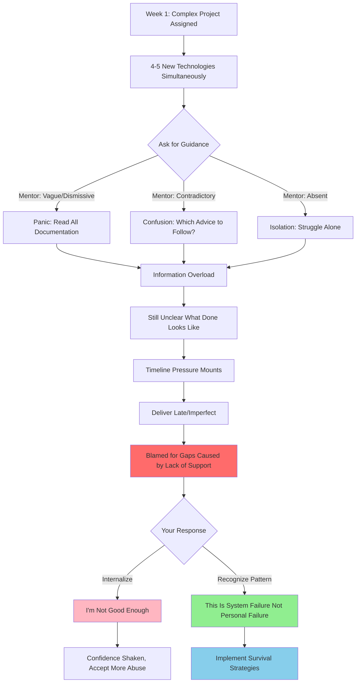
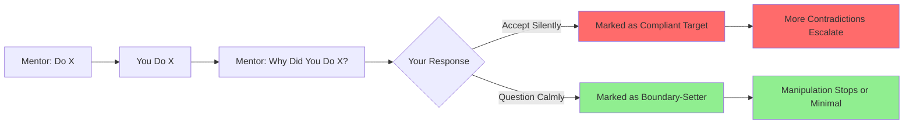
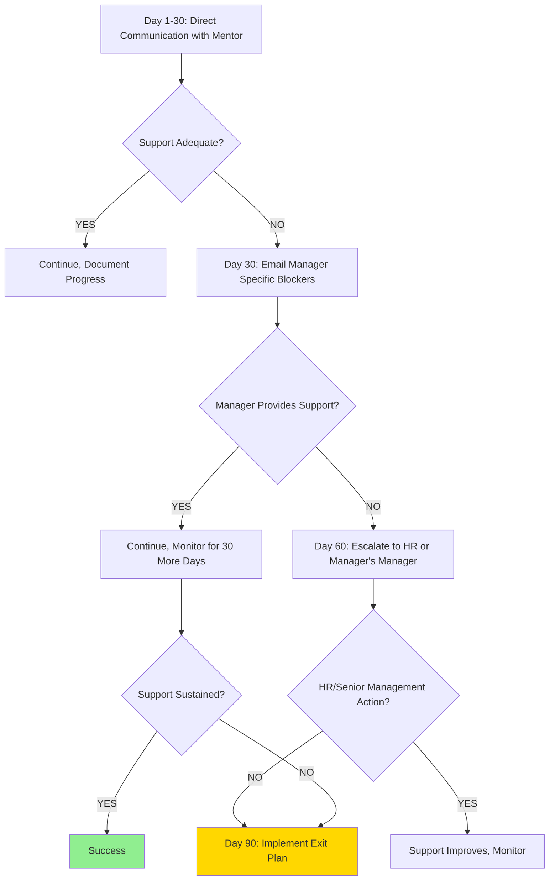

# Onboarding Without Support: Strategy Guide

**Purpose:** Navigate tech stack overload and inadequate mentorship when organizational onboarding fails you.

**Audience:** Engineers joining teams with new technologies expecting structured support, receiving minimal or contradictory guidance instead.

---

## The Core Problems

You've accepted a role involving a completely new technology stack. You're experienced in your field, but these specific tools are unfamiliar. You expect structured onboarding, mentorship, and clear guidance.

**Instead, you encounter THREE fundamental failures:**

---

### Problem 1: Thrown Into Complex Work Without Adequate Guidance

**What you expected:**
- Structured onboarding plan
- Clear learning priorities
- Gradual complexity increase
- Dedicated ramp-up time

**What you got:**
- Complex project assignment (Week 1)
- 4-5 new technologies simultaneously
- "You're experienced, you'll figure it out"
- No documentation on team-specific patterns
- Timeline pressure from day one

**Why this fails:**
- Most technologies have 100+ features, you'll use 5-10
- Without guidance, you can't prioritize
- "Comprehensive" learning is impossible under deadline
- You learn features you'll never use
- Timeline pressure mounts while you're still lost

**Quote:**
> "It's very easy to get lost in the details when you have to figure out what's actually important."

---

### Problem 2: Passive, Contradictory, or Absent Mentor

**What healthy mentorship looks like:**

| Healthy Mentor | Passive/Toxic Mentor |
|---------------|---------------------|
| Proactive check-ins (scheduled, regular) | Waits for you to ask (then acts annoyed) |
| Specific, actionable guidance | Vague answers ("Just Google it") |
| Consistent expectations | Contradictory guidance (says X, later criticizes you for doing X) |
| Documents team patterns | "It's all in the code" (no documentation) |
| Validates progress | No feedback or only criticism |
| Available for questions | Dismissive, irritated, unavailable |

**The contradiction pattern:**

**Example:**
1. **You ask:** "Should I document my learning in Jira?"
2. **Mentor says:** "Yeah, that sounds good."
3. **You do it** (create tickets, track learning)
4. **Weeks later, mentor says:** "Why are you documenting everything in Jira? That's not what tickets are for."

**What this reveals:**
- Mentor doesn't have clear process themselves
- They're reactive, not proactive
- Not invested in your success
- **May be boundary testing** (see Pattern Recognition section)

---

### Problem 3: No Clear Success Criteria Despite Repeated Requests

**What you need:**

| Essential Clarity | What You Actually Get |
|------------------|----------------------|
| "Monitor Flask app response time and error rate" | "Implement monitoring" (vague) |
| "Dashboard shows 95th percentile latency and 5xx errors" | "Make it production-ready" (undefined) |
| "Use our existing Prometheus setup as template" | "Figure out what works best" (no guidance) |
| "Week 1: basic metrics, Week 2: dashboards, Week 3: alerts" | No timeline or milestones |
| "Here's an example from similar project" | "Look at the codebase" (needle in haystack) |

**Why this is toxic:**
- You can't succeed if success isn't defined
- Moving goalposts ("Now I need X too")
- Blamed for not meeting unstated expectations
- "You should have known" (tribal knowledge)

**Pattern:**
```
You ask for clarity → Get vague response → Implement based on best guess →
Criticized for not meeting unstated expectations → Blamed for "not asking"
```

---

## Pattern Recognition: The Inadequate Onboarding Cycle



**Color Legend:**

| Color | Meaning |
|-------|---------|
| Red | The blame point (toxic) |
| Light Red | Internalization trap |
| Green | Recognition / breakthrough |
| Blue | Healthy response |

---

## Diagnostic Framework: Identifying Inadequate Support

**Use this checklist within first 30 days:**

### Warning Signs - Week 1-2

| Sign | Healthy Onboarding | Inadequate Support |
|------|-------------------|-------------------|
| Project assignment | Scoped starter project, clear success criteria | Complex production work, vague requirements |
| Documentation | Team wiki, getting-started guide, examples | "It's all in the codebase" or "Google it" |
| Mentor availability | Scheduled daily/weekly check-ins | "Ping me if you need anything" (then unavailable) |
| Technology ramp | 1-2 new tools at a time, with tutorials | 4-5 new tools simultaneously, sink-or-swim |
| Feedback | Proactive ("How's it going? Let me review") | Reactive ("Why isn't this done yet?") |

### Warning Signs - Week 3-6

| Pattern | What It Means |
|---------|--------------|
| Multiple requests for help ignored/dismissed | Mentor not invested in your success |
| Contradictory guidance (says X, later criticizes X) | Mentor has no clear process OR boundary testing |
| "You should have known" blame | Tribal knowledge, no documentation |
| Others got structured onboarding, you didn't | Differential treatment (potential discrimination) |
| Mentor gives vague approval, specific criticism | Setting you up to fail |

### Self-Assessment: Are You Being Set Up to Fail?

**Check if these apply:**

- You're still unclear on basic requirements after 30 days
- You've asked for clarification 3+ times, still no specifics
- You're blamed for mistakes caused by lack of guidance
- Mentor's guidance changes without explanation
- You feel constant anxiety about "doing it wrong"
- You're working 60+ hours trying to compensate for lack of support
- Others clearly received better onboarding than you

**If 4+ apply:** This is inadequate support. It's not you.

---

## Survival Strategies

### Strategy 1: The 20% Learning Rule

**Pareto Principle:** ~20% of features cover ~80% of use cases.

**Your goal:** Identify the minimal 20% that solves YOUR specific project. Ignore the rest.

---

#### Step 1: Define Minimum Viable Solution (Before Reading Docs)

**Instead of:** "Learn Prometheus comprehensively"

**Do this:**

**Email to mentor (forces clarity):**

```
Subject: Clarifying requirements for [Project]

Before I dive into learning, I want to confirm my understanding:

SPECIFIC OUTCOME:
[Your interpretation - e.g., "Monitor Flask app response time and error rate"]

SUCCESS CRITERIA:
[Measurable - e.g., "Dashboard shows 95th percentile latency and 5xx errors"]

SIMPLEST PATH:
[Your hypothesis - e.g., "Instrument Flask with Prometheus client, scrape metrics, visualize in Grafana"]

TIMELINE:
[Your estimate - e.g., "Week 1: basic metrics, Week 2: dashboard, Week 3: review"]

BLOCKERS I FORESEE:
[What you might need - e.g., "Access to Prometheus config, example dashboard"]

Please let me know if I'm off-base or if approach needs adjustment.
```

**Why this works:**
- Forces mentor to think through requirements
- Creates written record (protects you later)
- Surfaces gaps early (before weeks wasted)
- If they give vague response, you have evidence of inadequate guidance

---

#### Step 2: Reverse-Engineer from Working Examples

**Instead of:**
- Reading all documentation first
- Building from scratch

**Do this:**

| Step | Action | Time Investment |
|------|--------|----------------|
| 1 | Find existing monitoring setup (your org or GitHub) | 1-2 hours |
| 2 | Copy the working solution | 30 minutes |
| 3 | Deploy to your environment (expect failures) | 2-4 hours |
| 4 | Learn ONLY what you need to fix errors | Just-in-time |
| 5 | Adapt to your specific app | 2-4 hours |

**Total time:** 1-2 days (vs. weeks reading docs)

**Why this works:**
- Working example proves feasibility
- Learn by doing, not reading
- Avoids analysis paralysis
- Respects timeline pressure

---

#### Step 3: Just-in-Time Learning (Not Preemptive)

**Learn ONLY when you hit a blocker.**

**Example timeline:**

| What Happens | What You Learn | Time Spent |
|-------------|---------------|------------|
| Deploy Flask app → works | Nothing (it works!) | 0 minutes |
| Add Prometheus client → error | "How to instrument Flask with Prometheus" | 30 minutes |
| Fix error → continue | Nothing (move forward) | 0 minutes |
| Create Grafana dashboard → need query | "Basic PromQL for HTTP metrics" | 45 minutes |
| Query works → done | Nothing (ship it!) | 0 minutes |

**Total learning time:** 75 minutes (focused, contextual)

**vs. Traditional approach:**
- Read all Prometheus docs: 8 hours
- Read all Grafana docs: 6 hours
- Read all PromQL docs: 4 hours
- **Total:** 18 hours (90% wasted on features you don't use)

---

#### Step 4: Document YOUR Learning Path (For Next Time)

**As you solve problems, write your own guide:**

**Template:**

```markdown
# [Technology] Setup - My Notes

## What I'm Trying to Do:
[One-sentence goal]

## Steps That Worked:
1. [Specific action]
2. [Specific action]
3. [Specific action]

## Gotchas:
- [Thing that broke and how I fixed it]
- [Non-obvious requirement]

## Next Time:
Start with this template, adjust for new app.

## References:
- [Link to working example I copied]
- [Docs I actually needed]
```

**Why this matters:**
- Clarity for next similar task
- Onboarding doc for future hires (if team won't provide one)
- **Evidence of proactive work** (if blamed for "not documenting")
- You're building the support system team failed to provide

---

### Strategy 2: Force Clarity on Requirements (Protect Yourself)

**When you receive vague assignment, don't accept it silently.**

**Email template (send within 48 hours of assignment):**

```
Subject: Clarifying scope for [Project Name]

Hi [Manager/Mentor],

I want to make sure I understand the requirements correctly before starting:

GOAL:
[Your interpretation of what "done" means]

SUCCESS CRITERIA:
[Specific, measurable outcomes - e.g., "Dashboard shows X, Y, Z metrics"]

TIMELINE:
[Your estimate: "I estimate 2 weeks - Week 1 for basic implementation, Week 2 for review/polish"]

DEPENDENCIES:
[What you need: "Access to Prometheus config", "Example dashboard from similar project"]

REVIEW CHECKPOINTS:
[When to validate approach: "Can we sync on Day 3 to validate direction?"]

Please confirm if I'm on the right track or if I'm missing something.

Thanks,
[Your Name]
```

**What this accomplishes:**

| Benefit | Why It Matters |
|---------|---------------|
| Forces specificity | Vague assignments become concrete |
| Creates paper trail | Evidence if blamed later for "wrong approach" |
| Surfaces gaps early | If mentor can't clarify, you know support is inadequate |
| Sets expectations | Timeline/dependencies visible to all |
| Protects you legally | Documentation if you need to escalate |

**If mentor response is still vague:**

```
Thanks for the response. To make sure I deliver what you need:

- When you say "production-ready", what specific criteria define that?
- Can you point me to an example of what "good" looks like?
- What's the minimum viable version vs. nice-to-have features?

I want to prioritize correctly.
```

**If STILL vague after 2-3 attempts:** You have evidence of inadequate support. Document privately.

---

### Strategy 3: Create Your Own Onboarding Checklist

**Don't wait for team to onboard you. Build it yourself.**

**Week 1 Checklist:**

| Item | How to Get It | If Blocked |
|------|--------------|-----------|
| Access to all required systems | Request in writing (email/Slack) | Escalate to manager after 48 hours |
| Existing examples of similar work | Search codebase, ask in team chat | Ask: "Who built X? Can I see their implementation?" |
| Contacts for each technology | Ask: "Who owns Prometheus config? Grafana dashboards?" | Create list yourself from Git blame |
| Documentation links | Ask once, then Google if none exist | Start writing your own |
| Standards/patterns doc | Ask once | Assume none exist, infer from code |

**Week 2-4 Checklist:**

| Milestone | Target | Evidence |
|-----------|--------|----------|
| Working prototype deployed | End of Week 2 | Screenshot, deployment log |
| Feedback from 1 team member | Mid-Week 3 | Email/Slack thread |
| List of blockers | Ongoing | Private doc (for escalation if needed) |
| Delivered MVP | End of Week 4 | Demo-able, even if imperfect |

**Why this works:**
- You're driving your own ramp-up (not waiting for team)
- Gaps become visible quickly
- You can escalate specific blockers ("I don't have access to X")
- **Paper trail** (evidence you were proactive)

---

### Strategy 4: Find Allies Outside Your Immediate Team

**If your team is unsupportive, look elsewhere.**

**Internal allies:**

| Source | How to Find | What to Ask |
|--------|------------|-------------|
| Other teams using same stack | Slack search: "Prometheus" | "Can I see your monitoring setup?" |
| Communities of practice | Internal guilds, channels | "New to Prometheus, any tips?" |
| Engineers who built the tools | Git blame, OWNERS files | "Quick question about X feature" |
| Previous team members | LinkedIn, internal directory | "How did you learn this stack?" |

**External allies:**

| Source | How to Use |
|--------|-----------|
| Stack Overflow | Search existing Q&A (90% already answered) |
| Reddit (r/devops, r/sre) | Ask specific questions, show what you've tried |
| Official tool Slack/Discord | Often very helpful, active communities |
| GitHub Discussions | Check issues, discussions for similar use cases |

**Script for asking:**

```
Hi [Name/Channel],

I'm implementing [X] for the first time and hitting [specific blocker].

What I've tried:
- [Action 1]
- [Action 2]

Error/Question: [paste error or specific question]

Any guidance would be appreciated!
```

**Why this works:**
- Many engineers love helping when asked respectfully
- You get answers without depending on unsupportive team
- Builds network for future questions
- **Evidence you were resourceful** (if blamed for "not trying")

---

### Strategy 5: Timebox Exploration (Prevent Infinite Learning)

**For each new technology:**

| Phase | Time Budget | Goal |
|-------|------------|------|
| Survey learning | 2-4 hours | What is it? Basic concepts. High-level understanding. |
| Hands-on tutorial | 2-4 hours | Official "Getting Started" - run example, see it work |
| **STOP HERE** | - | Don't read more. Start building YOUR project. |
| Return to docs | Only when blocked | Just-in-time, focused searches |

**Why this works:**
- Prevents analysis paralysis
- Forces action (where real learning happens)
- Respects timeline pressure
- 80/20 rule in practice

**Example for Prometheus:**

| Time | Activity |
|------|----------|
| 2 hours | Read "What is Prometheus" + basic architecture |
| 2 hours | Run official tutorial, scrape sample app |
| **STOP** | Don't read about alerting, federation, advanced features |
| Later | When you need alerting, THEN read alerting docs |

---

### Strategy 6: Use AI as Your Learning Coach (When Mentor Fails)

**When mentor guidance is unclear/contradictory, use AI to structure learning:**

**AI can provide:**

| What You Need | How AI Helps | Mentor Equivalent |
|--------------|-------------|------------------|
| Learning priorities | "Which tech should I learn first for this use case?" | "Focus on X before Y" |
| Learning roadmap | "Give me 2-week plan to implement monitoring" | Structured onboarding plan |
| The 20% that matters | "Core Prometheus concepts for Flask monitoring?" | "You only need to know X, Y, Z" |
| Just-in-time answers | "I'm getting this error: [paste]" | Pair debugging session |
| Approach validation | "Is this a reasonable approach?" | Code review, design review |

**Why AI works when mentor doesn't:**

| AI | Inadequate Mentor |
|----|------------------|
| Consistent guidance (no contradictions) | Says X, later criticizes X |
| Available 24/7 | Dismissive, unavailable |
| No judgment for "basic" questions | Acts annoyed when you ask |
| Contextual (understands your use case) | Gives generic "Google it" answers |
| Explains WHY (builds understanding) | "Just do it this way" (no reasoning) |

---

#### AI-Assisted Learning Example

**Your situation:**
- Assigned: Implement Flask monitoring using Prometheus + Grafana on OpenShift
- 4 new technologies, no mentor guidance

**WITHOUT AI (traditional struggle):**

| Week | What Happens |
|------|-------------|
| 1-2 | Read all Prometheus docs (250+ pages) |
| 3 | Read all Grafana docs |
| 4 | Read all OpenShift docs |
| 5 | Try to connect the dots, get lost |
| 6 | Ask mentor → vague/contradictory answers |
| 7-8 | Waste weeks debugging, still unclear |

**WITH AI (strategic approach):**

**Prompt 1: Clarify the goal**

```
I need to implement monitoring for a Flask app using Prometheus and Grafana 
on OpenShift. I've never used these technologies.

What are the MINIMUM steps to get basic monitoring (response time, error rate) 
working? Give me a 20% solution that covers 80% of the use case.
```

**AI Response (example):**

```
1. Install prometheus-flask-exporter in your Flask app
2. Add 3 lines to app.py to expose /metrics endpoint
3. Configure Prometheus scrape config (1 YAML file)
4. Create Grafana dashboard (import template #3452)

Total implementation: ~2 hours
```

**Prompt 2: Just-in-time learning**

```
I'm getting this error when Prometheus tries to scrape my Flask app:
[paste error]

What's wrong and how do I fix it?
```

**Prompt 3: Validate approach**

```
Here's my implementation plan: [paste plan]

Is this reasonable, or am I overcomplicating it?
```

**Result:**

| Metric | Without AI | With AI |
|--------|-----------|---------|
| Time to working solution | 6-8 weeks | 3-5 days |
| Frustration level | High (constant blocks) | Low (fast feedback) |
| Learning quality | Shallow (read everything, use 10%) | Deep (learn what you use) |
| Confidence | Low (blamed for slow progress) | High (delivering, learning) |

---

#### When to Use AI vs. Mentor

| Situation | Use AI | Use Mentor |
|-----------|--------|-----------|
| "How do I do X in technology Y?" | YES (AI fast, accurate) | NO (mentor too slow/vague) |
| "What should I prioritize learning?" | YES (AI gives structured plan) | NO (mentor: "figure it out") |
| "Is this approach correct?" | YES (AI quick validation) | MAYBE (only for team-specific patterns) |
| "I'm stuck on this error" | YES (AI for debugging) | ONLY if AI can't solve |
| "What are team conventions?" | NO (AI doesn't know) | YES (if they'll answer) |
| "Should I do X or Y?" | YES (AI pros/cons) | MAYBE (if decision impacts team) |

**Key insight:**
> When mentor support is unreliable, AI becomes your primary learning partner. Use mentor only for team-specific context AI cannot know.

---

### Strategy 7: When Company Provides AI Assistants (Short-Term Lifesaver, Long-Term Red Flag)

**Context:** Some companies provide AI coding assistants (Claude Code, GitHub Copilot, internal AI tools) as part of engineering infrastructure.

**Short-term reality: This can save you.**

**Long-term reality: If this becomes your PRIMARY support system, you're in a toxic environment.**

---

#### Why Company-Provided AI Helps (Short-Term)

**Advantages over no support:**

| Challenge | AI Assistant Solution |
|-----------|---------------------|
| Mentor unavailable | AI available 24/7 |
| Contradictory guidance | AI gives consistent answers |
| "Figure it out yourself" | AI provides structured learning path |
| No documentation | AI explains codebase patterns |
| No examples | AI generates working code examples |
| Blocking errors | AI debugs with you in real-time |

**Practical example:**

**Scenario:** You're stuck on Prometheus configuration error at 11 PM, mentor unavailable.

**Without AI:**
- Google for hours
- Try random Stack Overflow solutions
- Still stuck next morning
- Ask mentor (if available) → wait for response

**With company AI (Claude Code, Copilot):**
- Paste error to AI
- Get explanation + solution in 2 minutes
- Unblocked immediately
- Continue learning

**Result:** You can function despite inadequate human support.

---

#### The Cognitive Load Problem (Long-Term)

**What happens after 6 months of AI-only support:**

| Human Mentor | AI-Only Support |
|--------------|----------------|
| Proactive check-ins (you're not alone) | You must initiate every interaction (isolation) |
| Validates your approach before you invest time | You implement, then ask AI if correct (wasted effort) |
| Understands team context ("We tried that, it doesn't work here") | Generic solutions (may not fit your environment) |
| Builds relationship, trust, advocacy | Transactional (no one fighting for you) |
| Emotional support when frustrated | Cold logic (no empathy) |
| Career guidance, growth opportunities | Task-focused only |

**Cognitive load reality:**

| Month | What You're Experiencing |
|-------|------------------------|
| 1-2 | AI is amazing! I'm unblocked constantly! |
| 3-4 | I'm asking AI 50+ questions per day... this is exhausting |
| 5-6 | I feel isolated. No one checks on me. I'm just... solving problems alone. |
| 7-8 | Burnout. Every problem is MY problem to solve. No team support. |
| 9-12 | Exit. This isn't sustainable. I need human mentorship. |

**Quote from lived experience:**
> "AI let me survive in an environment with zero human support. But surviving isn't thriving. After 6 months, I realized I was just... alone with a very smart chatbot. No team, no mentorship, no growth."

---

#### Why This Is Still a Toxic Environment

**The company is using AI as a band-aid for systemic failure.**

**What the company is doing:**

| Healthy Organization | Toxic Organization Using AI |
|---------------------|----------------------------|
| Provides structured onboarding + AI tools | Provides AI, skips onboarding ("You have Claude!") |
| Human mentors + AI for efficiency | AI replaces human mentors entirely |
| Team collaboration + AI assistance | Work alone + ask AI everything |
| AI augments learning | AI IS your only learning source |
| AI for speed, humans for strategy | AI for everything, humans absent |

**What this reveals:**

| Symptom | Diagnosis |
|---------|-----------|
| "We have AI, you'll be fine" (during hiring) | Lack of investment in human mentorship |
| No structured onboarding, just AI access | Cost-cutting disguised as "modern infrastructure" |
| Engineers primarily interact with AI, not each other | Isolating culture, no collaboration |
| Management says "AI makes mentors unnecessary" | Fundamental misunderstanding of human development |

**The cognitive burden transfer:**

**Before AI:**
- Company provided mentorship (their responsibility)
- You learned from humans (sustainable)

**With AI-only support:**
- Company outsourced mentorship to AI (cost savings)
- **You** bear cognitive burden of asking everything (unsustainable)
- **You** bear emotional burden of isolation (burnout risk)

---

#### When AI Assistants Work (vs. When They're a Red Flag)

**AI as supplement (healthy):**

| Scenario | Why This Works |
|----------|---------------|
| You have dedicated mentor + AI tools | AI for speed, human for strategy/context |
| Team collaborates + uses AI individually | Social support + efficiency tool |
| Manager checks progress + you use AI for coding | Oversight + autonomy balanced |
| Pair programming sessions + AI for boilerplate | Human learning + AI acceleration |

**AI as replacement (toxic):**

| Scenario | Why This Fails |
|----------|---------------|
| No mentor assigned, "just use Claude" | Isolation, no team integration |
| "Ask AI" response to every question | Human support abdication |
| No team collaboration, everyone solo + AI | Loneliness, no knowledge sharing |
| Manager doesn't check in, assumes AI handles it | Invisible struggles, no advocacy |

---

#### The 6-Month Test

**Ask yourself at 6 months:**

| Question | Healthy | Toxic (Exit) |
|----------|---------|-------------|
| What % of my questions go to AI vs. humans? | 50/50 or less to AI | 80%+ to AI |
| Do I feel part of a team? | YES (regular collaboration) | NO (mostly solo + AI) |
| Who advocates for my growth? | Manager, mentor, team | No one (AI can't advocate) |
| Am I learning team-specific knowledge? | YES (from humans) | NO (AI doesn't know our context) |
| Do I feel supported emotionally? | YES (human connections) | NO (isolated, just AI) |
| Would I recommend this team to others? | YES | NO (they'd be alone too) |

**If 4+ "Toxic" responses:** AI is masking a fundamentally broken support system. Exit.

---

#### What to Do If You're in AI-Only Environment

**Month 1-3: Use AI strategically, but force human interaction**

**Don't:**
- Accept AI as sole support
- Work in isolation just because AI unblocks you

**Do:**
- Use AI for immediate unblocking
- **Force human review:** "I used AI to implement X. Can you review my approach?"
- **Request pairing sessions:** "AI got me 80% there, can we pair for the last 20%?"
- **Create human touch points:** Weekly check-ins, code reviews, design discussions

**Email to manager (Month 1):**

```
Hi [Manager],

I've been using [AI assistant] effectively to ramp up on [technologies].

To ensure I'm learning team-specific patterns (not just generic best practices), 
I'd like to schedule:

- Weekly 30-minute check-ins with [Mentor/You]
- Code review on key implementations
- Bi-weekly pairing session with team member

This will help me integrate with team culture and avoid AI-specific blind spots.

Can we set these up?

Thanks,
[Your Name]
```

**Month 4-6: Evaluate if human support is increasing**

| Sign | Healthy Trajectory | Toxic Trajectory |
|------|-------------------|------------------|
| Human interactions | Increasing (team integrating you) | Flat or decreasing (still solo) |
| Manager check-ins | Regular, substantive | Rare or "how's AI working?" |
| Code review quality | Detailed, teaching | Rubber-stamp approval |
| Team inclusion | Invited to design discussions | Working alone, AI is your "team" |

**Month 6: Make go/stay decision**

**Stay if:**
- Human support has increased over 6 months
- AI is now supplement, not replacement
- You feel part of team
- Growing in team-specific knowledge

**Exit if:**
- Still primarily AI-dependent for learning
- Isolation hasn't improved
- Manager/team still absent
- AI is band-aid for broken culture

---

#### Key Insight: AI Doesn't Replace Human Development

**What AI can provide:**
- Immediate answers to technical questions
- Code examples and debugging help
- Rapid unblocking on syntax/errors
- Learning resources and explanations

**What AI CANNOT provide:**
- Team-specific context and tribal knowledge
- Emotional support and encouragement
- Career advocacy and growth opportunities
- Human relationships and collaboration skills
- Detection of when you're heading in wrong direction (contextual judgment)
- Protection from scapegoating or toxic dynamics

**Long-term career impact:**

| Skill | Developed With Humans | Developed With AI-Only |
|-------|--------------------|---------------------|
| Technical skills | YES | YES |
| Team collaboration | YES | NO (isolated) |
| Communication | YES (regular practice) | NO (atrophies) |
| Navigating ambiguity | YES (human mentors teach) | MAYBE (trial and error) |
| Political awareness | YES (mentors guide) | NO (AI doesn't understand politics) |
| Career growth | YES (advocates, visibility) | NO (no one knows your work) |

**After 1 year in AI-only environment:**
- **Technically competent** (AI taught you)
- **Socially isolated** (no team bonds)
- **Career stagnant** (no advocates)
- **Burned out** (cognitive burden, loneliness)

---

#### The Honest Conversation About AI in Onboarding

**AI assistants are incredible tools.** They can:
- Save you when human support is inadequate
- Accelerate learning when paired with human mentorship
- Provide 24/7 assistance for unblocking

**But they are NOT a replacement for:**
- Structured onboarding
- Dedicated human mentors
- Team collaboration and support
- Emotional and career guidance

**If a company tells you:** "We have AI, so you won't need much mentorship"

**What they're really saying:** "We're not investing in human development infrastructure. We're outsourcing it to AI and hoping you survive."

**Your response:** Use AI to survive short-term. Evaluate human support trajectory. Exit if AI remains your primary support after 6 months.

---

**Bottom line:**

**AI is a lifesaver in toxic environments (short-term survival).**

**AI-only support IS a toxic environment (long-term exit trigger).**

Don't confuse the tool for the culture. Great companies provide BOTH.

---

## Understanding Contradictory Guidance: Boundary Testing

**Why mentors give contradictory guidance:**

**Two possibilities:**

**1. Incompetence/Overwhelm (More Common)**
- Mentor doesn't have clear process themselves
- They're reactive, not proactive
- Overwhelmed, distracted
- Not invested in your success

**2. Deliberate Boundary Testing (Manipulation)**
- Tests if you accept contradiction without pushback
- Identifies compliant targets
- Establishes dominance

---

### The Boundary Testing Pattern

Research on manipulation shows contradictory guidance can function as a **boundary test**:

**How it works:**



**Real example:**

| Timeline | What Happened | What It Tested |
|----------|--------------|---------------|
| Week 2 | Mentor: "Document your learning in Jira" | Establishes baseline |
| Week 4 | You create Jira tickets documenting learning | You follow guidance |
| Week 6 | Mentor: "Why are you documenting in Jira?" | Tests: Will you accept contradiction? |
| Your response | If silent acceptance → compliant target | If you point out: "You said to do this" → boundary-setter |

**Why this matters:**
> Toxic people identify vulnerable targets through small boundary violations. If you accept small contradictions, they escalate to larger violations.

---

### How to Respond to Contradictory Guidance

**Script (calm, factual, non-confrontational):**

```
Subject: Clarifying guidance on [Topic]

Hi [Mentor],

I want to make sure I understand the expectations correctly.

On [Date], you suggested I [Action X] [link to message/email if possible].

Today, you mentioned that [Action X] isn't the right approach.

I want to align with your expectations. What approach would you prefer going forward?

Thanks,
[Your Name]
```

**What this accomplishes:**

| Benefit | Why It Matters |
|---------|---------------|
| Non-confrontational | No blame, just clarification |
| References original guidance | Shows you followed instructions |
| Asks for clarification | Gives them chance to explain |
| Creates written evidence | Protects you if pattern continues |
| Tests their response | If they gaslight ("I never said that"), you know it's manipulation |

**If they gaslight ("I never told you to do that"):**

```
I have the message from [Date] where you said [quote]. 
I'm happy to follow a different approach now, just want to make sure I understand.
```

**If they double down or get defensive:**
- This is likely manipulation, not confusion
- Document privately
- Implement Gray Rock technique (minimal engagement)
- Start exit timeline

---

## Why Some People Accept Inadequate Support Longer

**Not everyone responds to inadequate mentorship the same way.** Understanding **why** you might tolerate poor support can help you recognize and break the pattern.

---

### Vulnerability Pattern 1: Worth = Performance

**Background:**
Some people internalize the belief that their value depends on how useful or competent they appear. Often stems from childhood where approval was conditional on achievement.

**How it shows up:**

| You Think | Reality |
|-----------|---------|
| "If I ask too many questions, they'll think I'm incompetent" | Asking questions is professional, necessary |
| "If I can't figure this out, I'm not good enough" | No one can learn 4 new technologies alone under deadline |
| "I need to prove my worth by delivering despite lack of support" | Worth exists independently of over-delivery |

**Result:**
- You struggle alone instead of escalating
- You accept blame for gaps caused by inadequate onboarding
- You internalize: "Something is wrong with me" vs. "The system failed me"

**Why this is exploitable:**
Mentors/teams who provide poor support **benefit** when you blame yourself. You work harder to compensate for their failure.

---

### Vulnerability Pattern 2: Conflict Avoidance Over Self-Protection

**Background:**
If you grew up in environment where conflict was dangerous (led to anger, rejection), you learned: **peace at any cost**.

**How it shows up:**

| You Think | Healthy Alternative |
|-----------|-------------------|
| "If I complain about lack of support, they'll think I'm difficult" | "Asking for adequate support is professional" |
| "Easier to struggle alone than create conflict" | "Conflict now prevents worse damage later" |
| "Maybe I'm not good enough to succeed here" | "This environment is failing its responsibility to onboard me" |

**Result:**
- Don't push back on contradictory guidance
- Accept vague requirements without forcing clarity
- Tolerate inadequate support far longer than healthy

**Quote from research:**
> "Those who fear conflict more than exploitation become ideal targets. Toxic people test small boundaries; if accepted, they escalate."

---

### Vulnerability Pattern 3: Excessive Apologizing

**How it shows up:**

| You Say | What It Signals | Healthy Alternative |
|---------|----------------|-------------------|
| "Sorry to bother you, but I have a question..." | Your needs are a burden | "I have a question about X. When's good to discuss?" |
| "I know this is probably obvious, but..." | You assume you should know already | "I need clarification on X" |
| "Sorry for taking up your time..." | You're subordinate by default | "Can we sync for 15 minutes on X?" |

**Why this matters:**
Apologizing for **legitimate learning needs** signals you're unlikely to escalate when support is inadequate.

---

### Vulnerability Pattern 4: External Validation Dependency

**Background:**
If your sense of worth depends on others' approval, you're vulnerable to manipulation through strategic withdrawal of validation.

**How it shows up:**

| You Think | Why It's Problematic |
|-----------|---------------------|
| "If they say I'm doing well, I must be doing well" | Poor mentors don't provide validation → you assume you're failing |
| "If they're disappointed, I must be failing" | You work harder to "earn" approval that should be freely given as professional support |

**What healthy mentorship looks like:**

| Healthy | Unhealthy |
|---------|-----------|
| Regular, specific feedback (not dependent on you asking) | No feedback or only vague criticism |
| Acknowledgment of progress (proactive) | Validation withheld to control you |
| Support as default (not reward) | Support given only when you "prove yourself" |

---

### Self-Assessment: Am I Vulnerable?

**Check if these apply:**

- I avoid asking for help until I've exhausted all options
- I apologize frequently for normal professional needs
- When criticized, I immediately assume I did something wrong
- I accept vague guidance without pushing for specifics
- I work harder when support decreases (trying to "prove myself")
- I feel guilty when setting boundaries or escalating
- I internalize systemic failures as personal inadequacy

**If 3+ apply:** You may accept inadequate mentorship without recognizing it as **system failure**, not your failure.

---

### Breaking the Pattern

**1. Recognize the source:**

> "This pattern isn't my fault. It's an adaptation I developed in an environment where needs weren't met. It made sense then. It doesn't serve me now."

**2. Separate current reality from old pattern:**

| Old Pattern Says | Current Reality |
|-----------------|-----------------|
| "If I just work harder, they'll support me" | Adequate mentorship is a professional standard |
| "I need to earn their help" | You were hired for skills (support is owed, not earned) |
| "Something is wrong with me" | Lack of onboarding is system failure, not your failure |

**3. Practice new responses:**

| Old | New |
|-----|-----|
| "Sorry to bother you, but..." | "I need clarification on X. When can we discuss?" |
| "I should be able to figure this out" | "I've spent 4 hours on this. I need support to unblock." |
| Accept contradiction silently | "You said X before, now Y. Which should I follow?" |

---

## Documentation Templates

### Template 1: Requirements Clarification Email

**Send within 48 hours of assignment:**

```
Subject: Clarifying requirements for [Project Name]

Hi [Manager/Mentor],

Before I start, I want to confirm my understanding:

GOAL:
[Your interpretation of what "done" means]

SUCCESS CRITERIA:
[Specific, measurable - e.g., "Dashboard shows X, Y, Z metrics"]

TIMELINE:
[Your estimate - e.g., "2 weeks: Week 1 implementation, Week 2 review"]

DEPENDENCIES:
[What you need - e.g., "Access to Prometheus config", "Example from similar project"]

REVIEW CHECKPOINTS:
[When to validate - e.g., "Can we sync Day 3 to validate direction?"]

Please let me know if I'm off-base or if approach needs adjustment.

Thanks,
[Your Name]
```

---

### Template 2: Weekly Status Update (Unsolicited)

**Send every Friday, even if not asked:**

```
Subject: [Project Name] - Week [N] Update

Hi [Manager/Mentor],

Quick update on [Project]:

PROGRESS THIS WEEK:
- [Specific accomplishment 1]
- [Specific accomplishment 2]

BLOCKERS:
- [Specific blocker] - Need: [specific help]

PLAN FOR NEXT WEEK:
- [Specific goal 1]
- [Specific goal 2]

Let me know if priorities should shift.

Thanks,
[Your Name]
```

**Why send unsolicited:**
- Creates paper trail (evidence you were proactive)
- Surfaces blockers early
- Prevents "Why didn't you tell me?" blame later
- Shows progress even if slow

---

### Template 3: Escalation Email (After 30 Days of Inadequate Support)

```
Subject: Request for support on [Project]

Hi [Manager],

I'm hitting challenges with [Project] that I need help resolving:

WHAT I'VE TRIED:
- [Specific actions - e.g., "Read Prometheus docs", "Asked [Mentor] 3 times"]
- [Resources consulted - e.g., "Reviewed existing codebase examples"]
- [External research - e.g., "Stack Overflow, official tutorials"]

CURRENT BLOCKERS:
- [Technical blocker - e.g., "Prometheus scrape config failing, error: X"]
- [Process/knowledge gap - e.g., "No team documentation on deployment patterns"]

WHAT I NEED:
- [Specific support - e.g., "30-minute pairing session with someone who's deployed Prometheus before"]
- [Timeline - e.g., "Need this within 2 days to stay on track"]

IMPACT IF NOT UNBLOCKED:
- [Business impact - e.g., "Will miss sprint commitment", "Blocks dependent work"]

Can we discuss how to get this unblocked?

Thanks,
[Your Name]
```

**Why this works:**
- Shows effort (not just complaining)
- Specific asks (easier to action)
- Business impact (not just personal frustration)
- Documented (protects if they don't support)

---

### Template 4: Private Documentation Log (For Your Eyes Only)

**Store in personal email/cloud, NOT company systems:**

```
INADEQUATE SUPPORT LOG - [Project Name]

MENTOR: [Name]
START DATE: [Date]

INCIDENT #1
Date: 2026-05-28
What Happened: Asked for guidance on monitoring approach. Response: "Just Google it."
Context: This is first week, 4 new technologies, no team documentation.
Impact: Spent 8 hours reading generic docs, still unclear on team standards.

INCIDENT #2
Date: 2026-06-04
What Happened: Mentor said "Document learning in Jira" on 5/30. Today criticized me for doing so.
Evidence: Slack message 2026-05-30 10:15 AM: "Yeah, sounds good, track it in Jira"
Context: Contradictory guidance without explanation.
Impact: Wasted time on documentation now deemed "wrong approach."

INCIDENT #3
[...]

PATTERN SUMMARY:
- Frequency: [X incidents over Y weeks]
- Escalation attempted: [Date, outcome]
- Business impact: [Missed deadlines, quality issues, team friction]

USE OF THIS LOG:
- Exit interview (if I leave)
- HR escalation (if legally actionable)
- Personal reference (understand pattern for future)
```

---

## Boundary Scripts

### Script 1: When Blamed for Lack of Progress

**They say:** "This is taking too long. Why haven't you finished?"

**You say:**

```
I'm working through [Tech A, B, C] for the first time. 

I've asked for [specific support - e.g., "example code", "pairing session"] on [dates] 
but haven't received it.

What's the priority: speed or learning these technologies properly so I can maintain 
them long-term?
```

**Why this works:**
- Acknowledges timeline concern
- States facts (new technologies, requested support)
- Forces them to choose (speed vs. sustainable learning)
- Implies blame lies with lack of support, not your effort

---

### Script 2: When Support Is Dismissive

**They say:** "Just Google it."

**You say:**

```
I've reviewed external documentation. 

What I need is our team's specific patterns and standards - those aren't in 
public docs.

Can you point me to internal documentation, or pair with me for 30 minutes 
to show me how we do this?
```

**Why this works:**
- Shows you've done external research
- Distinguishes team-specific vs. generic knowledge
- Offers two options (doc or pairing)
- Creates expectation they should help (not just dismiss)

---

### Script 3: When Blamed for Mistakes

**They say:** "You should have known to do X."

**You say:**

```
I wasn't aware of that requirement. 

Is there documentation I should have reviewed, or is this tribal knowledge?

How do we prevent this next time? Should I create documentation for future 
team members?
```

**Why this works:**
- Doesn't accept blame ("should have known" implies it was documented)
- Exposes gap (no doc = team failure)
- Forward-looking (how to prevent)
- Subtly points out system failure (no documentation process)

---

### Script 4: When Given Contradictory Guidance

**They say:** "Why did you do X?" (after previously telling you to do X)

**You say:**

```
On [Date], you suggested I [Action X] [reference message if possible].

Today you mentioned [Action X] isn't the right approach.

I want to make sure I'm aligned. What approach would you prefer going forward?
```

**Why this works:**
- Non-confrontational (no blame)
- References original guidance (evidence)
- Gives them out ("going forward")
- Creates written trail if sent via email

---

### Script 5: When Escalating to Manager

**Email to manager (after 30 days inadequate support):**

```
Subject: Request for support on [Project]

Hi [Manager],

I need help getting unblocked on [Project].

CONTEXT:
I've been working on this for [X weeks] and have [tried A, B, C approaches].

BLOCKER:
[Specific blocker - technical or knowledge gap]

REQUESTS FOR HELP:
I've asked [Mentor] on [Date 1], [Date 2], [Date 3] but haven't received 
the guidance needed to proceed.

WHAT I NEED:
[Specific ask - e.g., "Pairing session with engineer who's done this before", 
"Access to internal example", "Clear success criteria"]

IMPACT:
[Business impact - e.g., "Will miss sprint commitment", "Blocks Team X"]

Can we discuss how to get this unblocked?

Thanks,
[Your Name]
```

---

## Escalation Strategy

### When to Escalate (Timeline)

**30-Day Rule:** Escalate if inadequate support continues after 30 days.

**Escalation triggers:**

| Trigger | Timeline | Action |
|---------|----------|--------|
| Still unclear on requirements | Day 30 | Email clarification request (Template 1) |
| Multiple help requests ignored | Day 30 | Document pattern, escalate to manager |
| Blamed for gaps caused by lack of support | Immediately | Escalate to manager (Template 5) |
| Contradictory guidance pattern (3+ times) | Day 45 | Escalate to manager, HR if malicious |
| Others got better onboarding | Day 60 | Escalate to HR (potential discrimination) |

---

### Escalation Path



---

### What to Expect When You Escalate

**Week 1-2 after escalation:**

| What Happens | What It Means |
|-------------|--------------|
| Manager schedules meeting | Taking it seriously (maybe) |
| Manager talks to mentor | May improve temporarily |
| No response | Not a priority |

**Week 3-4:**

| Outcome | What It Means |
|---------|--------------|
| Support improves | Manager held mentor accountable (rare) |
| Support stays same | Mentor protected, you're labeled "difficult" |
| You're transferred | You're easier to move than fix mentor |
| Subtle retaliation | Exclude from meetings, criticism increases |

**Month 3+:**

| Pattern | Interpretation |
|---------|---------------|
| Support improved and sustained | Success (10% of cases) |
| Temporary improvement, then regression | Performative change, not real |
| No change | System won't fix this, exit needed |
| You're pushed out | Labeled "problem employee" |

---

### Institutional Reality: Why Escalation Often Fails

**When you escalate inadequate mentorship:**

**HR/Management is asking (internally):**

| Question | Why It Matters to Them |
|----------|----------------------|
| Is this legally actionable? | If no, low priority |
| Is the mentor "valuable"? | If yes, protect mentor |
| Is this employee replaceable? | If yes, easier to move them |
| Will this create public problem? | If no, minimize action |

**NOT asking:**
- "How do we help this person succeed?"
- "Is the mentor failing their responsibilities?"
- "What's fair?"

**Why mentors aren't held accountable:**

| Reason | Impact |
|--------|--------|
| Technical output measured, mentorship not | Poor mentorship invisible to metrics |
| Long tenure = "valuable" | Cost of replacing mentor > your frustration |
| You're newer, easier to replace | System optimizes for continuity |

**Quote:**
> "The system rewards people who don't make waves, who absorb problems quietly, who leave before they become expensive."

---

## Exit Criteria

### When to Leave (3-6 Month Timeline)

**Exit if 3+ are true:**

- Support doesn't improve after escalation (Day 60)
- Still lost 6 months in (learning curve too steep without help)
- Blamed for failures caused by inadequate onboarding
- Pattern: Others get support, you don't (discrimination)
- Your skills atrophying (stuck debugging, not growing)
- Physical/mental health suffering (insomnia, anxiety, dread)
- Career damage (bad performance review for systemic failures)
- **AI is your primary support system** (80%+ of questions to AI, not humans)
- **Isolation despite AI tools** (solo work + chatbot, not team collaboration)

**Timeline:** 6 months maximum without adequate **human** support.

**Special case - AI-only environment:**
- If company provides AI but not human mentorship
- You're still primarily dependent on AI after 6 months
- **This IS inadequate support** (AI doesn't replace humans)
- Exit criteria applies even if AI unblocks you technically

**Why 6 months?**
- 90 days = Fair chance to improve
- 180 days = Long enough to establish pattern
- Beyond 6 months = You're accepting toxic environment

---

### How to Exit

**Internal transfer (if company is good, team is bad):**

**Email to HR/Manager:**

```
I'm interested in exploring internal opportunities where I can contribute effectively.

I'm looking for a team with [structured onboarding, collaborative culture, 
strong technical mentorship].

Can you connect me with [specific team/role]?
```

**What NOT to say:** "My current team is toxic" (creates record against you)

---

**External job search:**

**Start at Day 90 if escalation failed.**

**In interviews, ask about onboarding:**

| Question | Good Answer | Red Flag |
|----------|------------|----------|
| "Describe your onboarding process for new engineers" | Structured plan, assigned mentor, 30/60/90 milestones | "You'll learn as you go", "Self-starter culture" |
| "I haven't used [Tech X]. How does team support learning?" | Pairing sessions, internal docs, ramp-up time | "You'll pick it up", "Lots of docs online" |
| "What's the team's collaboration style?" | Regular syncs, open communication, supportive | "Everyone works independently", "Very autonomous" |
| "Biggest challenge someone in this role faces?" | Honest (but mentions support available) | "Lack of documentation", "Sink or swim", "Fast-paced with limited support" |

---

## Prevention: Questions to Ask BEFORE Accepting Role

**During interviews:**

| Question | Why It Matters | Red Flag Response |
|----------|---------------|------------------|
| "What does onboarding look like for this role?" | Reveals if structured or ad-hoc | "You'll figure it out", "Self-starter culture" |
| "I haven't used [Tech X]. How do you support learning?" | Tests if they invest in ramp-up | "Online docs", "You'll pick it up quickly" |
| "Can you describe typical first 30/60/90 days?" | Reveals expectations and support | Vague or "hit the ground running" |
| "Who would be my mentor/buddy?" | Tests if mentorship is real | "No formal mentor", "Team is your mentor" |
| "What's the team's collaboration style?" | Reveals if supportive or sink-or-swim | "Everyone independent", "Autonomous" |
| "How do you measure successful onboarding?" | Tests if they think about it | Blank stare, or "You deliver on time" |

**Request to speak with team members:**

```
Can I speak with 1-2 engineers who joined in the last 6 months about their onboarding experience?
```

**If they refuse:** Red flag (hiding something)

**If they allow, ask those engineers:**
- "What was your first month like?"
- "How much support did you get?"
- "What would you do differently?"

**Listen for:**
- Hesitation (they're being political)
- Enthusiastic ("Amazing onboarding!")
- Honest ("It was rough, but I had a great mentor")

---

## Key Takeaways

### 1. Inadequate Support Is System Failure, Not Personal Failure

**You are not:**
- Too slow
- Not smart enough
- Asking too many questions

**The system failed to:**
- Provide structured onboarding
- Assign competent mentor
- Define clear success criteria
- Support learning new technologies

---

### 2. The 20% Learning Rule Saves Weeks

**80/20 principle:**
- 20% of features = 80% of use cases
- Identify that 20%, ignore the rest
- Reverse-engineer from examples
- Just-in-time learning (not preemptive)

**Result:** Days to working solution (not weeks in docs)

---

### 3. Force Clarity on Requirements (Protect Yourself)

**Never accept vague assignments silently.**

**Send email within 48 hours:**
- Your interpretation of "done"
- Success criteria (measurable)
- Timeline estimate
- Dependencies

**Creates paper trail.** Evidence if blamed later.

---

### 4. AI Becomes Your Learning Partner (When Mentor Fails)

**When mentor is:**
- Vague / contradictory / absent
- Dismissive / unavailable
- No clear process

**Use AI for:**
- Learning priorities and roadmap
- Just-in-time answers
- Approach validation

**Consistent, available, no judgment.**

---

### 5. Document Everything (But Protect Yourself)

**Public documentation (company email):**
- Requirements clarification
- Weekly status updates
- Escalation emails

**Private documentation (personal email/cloud):**
- Inadequate support incidents
- Contradictory guidance log
- Evidence for exit interview/HR

**Never store private log in company systems.**

---

### 6. Recognize Boundary Testing (Contradictory Guidance)

**Pattern:**
1. Mentor says: "Do X"
2. You do X
3. Mentor says: "Why did you do X?"

**This tests:** Will you accept contradiction without pushback?

**Response:** Point out calmly (in writing): "You said X before. Which should I follow?"

**If pattern continues:** Likely manipulation, not confusion. Start exit plan.

---

### 7. AI Is Short-Term Lifesaver, Long-Term Red Flag

**If company provides AI assistants:**
- Short-term: Saves you when human support fails
- Use strategically for unblocking, learning

**Long-term (6+ months):**
- If AI is still your PRIMARY support (80%+ questions)
- This IS inadequate support (AI ≠ human mentorship)
- Cognitive burden + isolation = burnout
- Exit: Great companies provide AI AND humans

**Warning sign:** "We have AI, you won't need much mentorship" = toxic

### 8. Understand Why You Might Accept Poor Support

**Vulnerability patterns:**
- Worth = performance (fear asking for help)
- Conflict avoidance (tolerate poor treatment)
- Excessive apologizing (signal subordinate position)
- External validation dependency (work harder when support decreases)

**If 3+ apply:** You may accept inadequate support longer than healthy.

**Break the pattern:** Recognize source, separate old pattern from current reality.

---

### 9. Escalate at 30 Days, Exit at 90-180 Days

**Timeline:**

| Day | Action |
|-----|--------|
| 1-30 | Direct communication, force clarity, document |
| 30 | Escalate to manager if support inadequate |
| 60 | Escalate to HR/senior management if no improvement |
| 90 | Start job search if still no support |
| 180 | Exit (max timeline in unsupported environment) |

**Don't wait 6+ months hoping it improves.** Pattern is established by Day 90.

---

### 10. System Won't Protect You (Institutional Reality)

**HR exists to:**
- Protect company from lawsuits
- Minimize disruption
- Preserve continuity

**HR does NOT:**
- Fix inadequate mentors (unless legally actionable)
- Prioritize your growth over company risk
- Hold "valuable" mentors accountable

**When you escalate, you create "difficult employee" record.** Even if you're right.

**Response:** Document privately, escalate only if willing to leave or legally actionable.

---

### 11. You Deserve Adequate Support (Exit If You Don't Get It)

**You deserve:**
- Structured onboarding
- Proactive mentorship
- Clear requirements
- Support learning new technologies

**If you don't get it after 3-6 months:**
- This environment is toxic
- Survive short-term (apply strategies)
- Exit mid-term (find supportive team)
- Thrive elsewhere

**Don't sacrifice your career and health for a system that won't change.**

---

## Related Guides

- **[HR Interaction Strategy Guide](../hr-interaction-strategy-guide/)** - Why HR won't fix inadequate mentorship
- **[Boundary Setting Guide](../boundary-setting-guide/)** - How to set and maintain professional boundaries
- **[Work Acceptance Checklist](../work-acceptance-checklist/)** - Red flags to spot during hiring
- **[Probation Success Strategy](../probation-success-strategy/)** - New role success framework

---

## Validation & Research

**Adult learning theory:**
- Just-in-time learning > comprehensive learning (Schank, 1999)
- Learning by doing > learning by reading (Kolb's experiential learning)
- Immediate context improves retention (Ambrose et al., 2010)

**Onboarding research:**
- Structured onboarding improves performance 60% (BambooHR, 2018)
- 88% of employees say onboarding is poor (Gallup, 2019)
- Poor onboarding increases early turnover 50%

**Cognitive load:**
- Working memory: 7±2 items (Miller, 1956)
- Learning 4-5 new technologies simultaneously = cognitive overload
- Prioritization critical to avoid paralysis

**For deeper reading:**
- Schank, R. (1999). *Dynamic Memory Revisited*
- Ambrose, S. et al. (2010). *How Learning Works*
- Newport, C. (2016). *Deep Work*

---

**Last Updated:** 2026-05-28  
**Status:** Complete  
**Feedback:** [Open an issue](https://github.com/angelus-h/angelus-h.github.io/issues)
