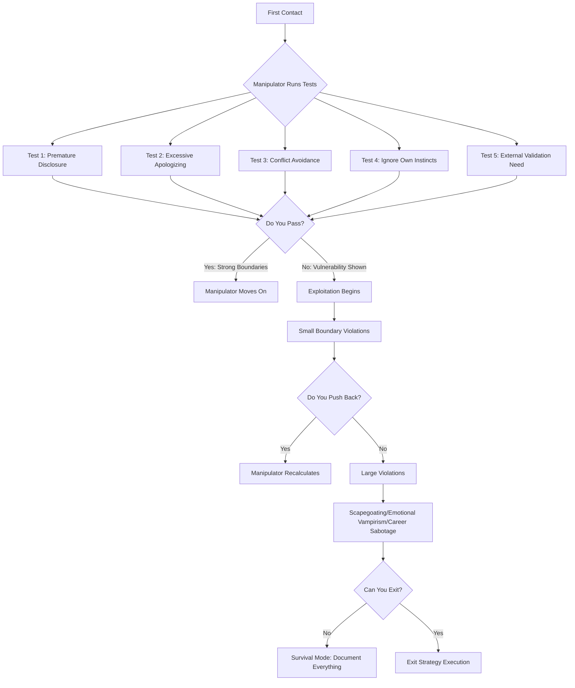
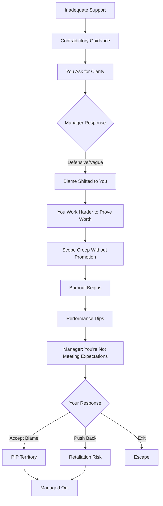
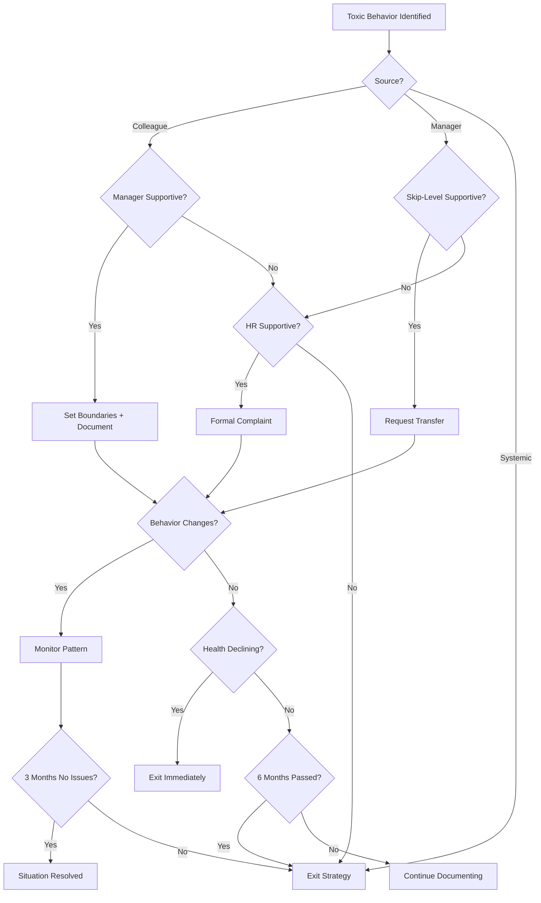

# Toxic Workplace Survival Guide

**Understanding manipulation patterns, recognizing vulnerability exploitation, and building strategic boundaries**

> **Note:** All case studies in this guide use anonymized companies, teams, and individuals. Toxic behavior patterns can occur in any organization regardless of size, industry, or reputation. The goal is to recognize patterns, not to label specific workplaces.

---

## What This Guide Covers

**Three core problems:**

1. **Manipulative colleagues systematically test and exploit vulnerability signals** (excessive apologizing, premature disclosure, conflict avoidance, external validation dependency)
2. **Toxic workplace dynamics are protected by institutional structures** (gender-based preferential treatment, missing accountability, HR protects company not individuals)
3. **Personal history patterns make you a predictable target** (worth = performance, something-in-me-is-wrong belief, fear of being "too harsh")

**What this guide provides:**
- Pattern recognition frameworks for manipulation tactics
- Diagnostic tools for assessing vulnerability signals
- Strategic boundary scripts for professional interactions
- Decision frameworks for staying vs. exiting toxic environments
- Documentation templates for protecting yourself
- Real case studies from corporate environments (teams and individual colleagues anonymized)

---

## Core Problem

**The trap:**

Toxic people don't randomly select victims. They **systematically assess vulnerability through specific tests**, then exploit predictable patterns.

**Why it persists:**

| Institutional Factor | Why It Protects Toxicity |
|---------------------|-------------------------|
| HR optimizes for legal risk | Not individual wellbeing |
| Attractiveness-based privilege | Some people get different standards |
| "Don't make waves" culture | Rewards quiet suffering |
| Fear-based management | Scapegoating easier than fixing systems |
| Performance > boundaries | Being "good at job" = accepting exploitation |

**The competence paradox:**

You become excellent at your job → They load you with more responsibility → You accept scope creep (fear of conflict, worth = usefulness) → You burn out → They blame you for "not managing expectations."

**Personal history amplifier:**

Growing up unloved → "Something in me must be wrong" → Over-apologize, over-give, under-ask → Become easy target → Toxic people sense this within first interactions.

---

## Pattern Recognition

### The Manipulation Assessment Cycle



### Toxic Workplace Spiral



---

## Diagnostic Framework

### The 6 Vulnerability Signals (Self-Assessment)

Rate yourself honestly on each vulnerability signal:

| Vulnerability Signal | Never (0) | Rarely (1) | Sometimes (2) | Often (3) | Always (4) |
|---------------------|-----------|------------|---------------|-----------|------------|
| **1. Premature Disclosure** - Share personal struggles/insecurities before trust is earned | | | | | |
| **2. Excessive Apologizing** - Say "sorry" for normal behavior that doesn't require apology | | | | | |
| **3. Conflict Avoidance** - Fear of confrontation > fear of being exploited | | | | | |
| **4. Ignore Own Instincts** - Dismiss gut feelings of "something is wrong" | | | | | |
| **5. External Validation Dependency** - Worth depends on others' approval | | | | | |
| **6. "People Are Good" Default** - Assume good intentions without earned trust | | | | | |

**Scoring:**

| Total Score | Assessment | Action Required |
|------------|------------|-----------------|
| 0-6 | Low vulnerability | Maintain current boundaries |
| 7-12 | Moderate vulnerability | Review specific weak areas |
| 13-18 | High vulnerability | **Active boundary work needed** |
| 19-24 | Critical vulnerability | **Therapy + immediate boundary protocols** |

---

### Toxic Colleague Red Flags Checklist

**In first 2 weeks of working with someone new:**

| Red Flag | Present? | Notes |
|----------|----------|-------|
| **Excessive friendliness** - "As if we've known each other forever" intensity | ☐ | |
| **Immediate oversharing** - Personal problems, relationship drama before trust earned | ☐ | |
| **Constant gossip** - Talks about everyone negatively | ☐ | |
| **Attention demands** - Expects all-day chatting, gets upset if you're busy | ☐ | |
| **Victim narratives** - Every small thing becomes full-day hysteria | ☐ | |
| **No empathy when you share problems** - Defends others against you, dismisses your concerns | ☐ | |
| **Contradictory guidance** - Says one thing, then criticizes you for doing it | ☐ | |
| **Boundary testing** - Small requests escalate quickly | ☐ | |
| **No reciprocity** - Takes your time/energy, gives nothing back | ☐ | |

**If 3+ red flags present:** High probability of toxic pattern. Maintain professional distance.

---

### Toxic Manager Red Flags Checklist

**In first 3 months with new manager:**

| Red Flag | Present? | Notes |
|----------|----------|-------|
| **Vague success criteria** - Despite repeated requests for clarity | ☐ | |
| **Contradictory instructions** - Then blames you for following them | ☐ | |
| **Defensive when questioned** - "Are you questioning my judgment?" | ☐ | |
| **No support during onboarding** - Throws you into complex work alone | ☐ | |
| **Passive mentorship** - Says will help, then disappears | ☐ | |
| **Scope creep without acknowledgment** - "Just one more thing" repeatedly | ☐ | |
| **Credit theft** - Your work presented as theirs | ☐ | |
| **Scapegoating** - Blames you for systemic problems | ☐ | |
| **PIP threats** - "If you don't improve..." after providing no clear path | ☐ | |

**If 4+ red flags present:** Toxic management pattern confirmed. Begin exit strategy.

---

### Toxic Workplace System Red Flags

**Organizational-level toxicity indicators:**

| System Red Flag | Present? | Evidence |
|----------------|----------|----------|
| **Preferential treatment** - Some people get different standards (attractiveness, gender, connections) | ☐ | |
| **Missing accountability** - Toxic behavior has no consequences | ☐ | |
| **HR protects company only** - "Let's not escalate" when you report problems | ☐ | |
| **Performance > boundaries** - Being good at job = accepting unlimited scope | ☐ | |
| **Fear-based culture** - People scared to speak up | ☐ | |
| **High turnover in specific teams** - Pattern of people quitting | ☐ | |
| **Promotion opacity** - No clear criteria, visibility > performance | ☐ | |
| **AI assistant as primary support** - Company provides AI instead of mentorship | ☐ | |

**If 5+ present:** Systemically toxic organization. Exit as soon as financially viable.

---

## Real Case Studies

### Case Study 1: Infrastructure Team Alpha - Structural Exclusion and Chronic Mobbing

**Timeline:** First team assignment (international team with dominant local language speakers)

**Red flags from interview:**
- Could not clearly define the role or success criteria
- Vague answers about required skill level
- No clear learning path outlined

**Setup - Structural sabotage:**
- Onboarding conducted by someone **not even on the team**
- Many new technologies to learn from zero (infrastructure automation, container platforms, scripting languages)
- **Information withholding:** Team members told the individual nothing proactively, forcing them to repeatedly ask basic questions
- **No guidance on priorities:** "What exactly do I need to know?" never answered
- Tasks thrown without context, then individual had to beg for help

**Cultural segregation:**
- International team with dominant local language group (Czech/Slovak majority)
- Despite everyone speaking English, local language dominance created invisible barriers
- New local hires treated as "precious eggs" (special attention, proactive help)
- Individual received only **structured ignorance** and **silent contempt**

**Physical injury + zero empathy:**
- Individual suffered broken ankle, housebound for months
- **Zero compassionate response:** No get-well messages, no "how are you feeling?"
- Performance expectations unchanged despite physical trauma
- Incident happened before holidays (additional isolation)

**Excessive task assignment:**
- New manager (also new to company) assigned disproportionately difficult project
- Task: Set up monitoring for team's applications (required understanding entire infrastructure, application codebases, learning Prometheus from scratch)
- Individual made mistake of not pushing back (accepted scope despite being new)
- Minimal support provided, progress was slow

**Failed mentorship:**
- Team saw the struggle, individual reported to team lead
- Senior engineer volunteered to mentor
- **Reality:** Mentorship was performative theater
  - Individual felt **active hostility** from assigned mentor
  - Mentor provided no proactive guidance (individual had to keep asking questions)
  - This is not mentorship, this is abandonment with a label

**Team building events - ritualized exclusion:**
- Team frequently went to restaurants for team building
- Individual attended hoping to build bridges
- **Reality:** Complete social isolation
  - Could not join conversations (not invited)
  - No one spoke to them
  - Final incident: Individual went to restroom, team left belongings unattended and departed
  - **This was the last straw** - individual refused to attend further events

**Downward spiral:**
- Constant stress led to more mistakes
- Mistakes led to more stress (fear of making next mistake)
- Many errors due to **inadequate instructions** (not incompetence)
- **After serious production error:** Individual gave ultimatum to management
  - "Transfer me to another team or I terminate my contract"

**Vulnerability signals exploited:**

| Signal | How It Manifested |
|--------|------------------|
| Excessive apologizing | Internalized "I'm the problem" instead of "system is broken" |
| Conflict avoidance | Didn't push back on impossible task assignment |
| Ignored instincts | Red flags in interview dismissed, ongoing "something is wrong" feeling rationalized away |
| External validation dependency | Over-worked to prove worth, tried repeatedly to build bridges at team events |
| Worth = usefulness | Accepted unreasonable monitoring project (fear of seeming incompetent) |
| "Maybe I'm too sensitive" | When excluded from conversations, doubted own perception |

**What was actually happening:**
- **Chronic workplace mobbing** - systematic exclusion, information withholding, social isolation
- **Cultural/linguistic discrimination** - local language speakers formed in-group, individual marked as out-group
- **Structural indifference** - zero empathy for physical trauma, performative mentorship, ritualized exclusion
- **Gaslighting via abandonment** - "You have a mentor" (but mentor is hostile), "You're part of the team" (but excluded from all social connection)

**Resolution:**
- Individual delivered ultimatum
- Transferred to Infrastructure Team Beta
- **Subsequent performance:** Excellence in supportive environment
- **Former team response:** Zero self-reflection, labeled individual as "incompetent"

**Lesson:** 
- Problem was **systemic exclusion and chronic mobbing**, not individual competence
- Physical injury + zero empathetic response = highly concerning organizational culture (at minimum, basic human compassion was absent)
- Ritualized exclusion (team events where you're invisible) = clear signal to exit
- Subsequent excellence in Team Beta **proved competence level** - first environment was toxic, not individual
- Ultimatum worked: sometimes the only way out of mobbing is forced transfer or exit

---

### Case Study 2: Contradictory Guidance as Boundary Test

**Context:** Voluntary learning assignment (supporting another team's infrastructure)

**Setup:**
- Individual volunteered to learn infrastructure technology to provide first-level support
- Assigned to work with Senior Engineer B for training

**The contradictory guidance pattern:**

| Phase | What Happened |
|-------|--------------|
| **Week 1** | Senior Engineer B: "Document your learning process in Jira tickets" |
| **Week 2** | Individual documented learning struggles, questions, progress in Jira |
| **Week 3** | Senior Engineer B: "Why are you documenting everything in Jira?" |
| **Individual response** | Accepted blame, didn't challenge contradiction |

**What was actually happening:**
- **Not confusion - boundary test**
- First instruction established baseline ("do X")
- Second instruction contradicted first ("why are you doing X?")
- **If individual accepts contradiction without pushback → Marked as compliant target**

**Vulnerability signals exploited:**

| Signal | How It Manifested |
|--------|------------------|
| Excessive apologizing | "Sorry, I thought you wanted me to..." instead of "You told me to do this" |
| Conflict avoidance | Didn't confront contradiction directly |
| External validation dependency | Needed Senior Engineer's approval, accepted blame to preserve relationship |
| Premature disclosure | Documented struggles publicly (gave ammunition for later criticism) |

**Pattern recognition:**
- Toxic individuals test boundaries relentlessly
- Small boundary violations first (contradictory guidance on documentation)
- **They're measuring your reaction** - will you push back or accept?
- If you accept contradiction → Escalation to larger violations

**What healthy response looks like:**
- **Version 1 (factual):** "In our first meeting you said to document in Jira. Has that changed?"
- **Version 2 (direct):** "I'm getting conflicting guidance. Which direction should I follow?"
- **Version 3 (boundary):** "I followed your original instruction. If priorities changed, let's document the new approach."

**Lesson:**
- Contradictory guidance = **test**, not mistake
- Accepting blame for following instructions = **failed boundary test**
- Healthy colleagues clarify confusion; toxic colleagues weaponize it
- Document guidance in writing (email summaries after 1-on-1s) to prevent gaslighting

---

### Case Study 3: Corporate Colleague - Manipulation Through Attractiveness Privilege

**Timeline:** Two separate companies (Company A → Company B where individual helped her get hired)

**First contact (Company A):**

| Phase | Behavior |
|-------|----------|
| Week 1 | Excessive friendliness ("as if we've known each other forever") |
| Weeks 2-4 | Constant gossip about everyone, all-day chatting expectations |
| Month 2 | No empathy when the individual shared conflict with another colleague |
| Resolution | the individual blocked her → Connection ended |

**Second contact (Different company - 2 years later):**

| Phase | Behavior |
|-------|----------|
| LinkedIn reconnection | Story: New company backed out after she quit old job |
| the individual's guilt | "Maybe I was unfair to her" → Helped her get hired at his company |
| Mentorship role | the individual became her mentor |
| Exploitation begins | All-day attention demands, constant complaints, victim narratives |
| Workplace privilege | Home office without justification (the individual had to justify), team lead special treatment, male colleagues courting |
| Final betrayal | One morning: Announced she deleted him from social media |
| the individual response | Exploded, withdrew support |
| Her response | Quit, moved to another country with younger boyfriend |

**Vulnerability signals exploited:**

| Signal | How It Manifested |
|--------|------------------|
| Guilt | "Maybe I was too harsh" → Gave second chance |
| Worth = usefulness | Over-invested in mentorship, listened to nonsense all day |
| Conflict avoidance | Tolerated disrespect (chatting all day, gossip) too long |
| External validation | Needed to prove he was "good mentor" |

**Gender dynamics observation:**

| Evidence | What It Enabled |
|----------|----------------|
| Only 1 other woman in ~30 person team | Instant attention from male colleagues |
| Attractive woman | Preferential treatment from married team lead |
| Home office privileges | Claimed air conditioning sensitivity (no verification) |
| No accountability | Deleted the individual from social media publicly → No consequences |

**Lesson:** 
- **Trust first assessment** - First blocking was correct, guilt was wrong
- **Maintain professional distance** - Mentorship ≠ friendship
- **Excessive friendliness = red flag** - Not compliment
- **Don't give second chances when character is known**

---

## Survival Strategies

### Strategy 1: Strategic Opacity (Controlled Disclosure)

**Problem:** Premature disclosure gives manipulators exact buttons to push.

**Solution:** Disclosure proportional to proven trustworthiness.

**Implementation:**

| Relationship Stage | What to Share | What NOT to Share |
|-------------------|---------------|------------------|
| **Week 1-2** | Professional background, technical interests | Personal struggles, family problems, insecurities |
| **Month 1** | Work preferences, communication style | Conflicts with previous colleagues/managers |
| **Month 2-3** | Career goals (if manager asks directly) | Why you left previous role (if toxic) |
| **Month 3+** | Gradually more personal IF trust has been earned | Deep vulnerabilities, relationship problems |

**Script for deflecting premature intimacy:**

**Colleague:** "So tell me, why did you really leave your last job?"

**You (Week 1):** "I was looking for a role with more [technical growth/leadership opportunity]. How about you, what brought you here?"

**Redirect:** Turn question back to them without answering deeply.

---

### Strategy 2: Stop Excessive Apologizing

**Problem:** "Sorry" for normal behavior positions you as perpetually subordinate.

**Solution:** Replace reflexive apologies with neutral statements.

**Common scenarios:**

| Situation | Automatic Apology | Strategic Replacement |
|-----------|------------------|---------------------|
| Asking clarifying question | "Sorry, can I ask..." | "Quick question: ..." |
| Following up on request | "Sorry to bother you..." | "Following up on X..." |
| Sharing opinion in meeting | "Sorry, but I think..." | "I think..." OR "Another perspective: ..." |
| Declining unreasonable request | "I'm so sorry, I can't..." | "I'm not able to take that on right now." |
| Being unavailable | "Sorry I was in a meeting" | "I was in a meeting, what did you need?" |

**Only apologize when:**
- You actually made a mistake (missed deadline, incorrect information)
- You caused harm (not just inconvenience)
- Apology leads to specific corrective action

**Script for when caught apologizing:**

**Them:** "You apologize a lot."

**You:** "You're right. Working on that. What I meant was: [restate without sorry]."

---

### Strategy 3: Comfort with Necessary Conflict

**Problem:** Fear of confrontation > fear of exploitation → Small violations → Large violations.

**Solution:** Short-term discomfort of confrontation < long-term damage of unchecked exploitation.

**Boundary scripts for common violations:**

| Violation Type | Boundary Script |
|---------------|----------------|
| **Constant chatting during work** | "I need focused time right now. Can we catch up at [specific time]?" |
| **Vague contradictory guidance** | "Last week you said X, now Y. Help me understand which direction to go." |
| **Scope creep** | "That's outside the scope we agreed on. If we add this, what should I deprioritize?" |
| **All-day availability expectation** | "I check messages at [times]. For urgent issues, use [escalation path]." |
| **Emotional dumping** | "That sounds really hard. I'm not the right person to help with that. Have you talked to [appropriate resource]?" |

**Tone:** Calm, factual, not defensive. State boundary, offer alternative.

**What happens:**
- Healthy people respect boundaries → Relationship improves
- Toxic people push back → Now you have data (they're toxic)

---

### Strategy 4: Trust Your Instincts (Then Investigate)

**Problem:** Gut feeling says "something is wrong" → Rationalize it away → Get burned.

**Solution:** When something feels wrong, investigate instead of dismiss.

**Instinct investigation framework:**

| Step | Action |
|------|--------|
| **1. Name the feeling** | "I feel uneasy about [person/situation]." |
| **2. Identify specific behaviors** | "They did X, Y, Z that triggered this." |
| **3. Check against red flag lists** | Toxic colleague checklist, toxic manager checklist |
| **4. Talk to trusted third party** | Someone outside situation (not workplace gossip) |
| **5. Test with small boundary** | Set one small limit, observe reaction |
| **6. Document pattern** | If behavior repeats, write it down with dates |

**Common rationalizations to stop using:**

| Rationalization | Reality |
|----------------|---------|
| "Maybe I'm being unfair" | Your gut is pattern-recognition system, not random |
| "I should give them a chance" | You can be polite while maintaining distance |
| "They're probably just stressed" | Stress explains, doesn't excuse boundary violations |
| "I don't want to seem difficult" | Protecting yourself ≠ being difficult |

**Quote to remember:**
> "Your subconscious processes information faster than conscious mind. When something feels wrong, that feeling isn't random. It's your pattern-recognition system warning of danger."

---

### Strategy 5: Build Internal Validation (Worth Independent of Performance)

**Problem:** External validation dependency → Manipulator controls validation supply → Exploitation.

**Solution:** Worth exists independent of any individual's opinion.

**Internal validation practices:**

| Practice | How It Helps |
|----------|-------------|
| **Document your wins privately** | Proof of competence that no one can take away |
| **Remind yourself of past successes** | When current role feels like failure, review previous excellence |
| **Separate performance from worth** | "I am competent" vs. "I am worthy" (both true, not dependent) |
| **Notice when seeking external validation** | Pause before asking "Did I do okay?" - Check in with yourself first |
| **Build validation sources outside work** | Hobbies, friendships, learning projects where worth isn't tied to boss's opinion |

**Script for when manager withholds validation:**

**Internal dialogue (NOT said aloud):** "I know my work is solid. Q2-Q4 Team Beta performance proved my level. Senior Engineer A's opinion doesn't define my competence."

**External action:** Begin documenting everything, prepare exit strategy.

---

### Strategy 6: Strategic Awareness Without Paranoia

**Problem:** Either too trusting (naive) OR too defensive (paranoid) → Need middle path.

**Solution:** Recognize assessment happens in every interaction, respond strategically while remaining warm.

**How to be strategically aware:**

| Principle | In Practice |
|-----------|------------|
| **Assume assessment, not malice** | Everyone evaluates new colleagues - that's normal |
| **Watch for patterns, not single incidents** | One boundary test = data point. Pattern = red flag. |
| **Be warm AND boundaried** | You can be friendly while maintaining professional distance |
| **Give trust proportionally** | Start neutral, increase trust as earned, decrease if violated |
| **Don't overshare early** | Strategic opacity in first 2 months |
| **Exit when pattern is clear** | Don't wait for "proof beyond doubt" - 3+ red flags = enough |

**Quote to remember:**
> "The person who understands how targets are selected has already begun removing themselves from the selection pool."

---

## Documentation Templates

### Template 1: Toxic Interaction Log

**Use when:** Documenting pattern of manipulative behavior from colleague or manager.

**Format:**

```
Date: [YYYY-MM-DD]
Person: [Name, Role]
Context: [Where, when, who else present]

What Happened:
[Specific behavior - quote if possible]

Red Flag Category:
☐ Excessive friendliness / Oversharing
☐ Boundary testing
☐ Contradictory guidance
☐ Victim narrative / Emotional dumping
☐ No reciprocity
☐ Defensive when questioned
☐ Blame shifting
☐ Credit theft
☐ Scapegoating

My Response:
[What I said/did]

Their Reaction:
[How they responded]

Pattern Note:
[Is this first occurrence or part of pattern?]

Next Action:
☐ Continue monitoring
☐ Set boundary
☐ Escalate to manager
☐ Document for HR
☐ Begin exit strategy
```

**Storage:** Private notes (NOT shared with anyone at company).

---

### Template 2: Boundary Violation Tracker

**Use when:** Manager or colleague repeatedly violates professional boundaries.

**Format:**

| Date | Violation Type | What Happened | My Response | Outcome | Escalation? |
|------|---------------|---------------|-------------|---------|-------------|
| 2024-01-15 | Scope creep | Asked to add feature X outside project scope | "That's outside scope. What should I deprioritize?" | Defensive response, no answer | Monitor |
| 2024-01-22 | After-hours contact | Messaged at 10pm expecting immediate response | Responded next morning 9am | Passive-aggressive comment about "responsiveness" | **Pattern forming** |
| 2024-01-29 | Contradictory guidance | Said "don't document in Jira" after previously saying to do so | Asked for clarification | Blamed me for "not understanding" | **Escalate if repeats** |

**When to act:**

- **3 violations same type:** Pattern confirmed, set firm boundary
- **5 total violations:** Escalate to skip-level or HR (with this documentation)
- **Manager becomes defensive about documentation:** Begin exit strategy

---

### Template 3: Manager 1-on-1 Clarification Script

**Use when:** Manager gives vague or contradictory guidance.

**Script:**

```
"I want to make sure I understand expectations clearly.

Last week you mentioned [X].
This week you said [Y].

Help me understand:
1. Which direction should I prioritize?
2. If both are important, what should I deprioritize to make room?
3. How will success be measured for this?

I want to make sure I'm aligned with your expectations."
```

**Purpose:**
- Forces clarity (healthy manager will appreciate this)
- Creates documented trail (toxic manager will be evasive - you now have data)
- Shows you're trying to align (protects you if they later blame you)

**If manager response is defensive:** Red flag. They don't want clarity, they want ambiguity (so they can blame you later).

---

### Template 4: Exit Strategy Preparation Checklist

**Use when:** Toxic pattern confirmed, planning departure.

**Preparation (3-6 months before exit):**

| Task | Completed | Notes |
|------|-----------|-------|
| **Update CV** | ☐ | Highlight Q2-Q4 achievements, downplay Q1 |
| **LinkedIn profile refresh** | ☐ | Recommendations from Team Beta colleagues |
| **Financial runway** | ☐ | 3-6 months expenses saved |
| **Document all wins** | ☐ | Private log of successes (for interviews) |
| **Build external network** | ☐ | Attend meetups, reconnect with ex-colleagues |
| **Identify references** | ☐ | People who will vouch for your work (NOT toxic manager) |
| **Research market rates** | ☐ | Know your worth (the individual: 65-85k EUR, not 41.6k) |
| **Set exit timeline** | ☐ | "I will leave by [date] regardless of new job" |

**During job search:**

| Task | Completed | Notes |
|------|-----------|-------|
| **Apply to 10+ roles/week** | ☐ | |
| **Practice interview stories** | ☐ | "Why leaving?" = "Looking for growth opportunity" NOT "toxic manager" |
| **Maintain performance** | ☐ | Don't check out mentally before exit |
| **Don't tell anyone at work** | ☐ | Including "trusted" colleagues (information travels) |
| **Negotiate from strength** | ☐ | "I'm looking for right fit" not "I need to escape" |

**Exit execution:**

| Task | Completed | Notes |
|------|-----------|-------|
| **Give 2 weeks notice (no more)** | ☐ | Don't give them time to sabotage transition |
| **Exit interview: Stay neutral** | ☐ | "Looking for new challenges" NOT "Manager was toxic" |
| **Don't burn bridges publicly** | ☐ | LinkedIn stays professional |
| **Take nothing from company** | ☐ | Clean exit, no ammunition for retaliation |

---

## Boundary Scripts for Common Scenarios

### Scenario 1: Colleague Overshares Personal Drama

**Them:** "Can I talk to you about my relationship problems? My boyfriend is such a..."

**Weak response (enables emotional vampirism):** "Of course! Tell me everything."

**Strategic boundary:**
- **Version 1 (gentle):** "That sounds really hard. I'm not the best person to help with relationship stuff. Have you talked to a friend outside work about it?"
- **Version 2 (firmer):** "I keep work and personal separate. I'm sure you'll figure it out."
- **Version 3 (if they persist):** "I'm not comfortable being your therapist. Let's keep our conversations work-focused."

**Tone:** Compassionate but firm. Not apologizing for the boundary.

---

### Scenario 2: Manager Gives Contradictory Guidance Then Blames You

**Them:** "Why did you do X? I never told you to do that."

**Weak response (accepts blame):** "Oh, I'm sorry, I must have misunderstood."

**Strategic boundary:**
- **Version 1 (factual):** "In our meeting on [date], you said [specific quote]. I have notes if you'd like to review them."
- **Version 2 (if they get defensive):** "I followed the guidance from our last discussion. If priorities have changed, let's document the new direction."
- **Version 3 (if pattern repeats):** "I'm noticing conflicting guidance. Going forward, I'll send you a summary email after our 1-on-1s to confirm alignment. Does that work?"

**Purpose:** 
- Creates paper trail
- Shows you're not crazy (they DID say that)
- If they refuse email confirmations → Major red flag (they want ambiguity)

---

### Scenario 3: "Just One More Thing" Scope Creep

**Them:** "Can you also take on [new task outside scope]? It's urgent."

**Weak response (enables exploitation):** "Sure, I'll make it work."

**Strategic boundary:**
- **Version 1 (clarifying):** "That's outside the original scope. If I add this, what should I deprioritize?"
- **Version 2 (firmer):** "My plate is full with [current projects]. If this is higher priority, which of those should I pause?"
- **Version 3 (if they insist "do both"):** "I want to make sure I'm setting realistic expectations. Adding this means [original deadline] will move to [new date]. Which would you prefer?"

**Tone:** Collaborative problem-solving, not refusing to help. Forces THEM to make tradeoff decision.

---

### Scenario 4: Excessive After-Hours Contact

**Them:** [10pm message] "Need this by tomorrow morning."

**Weak response (enables 24/7 availability):** [10pm] "On it!"

**Strategic boundary:**
- **Version 1 (immediate):** [Next morning 9am] "Saw your message this morning. I check messages during work hours. For true emergencies, please call."
- **Version 2 (proactive):** "Going forward, my availability is [9am-6pm]. For after-hours emergencies, here's the escalation process: [...]"
- **Version 3 (if pattern continues):** [Document in 1-on-1] "I've noticed several after-hours requests. Let's set clear expectations about response times."

**Tone:** Matter-of-fact. Not apologizing for having boundaries.

---

### Scenario 5: "You're So Sensitive" Gaslighting

**Them:** "You're overreacting. I was just joking. You're too sensitive."

**Weak response (accepts their framing):** "Sorry, I guess I misunderstood."

**Strategic boundary:**
- **Version 1 (reframe):** "I'm not overreacting. That comment was inappropriate. Please don't do it again."
- **Version 2 (if they double down):** "Whether you intended it as a joke doesn't change the impact. I'm asking you not to repeat it."
- **Version 3 (if pattern):** "This is the third time you've made comments like this. If it continues, I'll escalate to HR."

**Tone:** Calm, factual. Don't JADE (Justify, Argue, Defend, Explain). State boundary, period.

---

## Exit Criteria

### When to Stay and Fight

**Stay IF:**

| Criterion | Met? |
|-----------|------|
| Toxic behavior is from **colleague** (not manager) | ☐ |
| Manager is supportive when you report issues | ☐ |
| HR takes reports seriously (action, not just "let's not escalate") | ☐ |
| Company has clear escalation paths that work | ☐ |
| You have allies/witnesses | ☐ |
| Toxic person has history of consequences for bad behavior | ☐ |
| You've been there <6 months (too early to judge pattern) | ☐ |

**If 4+ criteria met:** Consider staying, setting boundaries, documenting.

---

### When to Exit Immediately

**Exit IF:**

| Red Flag | Present? | Action |
|----------|----------|--------|
| **Physical safety risk** | ☐ | Leave immediately, legal action |
| **Sexual harassment** | ☐ | Report to HR + external authorities, exit |
| **Illegal activity** | ☐ | Document, report externally, exit |
| **Psychological abuse** (yelling, public humiliation, threats) | ☐ | Document, report, exit |
| **Retaliation after reporting** | ☐ | Legal consultation, exit |

**Timeline:** As soon as financially viable. Health > paycheck.

---

### When to Exit Strategically (3-6 Month Plan)

**Exit via job search IF:**

| Pattern | Present? | Severity |
|---------|----------|----------|
| **Manager is the toxic one** | ☐ | High (hard to fix) |
| **5+ red flags from toxic manager checklist** | ☐ | High |
| **HR protects company, not you** | ☐ | High |
| **Systemic toxicity** (5+ organizational red flags) | ☐ | Critical |
| **Your health declining** (sleep, anxiety, depression) | ☐ | Critical |
| **3+ boundary violations documented, no change** | ☐ | High |
| **Competence trap confirmed** (2+ years, no promotion path) | ☐ | Medium |
| **Preferential treatment system** (you're not favored) | ☐ | Medium |
| **Label stuck** ("the person who handles X") | ☐ | Medium |

**If 3+ High severity OR 1+ Critical:** Begin exit strategy immediately.

**Timeline:** 3-6 months (update CV, apply, secure offer, exit cleanly).

---

### Decision Framework: Stay vs. Exit



---

## The Invisible Shield: Becoming an Unattractive Target

**Key principle:**
> "Most toxic people are efficient. They don't want to work hard for exploitation. When they assess you and find proper boundaries, strategic disclosure, conflict tolerance, trust in instincts, and internal value source - they simply move on to easier prey."

### What Makes You an Unattractive Target

| Quality | What It Looks Like | Why Toxic People Avoid |
|---------|-------------------|----------------------|
| **Strategic Opacity** | Disclosure proportional to earned trust | No easy buttons to push |
| **Comfortable with Necessary Conflict** | Short-term confrontation > long-term exploitation | Tests fail (you push back) |
| **Trust Your Instincts** | Investigate "something wrong" feeling | You catch manipulation early |
| **Internal Validation** | Worth independent of their opinion | Can't control via validation withdrawal |
| **Strategic Awareness** | Recognize assessment without paranoia | Not naive, not exploitable |

**The paradox:**
> "The same qualities that repel toxic people also attract healthy people. Boundaries that repel predators signal self-respect to those who genuinely value you."

---

## Key Takeaways

### 1. You Are Not Crazy

**If you feel:**
- "Something is wrong but I can't prove it"
- "Everyone else seems fine with this person"
- "Maybe I'm too sensitive"

**Reality:**
- Your gut feeling = pattern recognition system
- Toxic people are good at managing up (boss doesn't see it)
- You're not too sensitive, you're accurately perceiving manipulation

---

### 2. Vulnerability Signals Are Learned (And Can Be Unlearned)

**Where they come from:**
- Growing up unloved → "Something in me must be wrong"
- Over-apologizing, over-giving, under-asking
- Worth = performance

**How to unlearn:**
- Name the pattern when it happens
- Practice boundary scripts
- Build internal validation
- Consider therapy for deep patterns

---

### 3. Trust First Assessment

**Common mistake:**
- First interaction: "Something feels off" → Block/distance
- Later: "Maybe I was too harsh" → Give second chance
- **Result:** Get burned again

**Reality:**
- First assessment was correct
- Guilt is not evidence of wrongdoing
- You don't owe toxic people second chances

**Quote:**
> "Tanulság: Aki egyszer már visszaélt a bizalmaddal, az nagy eséllyel megteszi másodjára is."

---

### 4. Some Workplaces Are Not Fixable

**You can fix:**
- Individual toxic colleague (if manager supportive)
- Misunderstanding with good-faith manager
- Your own boundary skills

**You cannot fix:**
- Toxic manager (they control your reality there)
- Systemic toxicity (HR, culture, preferential treatment)
- Organization that profits from your exploitation

**When to stop trying:**
- 3+ red flags from toxic manager checklist
- 5+ organizational toxicity indicators
- 6 months of documented issues, no change
- Your health declining

**Exit ≠ Failure. Exit = Self-preservation.**

---

### 5. The 2-3 Year Decision Point Applies Here Too

**Timeline:**

| Time in Role | Action |
|-------------|--------|
| **0-3 months** | Learn environment, build boundaries |
| **3-6 months** | If toxic pattern clear, begin exit strategy |
| **6-12 months** | If still toxic, actively job searching |
| **12-24 months** | Should be close to exit (health cost too high) |
| **2+ years** | If still there, competence trap likely forming |

**Why not stay longer in toxic environment:**
- Health damage (anxiety, depression, burnout)
- Competence trap + toxic = worst combo (exploited for being good)
- Label forming ("the person who accepts abuse")
- Harder to leave the longer you stay (learned helplessness)

---

## Connection to Other Guides

### Links to HR Interaction Strategy Guide

**Why HR won't save you:**
- HR optimizes for company legal risk, not your wellbeing
- Reporting toxic colleague = permanent record (you're now "difficult")
- System protects continuity > individual justice

**When to involve HR:**
- Sexual harassment (legal liability)
- Illegal activity (legal liability)
- After you've already decided to exit (create paper trail for potential lawsuit)

**Reference:** `/practices/professional-development/hr-interaction-strategy-guide/`

---

### Links to Onboarding Without Support Guide

**Overlap:**
- Contradictory guidance as boundary test
- Inadequate mentorship as systemic failure
- Team Alpha case study
- When to recognize environment is toxic (not you)

**Key addition here:** 
- Onboarding guide focuses on **learning strategy despite bad support**
- This guide focuses on **recognizing when bad support = toxic pattern, exit needed**

**Reference:** `/practices/professional-development/onboarding-without-support-guide/`

---

### Links to Competence Trap Guide

**Overlap:**
- Being good at job → More responsibility → No promotion → Exploitation
- Scope creep acceptance
- Worth = performance pattern

**Key addition here:**
- Competence trap in **toxic environment** = fastest burnout
- "Too good to move" + "toxic manager" = trapped
- Exit before competence trap + toxicity fully form

**Reference:** `/practices/professional-development/competence-trap-guide/`

---

### Links to Boundary Setting Guide

**Foundation:**
- This guide builds on boundary concepts
- Adds manipulation-specific scripts
- Connects boundaries to vulnerability signals

**Reference:** `/practices/professional-development/boundary-setting-guide.md`

---

## Final Thoughts

**From the video:**
> "The person who understands how targets are selected has already begun removing themselves from the selection pool."

**Application:**

You don't need to become cold, closed, or paranoid.

You need to become **strategically aware** while remaining warm, open, and generous with people who've **earned trust**.

**The goal is NOT:**
- To see predators everywhere
- To treat every person as potential threat
- To never be vulnerable again

**The goal IS:**
- Understand the game you're already playing (whether you know it or not)
- Recognize assessment happens in every interaction
- Build the invisible shield (boundaries + internal validation)
- Attract healthy people, repel toxic people
- Exit toxic environments before permanent damage

**Remember:**
- Team Alpha Q1 "failure" → Q2-Q4 excellence (problem was environment, not you)
- Corporate colleague first assessment → Correct (guilt was wrong)
- Worth exists independent of any toxic person's opinion
- Exit ≠ failure, Exit = choosing yourself

---

**Last Updated:** 2026-05-28  
**Status:** Complete  
**Related Guides:**
- [HR Interaction Strategy Guide](../hr-interaction-strategy-guide/)
- [Onboarding Without Support Guide](../onboarding-without-support-guide/)
- [The Competence Trap Guide](../competence-trap-guide/)
- [Boundary Setting Guide](../boundary-setting-guide.md)
