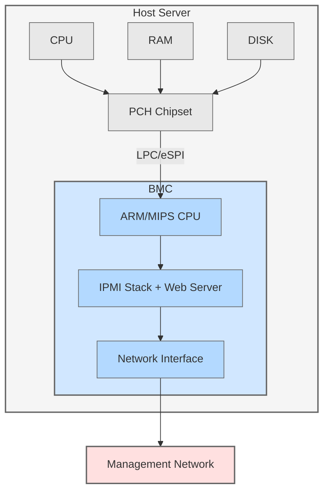

# IPMI Deep Reference - Production Field Guide

## Purpose and Scope

This is a **production-grade technical reference** for IPMI (Intelligent Platform Management Interface), written for:

- Senior Linux system administrators
- Infrastructure engineers managing bare-metal servers
- Homelab builders working with enterprise refurbished hardware
- DevOps/SRE teams automating datacenter operations

**This is NOT:**
- Marketing material
- Beginner-level overview
- Vendor sales pitch

**This IS:**
- Deep technical reference
- Operational troubleshooting guide
- Security analysis
- Vendor comparison with real quirks and bugs
- Production battle-tested knowledge

---

## 1. IPMI History and Purpose

### Why IPMI Exists

**The Problem (1990s):**
- Servers in remote datacenters crashed → required physical access
- No way to power cycle remotely
- BIOS errors invisible without monitor/keyboard
- Hardware monitoring required OS agent → if OS crashed, no monitoring

**The Solution:**
- **Out-of-band management** - management network separate from production
- **BMC (Baseboard Management Controller)** - dedicated chip that runs independently
- **IPMI** - standardized protocol for remote management

**IPMI = Industry Standard** (Intel, HP, Dell, NEC, 1998)

### Out-of-Band vs In-Band Management

| Type | Example | Dependency |
|------|---------|------------|
| **In-band** | SSH, SNMP agent, Nagios | Requires working OS |
| **Out-of-band** | IPMI/BMC, iLO, iDRAC | Works even if OS is crashed |

**Critical difference:** Out-of-band works when:
- OS kernel panicked
- Boot loader failed
- Network driver crashed
- Disk is unmounted
- SSH daemon is down

### IPMI Versions

| Version | Year | Key Features |
|---------|------|--------------|
| **IPMI 1.0** | 1998 | Basic sensor reading, event logging |
| **IPMI 1.5** | 2001 | Serial-over-LAN (SOL) |
| **IPMI 2.0** | 2004 | RMCP+, encryption, stronger auth |

**Most modern servers:** IPMI 2.0 (some legacy gear still runs 1.5)

**Important:** IPMI 2.0 is the last version. Industry moving to **Redfish** (2014+).

---

## 2. BMC Architecture

### What is a BMC?

**Baseboard Management Controller** = dedicated microcontroller on the motherboard with:

- **Own CPU** (ARM, MIPS, or x86) - typically low-power
- **Own RAM** (16-128 MB)
- **Own firmware** (embedded Linux or RTOS)
- **Own network interface** (dedicated or shared with host)
- **Independent power** (standby power rail)

**Key insight:** BMC is a **computer within a computer**.

### BMC Block Diagram



### BMC Interfaces to Host

**Physical interfaces:**

1. **KCS (Keyboard Controller Style)** - legacy, I/O ports
2. **SMIC (Server Management Interface Chip)** - rare
3. **BT (Block Transfer)** - improved performance
4. **SSIF (SMBus System Interface)** - I2C/SMBus
5. **IPMB (Intelligent Platform Management Bus)** - backplane communication

**In Linux kernel:**

```bash
# Check loaded IPMI modules
lsmod | grep ipmi

# Typical output:
ipmi_devintf      20480 0
ipmi_si        65536 0
ipmi_msghandler    53248 2 ipmi_devintf,ipmi_si
```

**Interface detection in dmesg:**

```bash
dmesg | grep -i ipmi

# Example output:
ipmi_si: IPMI System Interface driver
ipmi_si dmi-ipmi-si.0: Found new BMC (man_id: 0x0002a2, prod_id: 0x0100)
ipmi_si dmi-ipmi-si.0: IPMI kcs interface initialized
```

### What BMC Can Do (Independently of Host OS)

| Function | Description | Use Case |
|----------|-------------|----------|
| **Sensor reading** | Temperature, voltage, fan RPM | Hardware monitoring |
| **Event logging** | SEL (System Event Log) | Post-mortem crash analysis |
| **Power control** | Power on, off, reset, cycle | Remote reboot |
| **Boot device** | Set next boot to PXE/disk/CDROM | OS installation |
| **Serial console** | SOL (Serial-over-LAN) | Console access without KVM |
| **Virtual media** | Mount ISO over network | Remote OS install |
| **KVM-over-IP** | Remote keyboard/video/mouse | BIOS configuration |
| **Watchdog timer** | Auto-reset if OS hangs | High availability |

---

## 3. IPMI Communication Protocols

### RMCP and RMCP+

**RMCP = Remote Management Control Protocol**

- **UDP port 623** (both source and destination)
- **No encryption in RMCP v1** (IPMI 1.5)
- **RMCP+ (IPMI 2.0)** adds:
- Session authentication
- Encryption (AES-128-CBC)
- Integrity checking (HMAC-SHA1/SHA256)

### LAN vs LANPlus

**ipmitool interface selection:**

```bash
# Old IPMI 1.5 (unencrypted)
ipmitool -I lan -H <bmc-ip> -U <user> -P <pass> <command>

# Modern IPMI 2.0 (encrypted)
ipmitool -I lanplus -H <bmc-ip> -U <user> -P <pass> <command>
```

**Always use `-I lanplus` for production:**
- Encrypted session
- Stronger authentication
- Prevents password sniffing

### Cipher Suites

**IPMI 2.0 supports multiple cipher suites:**

| Cipher | Auth | Integrity | Encryption | Security |
|--------|------|-----------|------------|----------|
| **0** | None | None | None | UNSAFE |
| **1** | HMAC-SHA1 | None | None | Weak |
| **2** | HMAC-SHA1 | HMAC-SHA1-96 | None | Weak |
| **3** | HMAC-SHA1 | HMAC-SHA1-96 | AES-CBC-128 | Good |
| **6** | HMAC-MD5 | None | None | Weak |
| **17** | HMAC-SHA256 | HMAC-SHA256-128 | AES-CBC-128 | Best |

**Check supported ciphers:**

```bash
ipmitool -I lanplus -H <bmc-ip> -U <user> -P <pass> channel getciphers ipmi
```

**Force specific cipher:**

```bash
ipmitool -I lanplus -C 3 -H <bmc-ip> -U <user> -P <pass> chassis status
```

**Security recommendation:**
- Disable cipher 0 in BMC settings
- Prefer cipher 3 or 17
- Many Supermicro BMCs default to cipher 3

### IPMI Packet Flow

**Simplified packet flow for `ipmitool chassis status`:**

```
Client ──┬──> RMCP+ Session Setup (UDP 623)
│  ├─ Get Channel Auth Capabilities
│  ├─ Open Session Request
│  ├─ RAKP Message 1 (challenge)
│  └─ RAKP Message 3 (proof)
│
├──> IPMI Command (encrypted payload)
│  └─ NetFn: Chassis, Cmd: Get Chassis Status
│
└──< IPMI Response (encrypted payload)
└─ Power state, boot flags, etc.
```

**Wireshark capture:**

```bash
tcpdump -i any -n port 623 -w ipmi.pcap
```

**Analyze with Wireshark:**
- Filter: `rmcp`
- Look for RAKP authentication exchange
- Note: encrypted payload not readable (good!)

### Raw IPMI Commands

**Every ipmitool command is a wrapper around raw IPMI:**

**Example: Chassis power status**

```bash
# High-level command
ipmitool chassis power status

# Equivalent raw command
ipmitool raw 0x00 0x01
# NetFn: 0x00 (Chassis), Cmd: 0x01 (Get Chassis Status)
```

**Raw command structure:**

```
ipmitool raw <netfn> <cmd> [data bytes...]
```

**Common NetFn values:**

| NetFn | Function | Examples |
|-------|----------|----------|
| 0x00 | Chassis | Power control, boot options |
| 0x04 | Sensor/Event | Read sensors, SEL |
| 0x06 | Application | BMC info, watchdog |
| 0x0a | Storage | SDR, SEL, FRU |
| 0x0c | Transport | LAN config, SOL |

**Use cases for raw commands:**
- Vendor-specific OEM commands
- Automation scripts
- Debugging BMC behavior
- When ipmitool doesn't expose a feature

---

## 4. ipmitool Deep Reference

### Installation

```bash
# RHEL/Rocky/Alma
sudo dnf install ipmitool

# Debian/Ubuntu
sudo apt install ipmitool

# Verify
ipmitool -V
# version 1.8.19 (typical)
```

### Local vs Remote Usage

**Local (on the server itself):**

```bash
# Uses kernel driver (/dev/ipmi0)
ipmitool sensor list
ipmitool sdr list
ipmitool sel list
```

**Remote (over network):**

```bash
# Basic syntax
ipmitool -I lanplus -H <IP> -U <user> -P <password> <command>

# Example
ipmitool -I lanplus -H 192.168.1.100 -U ADMIN -P ADMIN chassis status
```

**Password from file (avoid shell history):**

```bash
# Create password file
echo -n 'ADMIN' > ~/.ipmi_pass
chmod 600 ~/.ipmi_pass

# Use with -f
ipmitool -I lanplus -H 192.168.1.100 -U ADMIN -f ~/.ipmi_pass chassis status
```

**Environment variable:**

```bash
export IPMI_PASSWORD='ADMIN'
ipmitool -I lanplus -H 192.168.1.100 -U ADMIN -E chassis status
```

### Sensor Commands

**List all sensors:**

```bash
ipmitool sensor list
```

**Example output:**

```
CPU Temp     | 42.000   | degrees C | ok  | na    | 5.000   | 10.000  | 85.000  | 90.000  | na
Chassis Intru  | 0x0    | discrete  | 0x0000| na    | na    | na    | na    | na    | na
FAN1       | 3200.000  | RPM    | ok  | 300.000  | 500.000  | 700.000  | 25300.000 | 25400.000 | 25500.000
PS1 Status    | 0x1    | discrete  | 0x0100| na    | na    | na    | na    | na    | na
```

**Columns explained:**

| Column | Meaning |
|--------|---------|
| Name | Sensor identifier |
| Value | Current reading |
| Units | C, RPM, Volts, Watts, etc. |
| Status | ok, nc (non-critical), cr (critical), nr (non-recoverable) |
| Thresholds | Lower/Upper limits for alarms |

**Query specific sensor:**

```bash
ipmitool sensor get "CPU Temp"
```

**Output:**

```
Locating sensor record...
Sensor ID       : CPU Temp (0x1)
Entity ID       : 3.1 (Processor)
Sensor Type (Analog) : Temperature
Sensor Reading    : 42 (+/- 0) degrees C
Status        : ok
Lower Non-Recoverable : na
Lower Critical    : 5.000
Lower Non-Critical  : 10.000
Upper Non-Critical  : 85.000
Upper Critical    : 90.000
Upper Non-Recoverable : na
```

**Monitoring script example:**

```bash
#!/bin/bash
# Monitor CPU temperature

TEMP=$(ipmitool sensor get "CPU Temp" | grep "Sensor Reading" | awk '{print $4}')

if (( $(echo "$TEMP > 80" | bc -l) )); then
echo "CRITICAL: CPU temp ${TEMP}C" | mail -s "Temperature Alert" ops@example.com
fi
```

### SDR (Sensor Data Repository)

**SDR = metadata about sensors**

**List all SDR entries:**

```bash
ipmitool sdr list
```

**SDR types:**

```bash
ipmitool sdr type list
```

**Example types:**
- Temperature
- Voltage
- Fan
- Power Supply
- Intrusion
- Watchdog

**Dump SDR to file (for analysis):**

```bash
ipmitool sdr dump sdr.bin
```

**Restore SDR (after BMC firmware update):**

```bash
ipmitool sdr restore sdr.bin
```

### SEL (System Event Log)

**List all events:**

```bash
ipmitool sel list
```

**Example output:**

```
1 | 01/23/2026 | 14:32:15 | Power Unit #0x01 | Power off/down | Asserted
2 | 01/23/2026 | 14:35:42 | Power Unit #0x01 | Power on | Asserted
3 | 01/24/2026 | 03:12:09 | Fan #0x02 | Lower Critical going low | Asserted
4 | 01/24/2026 | 03:12:11 | Fan #0x02 | Lower Critical going low | Deasserted
```

**SEL entries explained:**

| Field | Example | Meaning |
|-------|---------|---------|
| ID | 1 | Sequential entry number |
| Date/Time | 01/23/2026 14:32:15 | Event timestamp (BMC clock) |
| Sensor | Power Unit #0x01 | Which component |
| Event | Power off/down | What happened |
| State | Asserted/Deasserted | Current state |

**Critical insight:** SEL persists across reboots. Check it after crashes.

**Get SEL info:**

```bash
ipmitool sel info
```

**Output:**

```
SEL Information
Version     : 1.5 (v1.5, v2 compliant)
Entries     : 234
Free Space    : 3840 bytes
Percent Used   : 38%
Last Add Time  : 01/24/2026 14:23:45
Last Del Time  : Not Available
Overflow     : false
Supported Cmds  : 'Delete' 'Reserve'
```

**Save SEL to file before clearing:**

```bash
ipmitool sel save sel.txt
```

**Clear SEL (dangerous in production!):**

```bash
ipmitool sel clear
```

**WARNING:** Never clear SEL without saving it first. Critical failure evidence may be lost.

**Watch SEL in real-time:**

```bash
watch -n 5 'ipmitool sel list | tail -20'
```

**Filter SEL by date:**

```bash
ipmitool sel list | grep "01/24/2026"
```

### Chassis Commands

**Power status:**

```bash
ipmitool chassis power status
# Output: Chassis Power is on
```

**Power control:**

```bash
ipmitool chassis power on    # Power on
ipmitool chassis power off    # Hard power off (dangerous!)
ipmitool chassis power cycle   # Power off then on
ipmitool chassis power reset   # Hard reset (like pressing reset button)
ipmitool chassis power soft   # ACPI shutdown (graceful)
```

** Best practice:**
- Always use `power soft` for graceful shutdown
- Only use `power off` if OS is unresponsive
- `power cycle` = force off + on (data loss risk)

**Boot device override (one-time boot):**

```bash
ipmitool chassis bootdev pxe    # Boot from network
ipmitool chassis bootdev disk    # Boot from disk
ipmitool chassis bootdev cdrom   # Boot from virtual CD
ipmitool chassis bootdev bios    # Boot to BIOS setup
ipmitool chassis bootdev none    # Clear boot override
```

**Check boot parameters:**

```bash
ipmitool chassis bootparam get 5
```

**Output:**

```
Boot parameter version: 1
Boot parameter 5 is valid/unlocked
Boot parameter data: 8014000000
Boot Flags :
- Boot Flag Valid
- Options apply to only next boot
- BIOS PC Compatible (legacy) boot
- Boot Device Selector : Force Boot from default Hard-Drive
- Console Redirection control : System Default
- BIOS verbosity : Console redirection occurs per BIOS configuration
- BIOS Mux Control Override : BIOS uses recommended setting
```

**Chassis identify (blink server LEDs):**

```bash
ipmitool chassis identify 30  # Blink for 30 seconds
ipmitool chassis identify 0   # Stop blinking
```

**Useful in datacenters to physically locate a specific server.**

**Chassis status:**

```bash
ipmitool chassis status
```

**Output:**

```
System Power     : on
Power Overload    : false
Power Interlock   : inactive
Main Power Fault   : false
Power Control Fault : false
Power Restore Policy : previous
Last Power Event   : 
Chassis Intrusion  : inactive
Front-Panel Lockout : inactive
Drive Fault     : false
Cooling/Fan Fault  : false
```

### MC (Management Controller) Info

**Get BMC details:**

```bash
ipmitool mc info
```

**Output:**

```
Device ID         : 32
Device Revision      : 1
Firmware Revision     : 1.73
IPMI Version       : 2.0
Manufacturer ID      : 10876 (Supermicro)
Manufacturer Name     : Unknown (0x2A7C)
Product ID        : 2137 (0x0859)
Product Name       : Unknown (0x859)
Device Available     : yes
Provides Device SDRs   : no
Additional Device Support :
Sensor Device
SDR Repository Device
SEL Device
FRU Inventory Device
IPMB Event Receiver
IPMB Event Generator
Chassis Device
Aux Firmware Rev Info   :
0x00
0x00
0x00
0x00
```

**Key fields:**
- **Device ID**: BMC chip identifier
- **Firmware Revision**: BMC firmware version
- **IPMI Version**: 2.0 = modern
- **Manufacturer ID**: 10876 = Supermicro, 674 = Dell, etc.

**Check if BMC is responding:**

```bash
ipmitool mc guid
# Returns BMC Global Unique ID
```

**Reset BMC (cold reset):**

```bash
ipmitool mc reset cold
```

**WARNING:** Resetting BMC will:
- Drop active SOL/KVM sessions
- Take 30-60 seconds to come back online
- May require reconfiguring network settings (some vendors)

### User Management

**List users:**

```bash
ipmitool user list 1
```

**Output:**

```
ID Name       Callin Link Auth IPMI Msg  Channel Priv Limit
1          false  false   true    Unknown (0x00)
2  ADMIN      false  false   true    ADMINISTRATOR
3  user       false  false   true    USER
4          false  false   true    Unknown (0x00)
```

**Create new user:**

```bash
ipmitool user set name 3 newuser
ipmitool user set password 3 newpassword
ipmitool user enable 3
```

**Set privilege level:**

```bash
ipmitool user priv 3 4 1
# user 3, privilege 4 (ADMINISTRATOR), channel 1 (LAN)
```

**Privilege levels:**

| Level | Name | Capabilities |
|-------|------|--------------|
| 1 | CALLBACK | Limited remote console |
| 2 | USER | Read-only sensors |
| 3 | OPERATOR | Power control, read/write |
| 4 | ADMINISTRATOR | User management, full control |
| 5 | OEM | Vendor-specific |

**Disable user:**

```bash
ipmitool user disable 3
```

### LAN Configuration

**Print LAN config:**

```bash
ipmitool lan print 1
```

**Example output:**

```
Set in Progress     : Set Complete
Auth Type Support    : MD5 PASSWORD 
Auth Type Enable    : Callback : MD5 
: User   : MD5 
: Operator : MD5 
: Admin  : MD5 
: OEM   : MD5 
IP Address Source    : Static Address
IP Address       : 192.168.1.100
Subnet Mask       : 255.255.255.0
MAC Address       : a4:bf:01:23:45:67
SNMP Community String  : public
IP Header        : TTL=0x40 Flags=0x40 Precedence=0x00 TOS=0x10
Default Gateway IP   : 192.168.1.1
802.1q VLAN ID     : Disabled
802.1q VLAN Priority  : 0
RMCP+ Cipher Suites   : 0,1,2,3,6,7,8,11,12
Cipher Suite Priv Max  : aaaaaaaaaaaaaaa
:   X=Cipher Suite Unused
:   c=CALLBACK
:   u=USER
:   o=OPERATOR
:   a=ADMIN
:   O=OEM
```

**Set static IP:**

```bash
ipmitool lan set 1 ipsrc static
ipmitool lan set 1 ipaddr 192.168.1.100
ipmitool lan set 1 netmask 255.255.255.0
ipmitool lan set 1 defgw ipaddr 192.168.1.1
```

**Set to DHCP:**

```bash
ipmitool lan set 1 ipsrc dhcp
```

**Enable/disable VLAN:**

```bash
ipmitool lan set 1 vlan id 100    # Enable VLAN 100
ipmitool lan set 1 vlan id off    # Disable VLAN
```

**Set access mode:**

```bash
ipmitool lan set 1 access on     # Enable IPMI over LAN
ipmitool lan set 1 access off    # Disable (local only)
```

### SOL (Serial-over-LAN)

**Enable SOL:**

```bash
ipmitool sol set enabled true 1
ipmitool sol set force-encryption true 1
ipmitool sol set force-authentication true 1
```

**Activate SOL session:**

```bash
ipmitool -I lanplus -H <bmc-ip> -U <user> -P <pass> sol activate
```

**You'll see server's serial console output in your terminal.**

**SOL escape sequences:**

| Key Sequence | Action |
|--------------|--------|
| `~.` | Disconnect SOL |
| `~B` | Send break signal |
| `~?` | Help |

**Deactivate SOL:**

```bash
ipmitool sol deactivate
```

**Check SOL info:**

```bash
ipmitool sol info 1
```

**Output:**

```
Set in progress         : set-complete
Enabled             : true
Force Encryption        : true
Force Authentication      : true
Privilege Level         : ADMINISTRATOR
Character Accumulate Level (ms) : 100
Character Send Threshold    : 96
Retry Count           : 7
Retry Interval (ms)       : 100
Volatile Bit Rate (kbps)    : IPMI-Over-Serial-Setting
Non-Volatile Bit Rate (kbps)  : IPMI-Over-Serial-Setting
Payload Channel         : 1 (0x01)
Payload Port          : 623
```

**SOL use cases:**
- Remote console access without KVM
- Debugging boot failures
- GRUB menu interaction
- Kernel panic messages
- Lighter weight than Java/HTML5 KVM

### FRU (Field Replaceable Unit) Info

**Print FRU data:**

```bash
ipmitool fru print
```

**Output includes:**

```
FRU Device Description : Builtin FRU Device (ID 0)
Chassis Type     : Rack Mount Chassis
Chassis Part Number  : CSE-815TQC-R706WB2
Chassis Serial    : C8150AK12345678
Board Mfg Date    : Mon Jan 1 00:00:00 2024
Board Mfg       : Supermicro
Board Product     : X11SPL-F
Board Serial     : WM12345678901234
Board Part Number   : X11SPL-F
Product Manufacturer : Supermicro
Product Name     : SYS-5019C-M
Product Part Number  : SYS-5019C-M
Product Version    : 0123456789
Product Serial    : A123456789012345
```

**Useful for:**
- Asset inventory
- Warranty verification
- Serial number lookup
- Replacement part identification

---

## 5. Vendor-Specific Implementations

### Dell iDRAC

**iDRAC = Integrated Dell Remote Access Controller**

**Generations:**

| Generation | Models | Features |
|------------|--------|----------|
| iDRAC6 | PowerEdge R710, R610 | Basic IPMI, Java KVM |
| iDRAC7 | PowerEdge R720, R620 | HTML5 console |
| iDRAC8 | PowerEdge R730, R630 | Quick Sync, better performance |
| iDRAC9 | PowerEdge R740, R640 | Redfish API, modern web UI |

**Strengths:**
- Best-in-class web interface
- Excellent HTML5 KVM (no Java required)
- Lifecycle Controller (firmware management)
- Virtual console plugin works well
- iDRAC Direct (USB NIC on front panel)

**Weaknesses:**
- Enterprise license required for full features
- Virtual media slow on older generations
- IPMI over LAN sometimes disabled by default
- Some features locked behind paywall

**Common issues:**

**iDRAC not responding:**

```bash
# Check if iDRAC is alive
ping <idrac-ip>

# If alive but not responding to IPMI:
# May need to enable IPMI over LAN in web UI:
# iDRAC Settings → Network → IPMI Settings → Enable IPMI Over LAN
```

**Default credentials:**
- Username: `root`
- Password: `calvin`

** Change immediately after deployment!**

**Dell-specific ipmitool commands:**

```bash
# Get service tag
ipmitool -I lanplus -H <idrac-ip> -U root -P calvin raw 0x30 0xce 0x00 0x00 0x00

# Get asset tag
ipmitool fru print 0 | grep "Product Asset Tag"
```

### HP iLO

**iLO = Integrated Lights-Out**

**Generations:**

| Generation | Models | Features |
|------------|--------|----------|
| iLO3 | ProLiant G7 | Basic IPMI, Java KVM |
| iLO4 | ProLiant Gen8, Gen9 | HTML5 console, Intelligent Provisioning |
| iLO5 | ProLiant Gen10 | Redfish, RESTful API, security improvements |
| iLO6 | ProLiant Gen11 | Silicon Root of Trust |

**Strengths:**
- Very stable and reliable
- Advanced license adds useful features
- Integrated Remote Console (.NET IRC)
- Good documentation
- RESTful API (iLO4+)

**Weaknesses:**
- Advanced features require license
- Java IRC console outdated (pre-iLO5)
- .NET IRC only works on Windows
- HTML5 console requires license on older iLO

**Default credentials:**
- Username: `Administrator`
- Password: Printed on pull-out tag on server

**License types:**

| License | Features |
|---------|----------|
| **iLO Standard** | Basic remote management, KVM |
| **iLO Advanced** | Virtual media, remote console, directory integration |
| **iLO Scale-Out** | For entry-level servers (limited features) |

**HP-specific ipmitool commands:**

```bash
# Get server serial number
ipmitool -I lanplus -H <ilo-ip> -U Administrator -P <pass> fru print 1

# Get iLO firmware version
ipmitool -I lanplus -H <ilo-ip> -U Administrator -P <pass> mc info | grep "Firmware Revision"
```

**Common issue: iLO license expired**

**Symptoms:**
- Virtual media not working
- HTML5 console unavailable
- "Feature not available" errors

**Check license:**

Log into web UI → Information → Licensing

**Workaround (for testing):**
- Use iLO's built-in IPMI/SOL instead of web console
- Generate trial license key from HPE

### Supermicro IPMI

**Supermicro = Most common in homelab and refurb servers**

**BMC firmware versions:**

| Version | Era | Notes |
|---------|-----|-------|
| **1.x** | Legacy | Old Java KVM, buggy |
| **2.x** | 2015-2020 | Improved, but still quirky |
| **3.x** | 2020+ | HTML5 console, better security |

**Strengths:**
- No licensing - all features included
- Works out of box
- Good IPMI compatibility
- Cheap refurb servers on eBay

**Weaknesses:**
- Web UI is clunky and dated
- Security vulnerabilities in old firmware
- Java KVM requires old Java versions
- Fan control aggressive (noisy in homelab)
- Firmware updates can be tricky

**Default credentials:**
- Username: `ADMIN`
- Password: `ADMIN`

**WARNING: Many Supermicro servers on eBay still have default password!**

**Common issues:**

**1. Fan noise in homelab**

Supermicro BMC defaults to server-grade fan curves (loud!).

**Check fan mode:**

```bash
ipmitool -I lanplus -H <bmc-ip> -U ADMIN -P ADMIN sensor get FAN1
```

**Set fan mode to optimal (quieter):**

```bash
# Raw command to set fan mode (board-specific!)
# This is for X10/X11 boards - YMMV
ipmitool -I lanplus -H <bmc-ip> -U ADMIN -P ADMIN raw 0x30 0x45 0x01 0x00
```

**Set fan speed manually (percentage):**

```bash
# Enable manual fan control
ipmitool -I lanplus -H <bmc-ip> -U ADMIN -P ADMIN raw 0x30 0x45 0x01 0x01

# Set FAN1 to 30%
ipmitool -I lanplus -H <bmc-ip> -U ADMIN -P ADMIN raw 0x30 0x70 0x66 0x01 0x00 0x1E
```

** Be careful:** Setting fans too low can overheat server!

**2. Java KVM not working**

Supermicro's Java KVM requires:
- Old Java version (Java 8 or earlier)
- Security exceptions added to Java Control Panel
- `.jnlp` file association configured

**Workaround:**
- Upgrade BMC firmware to 3.x for HTML5 console
- Or use SOL instead: `ipmitool sol activate`

**3. Firmware update issues**

**Supermicro firmware flashing:**

```bash
# Download firmware from Supermicro support site
# File: BMC_X11AST2500_*.zip

# Extract and upload via web UI
# Or use ipmitool (if supported):
ipmitool -I lanplus -H <bmc-ip> -U ADMIN -P ADMIN hpm upgrade firmware.bin
```

** Warning:** Some Supermicro boards have dual firmware images (active/backup). Flashing wrong one can brick BMC.

**Safe update procedure:**
1. Backup current config (`ipmitool lan print`, user list, etc.)
2. Upload firmware via web UI (safest method)
3. Wait for automatic reboot (can take 5+ minutes)
4. Verify new version: `ipmitool mc info`

### Lenovo XClarity

**XClarity Controller (XCC) = Lenovo's BMC**

**Found in:**
- ThinkSystem servers (SR630, SR650, etc.)
- ThinkServer (older models)

**Strengths:**
- Modern HTML5 console
- No licensing for core features
- Good documentation
- RESTful API

**Weaknesses:**
- Less common in refurb market
- Some advanced features require XClarity Administrator (separate software)

**Default credentials:**
- Username: `USERID`
- Password: `PASSW0RD` (zero, not O)

### Fujitsu iRMC

**iRMC = Integrated Remote Management Controller**

**Found in:**
- PRIMERGY servers

**Strengths:**
- Good IPMI compatibility
- HTML5 console available
- AVR (Advanced Video Redirection) console

**Weaknesses:**
- Less common outside Europe/Japan
- Advanced Video Redirection requires license

**Default credentials:**
- Username: `admin`
- Password: `admin`

### OpenBMC

**OpenBMC = Open-source BMC firmware project**

**Used by:**
- Facebook (Open Compute Project)
- IBM POWER9 servers
- Some ASRock Rack boards
- Experimental Supermicro support

**Key differences from traditional IPMI:**
- Based on Linux (Yocto Project)
- Uses D-Bus for internal communication
- RESTful API (not just IPMI)
- Redfish support built-in
- SSH access to BMC for debugging

**Access OpenBMC console:**

```bash
ssh root@<bmc-ip>
# Default password varies by vendor
```

**Check OpenBMC services:**

```bash
systemctl status phosphor-ipmi-net.service
systemctl status bmcweb.service # Web server
```

**OpenBMC advantages:**
- Open source (auditable code)
- Modern architecture
- Active development
- Community support

**OpenBMC disadvantages:**
- Newer, less mature
- Vendor support varies
- May lack some legacy IPMI features

---

## 6. Linux Kernel Integration

### IPMI Kernel Modules

**Core modules:**

```bash
lsmod | grep ipmi
```

**Expected output:**

```
ipmi_devintf      20480 0
ipmi_si        65536 0
ipmi_msghandler    53248 2 ipmi_devintf,ipmi_si
```

**Module descriptions:**

| Module | Purpose |
|--------|---------|
| `ipmi_msghandler` | Core IPMI message handler |
| `ipmi_si` | System Interface driver (KCS/BT/SMIC) |
| `ipmi_devintf` | Character device interface (/dev/ipmi0) |
| `ipmi_ssif` | SMBus System Interface (I2C) |
| `ipmi_watchdog` | Watchdog timer driver |
| `ipmi_poweroff` | ACPI power-off support |

**Load modules manually:**

```bash
sudo modprobe ipmi_msghandler
sudo modprobe ipmi_si
sudo modprobe ipmi_devintf
```

**Check module parameters:**

```bash
modinfo ipmi_si
```

**Force module parameters:**

```bash
# Force KCS interface at I/O port 0xca2
sudo modprobe ipmi_si type=kcs ports=0xca2
```

### Device Files

**IPMI device:**

```bash
ls -l /dev/ipmi*
# Output: crw-rw---- 1 root root 246, 0 May 25 10:00 /dev/ipmi0
```

**Test device access:**

```bash
sudo ipmitool -I open sdr list
# Uses /dev/ipmi0 directly (no network)
```

**Permissions:**

```bash
# Add user to ipmi group (if exists)
sudo usermod -aG ipmi $USER

# Or use udev rule:
# /etc/udev/rules.d/99-ipmi.rules
KERNEL=="ipmi*", MODE="0660", GROUP="ipmi"
```

### dmesg Output Analysis

**Check IPMI initialization:**

```bash
dmesg | grep -i ipmi
```

**Successful initialization:**

```
[  2.123456] ipmi_si: IPMI System Interface driver
[  2.234567] ipmi_si dmi-ipmi-si.0: Found new BMC (man_id: 0x002a7c, prod_id: 0x0859, dev_id: 0x20)
[  2.345678] ipmi_si dmi-ipmi-si.0: IPMI kcs interface initialized
[  3.456789] ipmi_devintf: IPMI System Interface driver loaded
```

**Key info from dmesg:**
- **man_id**: Manufacturer ID (0x002a7c = Supermicro)
- **prod_id**: Product ID
- **dev_id**: Device ID
- **Interface type**: kcs, bt, smic

**Troubleshooting failed initialization:**

```bash
dmesg | grep -i ipmi | grep -i error
```

**Common errors:**

```
ipmi_si: Unable to find any System Interface
```

**Causes:**
- No BMC present (desktop motherboard)
- BMC disabled in BIOS
- Wrong kernel driver
- Hardware failure

**Fix:**
- Check BIOS settings for BMC
- Try different interface type
- Verify hardware compatibility

### systemd Integration

**IPMI systemd services:**

```bash
systemctl list-units | grep ipmi
```

**Example services:**

| Service | Purpose |
|---------|---------|
| `ipmievd.service` | IPMI event daemon |
| `ipmi.service` | Load IPMI modules |

**Enable IPMI event daemon:**

```bash
sudo systemctl enable --now ipmievd.service
```

**ipmievd logs SEL events to syslog:**

```bash
journalctl -u ipmievd.service -f
```

**Example log:**

```
May 25 10:15:23 server ipmievd[1234]: Fan #0x02 Lower Critical going low Asserted
May 25 10:15:30 server ipmievd[1234]: Fan #0x02 Lower Critical going low Deasserted
```

### Watchdog Integration

**IPMI watchdog = hardware timer that resets server if OS hangs**

**Load watchdog module:**

```bash
sudo modprobe ipmi_watchdog
```

**Check watchdog device:**

```bash
ls -l /dev/watchdog*
# Output: crw------- 1 root root 10, 130 May 25 10:00 /dev/watchdog
```

**Test watchdog (WARNING: will reboot server!):**

```bash
sudo sh -c 'echo "V" > /dev/watchdog'
# Server should reboot in ~60 seconds if watchdog configured
```

**systemd watchdog integration:**

```ini
# /etc/systemd/system/myservice.service
[Service]
WatchdogSec=30
```

**Service must call `sd_notify(WATCHDOG=1)` periodically or systemd kills it.**

---

## 7. Sensors and Hardware Monitoring

### Sensor Types

**IPMI defines multiple sensor types:**

| Type | Measures | Example |
|------|----------|---------|
| **Temperature** | Degrees C | CPU Temp, Ambient Temp |
| **Voltage** | Volts | 12V, 5V, 3.3V rails |
| **Fan** | RPM | Chassis fans, CPU fans |
| **Power Supply** | Watts, Status | PSU1 Status, Power Consumption |
| **Current** | Amps | 12V Current |
| **Discrete** | On/Off states | Intrusion, Presence |

**Threshold sensors:**

Each threshold sensor has up to 6 limits:

```
Upper Non-Recoverable (UNR) ─┐
Upper Critical (UC)     ├─ Alarm levels
Upper Non-Critical (UNC)   ─┘

[Normal Range]      

Lower Non-Critical (LNC)   ─┐
Lower Critical (LC)     ├─ Alarm levels
Lower Non-Recoverable (LNR) ─┘
```

**Example: CPU Temperature**

```
UNR: 95°C (server shuts down)
UC: 90°C (critical alarm)
UNC: 85°C (warning)

[Normal: 40-80°C]

LNC: 10°C (warning - too cold?)
LC: 5°C  (critical)
LNR: 0°C  (non-recoverable)
```

### Reading Sensors

**All sensors:**

```bash
ipmitool sensor list
```

**Filter by type:**

```bash
ipmitool sensor list | grep -i temp
ipmitool sensor list | grep -i fan
ipmitool sensor list | grep -i volt
```

**Specific sensor:**

```bash
ipmitool sensor get "CPU Temp"
```

**Sensor status values:**

| Status | Meaning |
|--------|---------|
| `ok` | Within normal range |
| `nc` | Non-critical (warning) |
| `cr` | Critical alarm |
| `nr` | Non-recoverable |
| `na` | Not available |

### Voltage Monitoring

**Typical voltage rails in servers:**

| Rail | Nominal | Tolerance | Purpose |
|------|---------|-----------|---------|
| 12V | 12.0V | ±5% (11.4-12.6V) | Drives, fans, PCIe |
| 5V | 5.0V | ±5% (4.75-5.25V) | USB, legacy |
| 3.3V | 3.3V | ±5% (3.135-3.465V) | Chipset, memory |
| VCore | 1.2V (varies) | ±3% | CPU core voltage |

**Check voltage sensors:**

```bash
ipmitool sensor list | grep -i volt
```

**Example output:**

```
12V       | 12.096   | Volts   | ok  | 10.170  | 10.773  | 11.375  | 12.825  | 13.428  | 14.030
5V        | 5.040   | Volts   | ok  | 4.246   | 4.493   | 4.740   | 5.460   | 5.707   | 5.954
3.3V       | 3.312   | Volts   | ok  | 2.789   | 2.951   | 3.113   | 3.587   | 3.749   | 3.911
Vcore      | 1.224   | Volts   | ok  | 0.816   | 0.864   | 0.912   | 1.392   | 1.440   | 1.488
```

**Out-of-range voltage:**

```
12V       | 11.200   | Volts   | nc  | ...
```

**`nc` = non-critical warning. Potential PSU degradation or high load.**

### Fan Monitoring

**List fan sensors:**

```bash
ipmitool sensor list | grep -i fan
```

**Example:**

```
FAN1       | 3200.000  | RPM    | ok  | 300.000  | 500.000  | 700.000  | 25300.000 | 25400.000 | 25500.000
FAN2       | 3100.000  | RPM    | ok  | 300.000  | 500.000  | 700.000  | 25300.000 | 25400.000 | 25500.000
FAN3       | na     | RPM    | na  | na    | na    | na    | na    | na    | na
```

**FAN3 shows `na` = fan not installed (empty bay)**

**Fan failure example:**

```
FAN1       | na     | RPM    | nr  | 300.000  | 500.000  | 700.000  | 25300.000 | 25400.000 | 25500.000
```

**`nr` = non-recoverable. Fan stopped. Check SEL:**

```bash
ipmitool sel list | grep -i fan
```

**Output:**

```
12 | 05/25/2026 | 14:23:15 | Fan #0x01 | Lower Critical going low | Asserted
```

**Action:**
- Replace failed fan immediately
- Server may throttle CPU or shut down to prevent overheating

### Power Supply Monitoring

**PSU sensors:**

```bash
ipmitool sensor list | grep -i "PS"
```

**Example:**

```
PS1 Status    | 0x1    | discrete  | 0x0100| na    | na    | na    | na    | na    | na
PS2 Status    | 0x1    | discrete  | 0x0100| na    | na    | na    | na    | na    | na
PS1 Power    | 120.000  | Watts   | ok  | na    | na    | na    | na    | na    | na
```

**Discrete sensor values:**

```
0x0100 = Presence detected, power good
0x0000 = Not present or failed
```

**PSU failure:**

```
PS1 Status    | 0x0    | discrete  | 0x0000| na    | na    | na    | na    | na    | na
```

**Check SEL:**

```bash
ipmitool sel list | grep -i "PS1"
```

**Output:**

```
15 | 05/25/2026 | 15:45:12 | Power Supply #0x01 | Failure detected | Asserted
```

**Redundant PSU configuration:**

Servers with dual PSUs can operate with one failed (N+1 redundancy).

**Check power redundancy:**

```bash
ipmitool chassis status | grep -i power
```

**Output:**

```
System Power     : on
Power Overload    : false
Power Interlock   : inactive
Main Power Fault   : false
Power Control Fault : false
Power Restore Policy : previous
```

### Threshold Events

**Thresholds trigger SEL events:**

**Example: Temperature crossing threshold**

**Normal state:**

```
CPU Temp     | 75.000   | degrees C | ok  | na    | 5.000   | 10.000  | 85.000  | 90.000  | na
```

**Temperature rises to 86°C:**

```
CPU Temp     | 86.000   | degrees C | nc  | na    | 5.000   | 10.000  | 85.000  | 90.000  | na
```

**SEL event logged:**

```
16 | 05/25/2026 | 16:12:34 | CPU Temp #0x01 | Upper Non-Critical going high | Asserted
```

**Temperature returns to 82°C:**

```
17 | 05/25/2026 | 16:15:45 | CPU Temp #0x01 | Upper Non-Critical going high | Deasserted
```

**Monitoring script:**

```bash
#!/bin/bash
# Alert on critical threshold crossings

ipmitool sel list | grep "Asserted" | grep -i "critical" | while read line; do
echo "ALERT: $line" | mail -s "IPMI Critical Event" ops@example.com
done
```

---

## 8. SEL — System Event Log

### SEL Structure

**SEL = circular buffer in BMC nonvolatile memory**

**Typical size:** 512 entries to 4096 entries

**When full:** Oldest entries overwritten (unless overflow protection enabled)

### Event Types

**Standard event types:**

| Type | Example |
|------|---------|
| **Threshold** | Temperature crossed upper critical |
| **Discrete** | Power button pressed, Fan failure |
| **OEM** | Vendor-specific events |

**Event severity:**

| Severity | Meaning |
|----------|---------|
| **Informational** | Normal state changes |
| **Warning** | Non-critical threshold |
| **Critical** | Component failure |
| **Non-recoverable** | System shutdown imminent |

### Reading SEL

**List all events:**

```bash
ipmitool sel list
```

**Last 20 events:**

```bash
ipmitool sel list | tail -20
```

**Filter by date:**

```bash
ipmitool sel list | grep "05/25/2026"
```

**Filter by keyword:**

```bash
ipmitool sel list | grep -i "fan"
ipmitool sel list | grep -i "power"
ipmitool sel list | grep -i "critical"
```

**SEL in verbose format:**

```bash
ipmitool sel elist
```

**Example verbose output:**

```
1 | 05/25/2026 | 10:15:23.000000 | Power Unit #0x01 | Power off/down | Asserted
Event Data: (00 00 00)
2 | 05/25/2026 | 10:18:45.123456 | Power Unit #0x01 | Power on | Asserted
Event Data: (00 00 00)
```

### Timestamp Issues

**BMC clock vs system clock:**

BMC has independent real-time clock (RTC).

**Check BMC time:**

```bash
ipmitool sel time get
```

**Output:**

```
05/25/2026 16:45:30
```

**Set BMC time:**

```bash
ipmitool sel time set "05/25/2026 16:50:00"
```

**Sync BMC time with system:**

```bash
ipmitool sel time set "$(date '+%m/%d/%Y %H:%M:%S')"
```

**Timezone caveat:**

BMC typically stores time in **local time** (not UTC).

**Best practice:** Set BMC to UTC to match system logs.

### Saving SEL

**Save to file:**

```bash
ipmitool sel save sel_backup_$(date +%Y%m%d).txt
```

**Output format:**

```
1,05/25/2026,10:15:23,Power Unit #0x01,Power off/down,Asserted
2,05/25/2026,10:18:45,Power Unit #0x01,Power on,Asserted
...
```

**Parse with scripts:**

```bash
#!/bin/bash
# Extract power events

grep "Power off" sel_backup_*.txt | while IFS=',' read id date time sensor event state; do
echo "Server powered off on $date at $time"
done
```

### Clearing SEL

**WARNING: Clearing SEL is destructive!**

**Always save before clearing:**

```bash
ipmitool sel save sel_backup.txt
ipmitool sel clear
```

**Confirm clear:**

```bash
Clear SEL? (y/n): y
Clearing SEL. Please allow a few seconds to erase.
```

**Verify:**

```bash
ipmitool sel list
# Should show only "Log area reset" event
```

**When to clear SEL:**

- After resolving persistent errors
- Before hardware replacement
- During preventive maintenance
- **Never** during active troubleshooting!

### SEL Corruption

**Symptoms:**

```bash
ipmitool sel list
# Output: SEL Get Overflow Error
```

**Or:**

```
Error reading SEL: 0xCA
```

**Causes:**
- BMC firmware bug
- Power loss during SEL write
- NVRAM corruption

**Recovery:**

```bash
# Try to clear SEL
ipmitool sel clear

# If that fails, reset BMC
ipmitool mc reset cold

# After BMC reboot, try again
ipmitool sel clear
```

**If still failing:**
- Update BMC firmware
- Contact vendor support
- May require BMC NVRAM reset (vendor-specific procedure)

### OEM Events

**Vendor-specific event format:**

```bash
ipmitool sel list
```

**Example OEM event:**

```
23 | 05/25/2026 | 12:34:56 | OEM record c0 | 000000 | 12 34 56 78 9a bc de
```

**OEM events are vendor-specific:**

- Supermicro: BIOS POST codes
- Dell: RAID events
- HP: IML (Integrated Management Log) entries

**Decoding OEM events:**

Requires vendor documentation. Example:

**Supermicro OEM:**

```
OEM record c0 | 000000 | 02 00 00 00 00 00 00
```

**Byte 0 = 0x02 = BIOS POST checkpoint**

**Dell OEM:**

```
OEM record df | 000157 | 01 02 03 04 05 06 07
```

**Look up in Dell IPMI User Guide (event code 0x157).**

---

## 9. Remote Console Technologies

### Serial-over-LAN (SOL)

**Pros:**
- Lightweight (text-only)
- Works over slow connections
- No Java/browser required
- Can capture output to file

**Cons:**
- No BIOS access (usually)
- Requires serial console configured in OS
- No mouse/keyboard for GUI

**Configure Linux for SOL:**

**1. Enable serial console in GRUB:**

```bash
# Edit /etc/default/grub
GRUB_CMDLINE_LINUX="console=tty0 console=ttyS1,115200n8"
GRUB_TERMINAL="serial console"
GRUB_SERIAL_COMMAND="serial --unit=1 --speed=115200"

# Rebuild GRUB config
sudo grub2-mkconfig -o /boot/grub2/grub.cfg # RHEL/Rocky
sudo update-grub # Debian/Ubuntu
```

**2. Enable getty on serial port:**

```bash
sudo systemctl enable --now serial-getty@ttyS1.service
```

**3. Test SOL connection:**

```bash
ipmitool -I lanplus -H <bmc-ip> -U <user> -P <pass> sol activate
```

**You should see boot messages and login prompt.**

**SOL escape sequences:**

| Sequence | Action |
|----------|--------|
| `~.` | Disconnect |
| `~B` | Send BREAK |
| `~~` | Type literal `~` |

**Disconnect:**

```
~.
[terminated ipmitool]
```

**Capture SOL output:**

```bash
ipmitool -I lanplus -H <bmc-ip> -U <user> -P <pass> sol activate | tee sol_output.log
```

### Java KVM

**Legacy remote console technology**

**Pros:**
- Full keyboard/video/mouse
- Access BIOS
- Mount virtual media

**Cons:**
- Requires old Java (security risk)
- Java applets deprecated
- JNLP file handling broken in modern browsers
- Performance poor over WAN

**Accessing Java KVM:**

1. Log into BMC web UI
2. Click "Remote Console" or "KVM Console"
3. Download `.jnlp` file
4. Open with Java Web Start

**Troubleshooting Java KVM:**

**Error: "Application blocked by security settings"**

**Fix:**

```bash
# Open Java Control Panel
# Security tab → Edit Site List
# Add: https://<bmc-ip>

# Or lower security level (not recommended)
```

**Error: "Unable to launch application"**

**Fix:**

```bash
# Edit ~/.java/deployment/deployment.properties
deployment.security.level=MEDIUM
deployment.insecure.jres=ALLOW
```

**Modern alternative:** Upgrade BMC firmware for HTML5 console.

### HTML5 Console

**Modern replacement for Java KVM**

**Pros:**
- No plugins required
- Works in any modern browser
- Good performance
- Full keyboard/video/mouse
- Virtual media support

**Cons:**
- Requires recent BMC firmware
- May require license (Dell, HP)
- Not available on old servers

**Accessing HTML5 console:**

1. Log into BMC web UI
2. Click "Launch Console" or "HTML5 Console"
3. Opens in new browser tab

**Features:**
- Keyboard macros (Ctrl+Alt+Del)
- Virtual media (ISO mount)
- Power control
- Screenshot capture

**Browser compatibility:**
- Chrome/Edge: Best
- Firefox: Good
- Safari: Limited

### Virtual Media

**Mount ISO over network for OS installation**

**Vendors:**

| Vendor | Feature Name | License Required? |
|--------|--------------|-------------------|
| Dell | Virtual Media | No (iDRAC7+) |
| HP | Virtual Media | Yes (iLO Advanced) |
| Supermicro | Virtual Media | No |

**Accessing virtual media:**

**Via web UI:**
1. Open console (Java or HTML5)
2. Virtual Media → CD/DVD → Browse
3. Select ISO file from local machine
4. Connect

**Via ipmitool (limited support):**

Some vendors support virtual media via IPMI, but most require proprietary tools.

**Example: Supermicro**

```bash
# Mount ISO (if supported by BMC firmware)
# Syntax varies by vendor - check documentation
```

**Most reliable:** Use web UI for virtual media.

### BIOS Remote Access

**Access BIOS settings remotely:**

1. Power on server
2. Open KVM console (Java or HTML5)
3. Watch POST screen
4. Press BIOS key (F2, Del, etc.)
5. Navigate BIOS as if physically present

**Boot to BIOS on next boot:**

```bash
ipmitool chassis bootdev bios
ipmitool chassis power reset
```

**Server boots to BIOS setup screen (visible in KVM).**

---

## 10. Firmware and Updates

### BMC Firmware Update Process

**General procedure (varies by vendor):**

1. Download firmware from vendor support site
2. Upload to BMC via web UI
3. Initiate update
4. BMC reboots (30-120 seconds)
5. Verify new version

** Risks:**
- Failed update can brick BMC
- Network settings may reset (vendor-specific)
- Active console sessions drop

### Dual Firmware Images

**Modern BMCs have dual firmware banks:**

```
┌─────────────┬─────────────┐
│ Bank 1   │ Bank 2   │
│ (Active)  │ (Backup)  │
│ v1.73   │ v1.65   │
└─────────────┴─────────────┘
```

**Update process:**

1. New firmware writes to inactive bank (Bank 2)
2. BMC validates new image
3. If valid, BMC switches to Bank 2 on next boot
4. If boot fails, BMC auto-reverts to Bank 1

**Check active bank:**

```bash
ipmitool mc info | grep -i "Aux Firmware"
```

**Some vendors show bank info in web UI.**

### Vendor-Specific Update Procedures

**Dell iDRAC:**

**Via web UI:**
1. Lifecycle Controller → Firmware Update
2. Upload `.exe` or `.d7` file
3. "Update and Reboot BMC"

**Via Linux:**

```bash
# Using Dell Update Package
chmod +x iDRAC-with-Lifecycle-Controller_Firmware_*.BIN
sudo ./iDRAC-with-Lifecycle-Controller_Firmware_*.BIN
```

**HP iLO:**

**Via web UI:**
1. Administration → Firmware
2. Upload `.bin` file
3. Flash and reboot

**Via iLO CLI:**

```bash
# Using hponcfg tool
sudo hponcfg -f update_ilo_firmware.xml
```

**Supermicro:**

**Via web UI:**
1. Maintenance → Firmware Update
2. Upload `.bin` file (enter image info form)
3. Upload and start upgrade

**Via ipmitool (if supported):**

```bash
ipmitool -I lanplus -H <bmc-ip> -U ADMIN -P ADMIN hpm upgrade firmware.bin
```

** Warning:** Some Supermicro boards don't support `hpm upgrade`. Use web UI instead.

### Recovery Modes

**If BMC firmware is corrupted:**

**Dell iDRAC recovery:**

1. Physical access required
2. Set jumper to recovery mode (consult manual)
3. Boot server with recovery image on USB
4. BMC auto-flashes from USB

**HP iLO recovery:**

1. Download iLO Security Override
2. Generate challenge code from server
3. Submit to HP for response code
4. Enter response code to unlock BMC

**Supermicro recovery:**

Many Supermicro boards have **BMC recovery jumper**:

1. Power off server
2. Move jumper to "Recovery" position
3. Power on
4. BMC boots to recovery mode (limited web UI)
5. Upload firmware via recovery interface
6. Move jumper back
7. Power cycle

**Consult motherboard manual for exact jumper location.**

### Secure Boot and BMC

**Modern servers support Secure Boot for BMC firmware:**

- Cryptographic signature verification
- Prevents unsigned firmware from loading
- Protects against malicious firmware

**Check Secure Boot status (vendor-specific):**

Some vendors expose this in `ipmitool mc info` or web UI.

**Secure Boot for host OS vs BMC firmware:**

These are **separate**:
- UEFI Secure Boot (host OS bootloader)
- BMC Secure Boot (BMC firmware)

**Updating signed firmware:**

Firmware must be signed by vendor's private key. User cannot create custom BMC firmware for Secure Boot-enabled systems.

### Rollback Procedures

**If new firmware causes issues:**

**Automatic rollback (dual image systems):**

If BMC fails to boot after update, it auto-reverts to previous firmware.

**Manual rollback (if web UI accessible):**

Some vendors allow selecting which firmware bank to boot:

1. Log into web UI
2. Firmware → Select Bank 1 (or "Previous Version")
3. Reboot BMC

**If BMC is unresponsive:**

Use recovery mode (see above).

---

## 11. Security

### Cipher 0 Vulnerability

**Cipher Suite 0 = No authentication, no encryption**

**Attack:**

```bash
# Attacker can connect without password
ipmitool -I lanplus -C 0 -H <target-ip> -U "" -P "" user list 1
```

**If cipher 0 is enabled, attacker gets user list!**

**More dangerous commands:**

```bash
# Change password
ipmitool -I lanplus -C 0 -H <target-ip> -U "" -P "" user set password 2 hacked

# Power off server
ipmitool -I lanplus -C 0 -H <target-ip> -U "" -P "" chassis power off
```

**Mitigation:**

**Disable cipher 0:**

Most vendors allow disabling weak ciphers.

**Supermicro (via web UI):**

1. Configuration → Users → Cipher Suite Privilege Levels
2. Uncheck "0 (None)"

**Dell iDRAC (via web UI):**

1. iDRAC Settings → Network → IPMI Settings
2. Disable "Unauthenticated IPMI over LAN"

**HP iLO:**

Cipher 0 disabled by default on iLO4+.

**Test if cipher 0 is enabled:**

```bash
ipmitool -I lanplus -C 0 -H <your-bmc-ip> -U "" -P "" mc info
```

**If this works, cipher 0 is enabled (FIX IT!).**

### Default Credentials

**Common default passwords:**

| Vendor | Username | Password |
|--------|----------|----------|
| Dell | root | calvin |
| HP | Administrator | Printed on server |
| Supermicro | ADMIN | ADMIN |
| Lenovo | USERID | PASSW0RD |

** CRITICAL:** Change default passwords immediately!

**Shodan/BinaryEdge scanning:**

Attackers actively scan for IPMI with default credentials.

**Real-world breach example:**

2013: Supermicro servers with default ADMIN/ADMIN credentials were compromised, used for DDoS attacks.

### VLAN Isolation

**Management network should be isolated:**

```
Production Network (VLAN 10)
↓
[Servers]
↓
Management Network (VLAN 100)
↓
[BMC interfaces]
```

**BMC on separate VLAN:**

**Configure BMC VLAN:**

```bash
ipmitool lan set 1 vlan id 100
```

**Firewall rules (management network):**

```bash
# Allow only from admin workstations
iptables -A INPUT -p udp --dport 623 -s 192.168.100.0/24 -j ACCEPT
iptables -A INPUT -p udp --dport 623 -j DROP

# Allow HTTPS to BMC
iptables -A INPUT -p tcp --dport 443 -s 192.168.100.0/24 -j ACCEPT
iptables -A INPUT -p tcp --dport 443 -j DROP
```

**ACL on switch:**

```
# Cisco example
ip access-list extended BMC-ACCESS
permit udp 192.168.100.0 0.0.0.255 any eq 623
deny udp any any eq 623
```

### Remote Exploitation

**IPMI vulnerabilities (historical):**

| CVE | Year | Impact |
|-----|------|--------|
| CVE-2013-4786 | 2013 | Authentication bypass (cipher 0) |
| CVE-2014-8272 | 2014 | Buffer overflow in SOL |
| CVE-2019-6260 | 2019 | Supermicro BMC credential leak |

**Metasploit modules:**

```bash
# Search for IPMI modules
msfconsole
msf6 > search ipmi
```

**Example modules:**

```
auxiliary/scanner/ipmi/ipmi_version    # Fingerprint IPMI
auxiliary/scanner/ipmi/ipmi_dumphashes   # Dump password hashes
auxiliary/scanner/ipmi/ipmi_cipher_zero  # Test cipher 0
```

**IPMI password hash dumping:**

```bash
# Using ipmipwner
ipmipwner --host <target-ip>
```

**Attackers can:**
- Dump IPMI user password hashes
- Crack hashes offline (weak passwords)
- Gain full BMC control

**Defense:**

- Strong passwords (20+ characters, random)
- Disable IPMI over LAN if not needed
- Network isolation
- Firmware updates

### Supply Chain Risks

**Supermicro 2018 controversy:**

Bloomberg report claimed malicious chips in Supermicro motherboards.

**Status:** Never confirmed, strongly denied by Supermicro/Apple/Amazon.

**Real supply chain risks:**

- **Counterfeit components:** Fake network cards, RAM
- **Firmware backdoors:** Nation-state level (speculative)
- **Preowned server risks:** Previous owner's BMC config

**Mitigations:**

- Buy from reputable vendors
- Verify firmware checksums (if provided)
- Factory reset BMC on new/used hardware
- Update firmware immediately
- Audit BMC config for unknown users

### BMC Rootkit Possibilities

**BMC runs independent OS (Linux/RTOS):**

Attacker with BMC access could:

- **Install persistent rootkit** in BMC firmware
- **Keylog** via KVM console
- **Inject packets** into host network (shared NIC)
- **Modify boot process** via virtual media
- **Survive OS reinstall** (BMC independent of host)

**Detection is very difficult:**

- BMC firmware is opaque
- No OS-level visibility into BMC
- Firmware updates may not erase rootkit (if attacker modifies update process)

**Defense:**

- **Physical security** (prevent unauthorized BMC access)
- **Strong authentication** (long random passwords)
- **Network isolation** (VLAN, firewall)
- **Monitor BMC access logs** (if available)
- **Regular firmware updates** from vendor

**Advanced defense (paranoid):**

- **Disable BMC entirely** if not needed
- **Hardware write-protect jumper** (some boards)
- **Out-of-band BMC monitoring** (separate network sniffer)

---

## 12. Automation

### Ansible Integration

**Ansible IPMI modules:**

| Module | Purpose |
|--------|---------|
| `ipmi_boot` | Set boot device |
| `ipmi_power` | Power control |
| `community.general.ipmi_power` | Enhanced power module |

**Example playbook:**

```yaml
---
- name: Power cycle servers
hosts: idrac_hosts
gather_facts: no
tasks:
- name: Power off server
community.general.ipmi_power:
name: "{{ inventory_hostname }}"
user: "{{ ipmi_user }}"
password: "{{ ipmi_password }}"
state: off

- name: Wait 10 seconds
pause:
seconds: 10

- name: Power on server
community.general.ipmi_power:
name: "{{ inventory_hostname }}"
user: "{{ ipmi_user }}"
password: "{{ ipmi_password }}"
state: on

- name: Set boot device to PXE
community.general.ipmi_boot:
name: "{{ inventory_hostname }}"
user: "{{ ipmi_user }}"
password: "{{ ipmi_password }}"
bootdev: network
persistent: no
```

**Inventory with IPMI credentials:**

```yaml
# inventory/hosts.yml
all:
children:
idrac_hosts:
hosts:
server01:
ansible_host: 192.168.1.101
server02:
ansible_host: 192.168.1.102
vars:
ipmi_user: ADMIN
ipmi_password: !vault |
$ANSIBLE_VAULT;1.1;AES256
...encrypted...
```

**Run playbook:**

```bash
ansible-playbook -i inventory/hosts.yml power_cycle.yml --ask-vault-pass
```

### Redfish vs IPMI

**Redfish = modern replacement for IPMI (DMTF standard)**

**Comparison:**

| Feature | IPMI | Redfish |
|---------|------|---------|
| **Protocol** | UDP 623, proprietary | HTTPS (RESTful API) |
| **Data format** | Binary | JSON |
| **Authentication** | RMCP+, cipher suites | OAuth, Basic Auth, Session |
| **Extensibility** | Limited | Schema-based, versioned |
| **Automation** | ipmitool CLI | curl, Ansible, Python |
| **Modern features** | No | Firmware update, tasks, eventing |

**Redfish example (curl):**

```bash
# Get system info
curl -k -u admin:password https://<bmc-ip>/redfish/v1/Systems/1

# Power on
curl -k -u admin:password -X POST https://<bmc-ip>/redfish/v1/Systems/1/Actions/ComputerSystem.Reset \
-H "Content-Type: application/json" \
-d '{"ResetType": "On"}'
```

**Ansible Redfish modules:**

```yaml
- name: Power on server via Redfish
community.general.redfish_command:
category: Systems
command: PowerOn
baseuri: "{{ bmc_ip }}"
username: "{{ bmc_user }}"
password: "{{ bmc_password }}"
```

**Vendor Redfish support:**

| Vendor | Redfish Support | IPMI Future |
|--------|-----------------|-------------|
| Dell | iDRAC9+ | IPMI still supported |
| HP | iLO5+ | IPMI deprecated |
| Supermicro | BMC 3.x+ | IPMI still primary |
| Lenovo | XCC | IPMI still supported |

**Should you migrate to Redfish?**

- **New deployments:** Use Redfish if available
- **Existing infrastructure:** IPMI still works, no rush
- **Automation:** Redfish is easier (JSON > binary)

### ipmitool Scripting

**Example: Monitor all servers**

```bash
#!/bin/bash
# check_all_servers.sh

SERVERS="192.168.1.101 192.168.1.102 192.168.1.103"
USER="ADMIN"
PASS="password"

for ip in $SERVERS; do
echo "=== Checking $ip ==="

# Power status
STATUS=$(ipmitool -I lanplus -H $ip -U $USER -P $PASS chassis power status 2>/dev/null)
echo "Power: $STATUS"

# Temperature
TEMP=$(ipmitool -I lanplus -H $ip -U $USER -P $PASS sensor get "CPU Temp" 2>/dev/null | grep "Sensor Reading" | awk '{print $4}')
echo "CPU Temp: ${TEMP}°C"

# Errors in SEL
ERRORS=$(ipmitool -I lanplus -H $ip -U $USER -P $PASS sel list 2>/dev/null | grep -ic "critical")
echo "Critical events in SEL: $ERRORS"

echo ""
done
```

**Run:**

```bash
chmod +x check_all_servers.sh
./check_all_servers.sh
```

**Output:**

```
=== Checking 192.168.1.101 ===
Power: Chassis Power is on
CPU Temp: 45°C
Critical events in SEL: 0

=== Checking 192.168.1.102 ===
Power: Chassis Power is on
CPU Temp: 52°C
Critical events in SEL: 2
```

**Advanced: Parse SEL into JSON**

```bash
#!/bin/bash
# sel_to_json.sh

ipmitool sel list | while IFS='|' read id datetime sensor event state; do
cat <<EOF
{
"id": "$(echo $id | xargs)",
"datetime": "$(echo $datetime | xargs)",
"sensor": "$(echo $sensor | xargs)",
"event": "$(echo $event | xargs)",
"state": "$(echo $state | xargs)"
},
EOF
done
```

**Output:**

```json
{
"id": "1",
"datetime": "05/25/2026 10:15:23",
"sensor": "Power Unit #0x01",
"event": "Power off/down",
"state": "Asserted"
},
...
```

### Monitoring Integration

**Prometheus IPMI Exporter:**

**Install:**

```bash
go install github.com/prometheus-community/ipmi_exporter@latest
```

**Config:**

```yaml
# /etc/ipmi_exporter.yml
modules:
default:
user: "ADMIN"
pass: "password"
driver: "LAN_2_0"
timeout: 10000
```

**Run:**

```bash
ipmi_exporter --config.file=/etc/ipmi_exporter.yml
```

**Prometheus scrape config:**

```yaml
scrape_configs:
- job_name: 'ipmi'
static_configs:
- targets:
- 192.168.1.101
- 192.168.1.102
metrics_path: /ipmi
params:
module: [default]
relabel_configs:
- source_labels: [__address__]
target_label: __param_target
- source_labels: [__param_target]
target_label: instance
- target_label: __address__
replacement: localhost:9290 # ipmi_exporter address
```

**Metrics exposed:**

```
ipmi_temperature_celsius{sensor="CPU Temp"} 45.0
ipmi_fan_speed_rpm{sensor="FAN1"} 3200
ipmi_power_watts{sensor="PS1 Power"} 120
ipmi_up{} 1
```

**Grafana dashboard:** Import #15423 (IPMI Exporter)

**Nagios/Zabbix:**

**Nagios plugin:**

```bash
#!/bin/bash
# check_ipmi_sensor.sh

HOST=$1
USER=$2
PASS=$3
SENSOR=$4

VALUE=$(ipmitool -I lanplus -H $HOST -U $USER -P $PASS sensor get "$SENSOR" | grep "Sensor Reading" | awk '{print $4}')

if [ -z "$VALUE" ]; then
echo "UNKNOWN - Could not read sensor"
exit 3
fi

echo "OK - $SENSOR: $VALUE | value=$VALUE"
exit 0
```

**Nagios config:**

```cfg
define command {
command_name  check_ipmi_sensor
command_line  /usr/lib/nagios/plugins/check_ipmi_sensor.sh $HOSTADDRESS$ $ARG1$ $ARG2$ "$ARG3$"
}

define service {
use           generic-service
host_name        server01
service_description   IPMI CPU Temp
check_command      check_ipmi_sensor!ADMIN!password!CPU Temp
}
```

---

## 13. Modern Alternatives

### Why Move Beyond IPMI?

**IPMI limitations:**

- Old protocol (1998 design)
- Security issues (cipher 0, weak auth)
- Binary protocol (hard to debug)
- Limited extensibility
- Vendor extensions inconsistent

**Modern needs:**

- RESTful APIs (JSON, HTTPS)
- Better security (OAuth, TLS)
- Standardized schemas
- Event streaming
- Firmware updates via API

### Redfish API

**Redfish = DMTF standard (2014+)**

**Architecture:**

```
Client (curl, Ansible, Python)
↓ HTTPS
REST API (JSON)
↓
Redfish Service (BMC)
↓
Hardware (sensors, power, etc.)
```

**Redfish URIs:**

```
/redfish/v1/             # Service root
/redfish/v1/Systems/1         # System (server)
/redfish/v1/Systems/1/Bios      # BIOS settings
/redfish/v1/Chassis/1         # Chassis
/redfish/v1/Managers/1        # BMC
/redfish/v1/UpdateService       # Firmware updates
/redfish/v1/EventService       # Event subscriptions
```

**Example: Get system info**

```bash
curl -k -u admin:password https://<bmc-ip>/redfish/v1/Systems/1 | jq .
```

**Output:**

```json
{
"@odata.type": "#ComputerSystem.v1_5_0.ComputerSystem",
"Id": "1",
"Name": "System",
"SystemType": "Physical",
"Manufacturer": "Supermicro",
"Model": "SYS-5019C-M",
"SerialNumber": "A123456789012345",
"PowerState": "On",
"BiosVersion": "1.2",
"ProcessorSummary": {
"Count": 1,
"Model": "Intel Xeon E-2288G"
},
"MemorySummary": {
"TotalSystemMemoryGiB": 64
}
}
```

**Power control:**

```bash
# Power on
curl -k -u admin:password -X POST https://<bmc-ip>/redfish/v1/Systems/1/Actions/ComputerSystem.Reset \
-H "Content-Type: application/json" \
-d '{"ResetType": "On"}'

# Power off (graceful)
curl -k -u admin:password -X POST https://<bmc-ip>/redfish/v1/Systems/1/Actions/ComputerSystem.Reset \
-H "Content-Type: application/json" \
-d '{"ResetType": "GracefulShutdown"}'
```

**Redfish advantages over IPMI:**

- HTTPS (standard protocol, firewall-friendly)
- JSON (human-readable, easy to parse)
- RESTful (standard HTTP methods)
- Extensible (vendor OEM extensions cleanly separated)
- Event subscriptions (push vs poll)

### OpenBMC Project

**OpenBMC = Open-source BMC firmware**

**Architecture:**

```
┌─────────────────────────────────┐
│   Web UI (Phosphor WebUI)   │
├─────────────────────────────────┤
│   REST API (bmcweb)      │
├─────────────────────────────────┤
│   D-Bus (Phosphor D-Bus)   │
├─────────────────────────────────┤
│ Sensors | IPMI | Power | FRU  │
├─────────────────────────────────┤
│   Linux (Yocto/Poky)     │
└─────────────────────────────────┘
```

**Key components:**

| Component | Purpose |
|-----------|---------|
| **bmcweb** | HTTPS server (Redfish API) |
| **phosphor-ipmi** | IPMI compatibility |
| **phosphor-dbus** | D-Bus message bus |
| **phosphor-hwmon** | Hardware monitoring |

**SSH to OpenBMC:**

```bash
ssh root@<bmc-ip>
# Password varies by vendor
```

**Check running services:**

```bash
systemctl status phosphor-ipmi-net.service
systemctl status bmcweb.service
```

**View D-Bus objects:**

```bash
busctl tree xyz.openbmc_project.State.Host
```

**OpenBMC advantages:**

- Open source (auditable)
- Active community
- Modern architecture
- Regular updates

**OpenBMC disadvantages:**

- Vendor support varies
- Less mature than proprietary BMCs
- Feature parity not always 100%

### Vendor REST APIs

**Dell iDRAC REST API:**

```bash
# Get system inventory
curl -k -u root:calvin https://<idrac-ip>/redfish/v1/Systems/System.Embedded.1
```

**HP iLO RESTful API:**

```bash
# Get thermal info
curl -k -u Administrator:<pass> https://<ilo-ip>/redfish/v1/Chassis/1/Thermal
```

**Supermicro Redfish API:**

```bash
# Get power state
curl -k -u ADMIN:ADMIN https://<bmc-ip>/redfish/v1/Systems/1 | jq .PowerState
```

### Industry Direction

**IPMI future:**

- **Deprecated** by DMTF (2015)
- **Still widely used** (legacy support)
- **New servers** include both IPMI and Redfish
- **Long tail** (IPMI won't disappear for years)

**Redfish adoption:**

- All major vendors support (Dell, HP, Lenovo, Supermicro)
- DMTF actively develops spec
- Better tooling (Python redfish library, Ansible modules)

**Timeline:**

- **2014-2020:** Transition period (both IPMI and Redfish)
- **2020-2026:** Redfish primary, IPMI secondary
- **2026+:** IPMI legacy-only

**Recommendation:**

- **New deployments:** Use Redfish APIs
- **Existing infrastructure:** IPMI fine, migrate opportunistically
- **Homelab:** IPMI perfectly adequate

---

## 14. Homelab and Refurb Servers

### Cheap Enterprise Servers

**Best value refurb servers (eBay/ServerMonkey):**

| Model | CPU | Era | IPMI | Price (used) | Notes |
|-------|-----|-----|------|--------------|-------|
| Dell R720 | Xeon E5-2600v2 | 2013 | iDRAC7 | $150-250 | Great value, loud |
| HP DL380 G8 | Xeon E5-2600v2 | 2013 | iLO4 | $150-250 | Reliable, license needed |
| Supermicro X10 | Xeon E5-2600v3 | 2015 | IPMI 2.0 | $200-350 | Quieter, flexible |
| Dell R730 | Xeon E5-2600v4 | 2016 | iDRAC8 | $300-500 | Modern features |

**What to check before buying:**

- iDRAC/iLO/IPMI accessible (test before buying)
- Default credentials work (if not, may be locked)
- No BIOS password (or get password from seller)
- Fans included (some sold without)
- PSU included (single PSU cheaper)
- Drive trays included (often sold separately)

### Used Dell/Supermicro/HP Considerations

**Dell R720/R730:**

**Pros:**
- Excellent iDRAC web UI
- Good community support (r/homelab)
- Easy to find parts

**Cons:**
- Loud fans (server-grade curves)
- Power hungry (200W+ idle)
- Large form factor (2U)

**HP DL380 G8/G9:**

**Pros:**
- Very reliable
- Good iLO interface
- Quieter than Dell (subjective)

**Cons:**
- iLO Advanced license for full features ($25-50 used)
- HP-specific drive trays
- Less flexible than Supermicro

**Supermicro X10/X11:**

**Pros:**
- No licensing
- Very flexible (many motherboard variants)
- Can run quiet with custom fan curves

**Cons:**
- Web UI dated
- Java KVM issues (fixed in newer firmware)
- Firmware updates tricky

### Fan Noise Problems

**Enterprise servers = loud by default**

**Why?**
- Designed for datacenter (ambient 20-25°C)
- Redundant fans (N+1)
- Conservative thermal management

**Homelab = quieter environment needed**

**Solutions:**

**1. Dell iDRAC fan control:**

**Disable third-party PCIe fan response:**

```bash
ipmitool -I lanplus -H <idrac-ip> -U root -P calvin raw 0x30 0x30 0x01 0x00
```

**Set manual fan speed:**

```bash
# Enable manual mode
ipmitool -I lanplus -H <idrac-ip> -U root -P calvin raw 0x30 0x30 0x01 0x00

# Set fan to 20% (hex 0x14)
ipmitool -I lanplus -H <idrac-ip> -U root -P calvin raw 0x30 0x30 0x02 0xff 0x14
```

**WARNING:** Monitor temps! Low fan speed can overheat server.

**2. Supermicro fan control:**

**Set fan mode to "Optimal" (quieter):**

```bash
ipmitool -I lanplus -H <bmc-ip> -U ADMIN -P ADMIN raw 0x30 0x45 0x01 0x00
```

**Set manual fan speed:**

```bash
# Enable manual mode
ipmitool -I lanplus -H <bmc-ip> -U ADMIN -P ADMIN raw 0x30 0x45 0x01 0x01

# Set all zones to 30%
ipmitool -I lanplus -H <bmc-ip> -U ADMIN -P ADMIN raw 0x30 0x70 0x66 0x01 0x00 0x1E
```

**3. HP iLO fan control:**

HP does not officially support fan control. Third-party tools exist (hponcfg mods), but risk overheating.

**Alternative: Replace fans**

**Noctua fan mod:**
- Replace stock fans with Noctua NF-A4x20 (40mm)
- Much quieter (20dBA vs 60dBA)
- **Risk:** Lower airflow, may overheat

**Only do this if:**
- You monitor temps closely
- Server in cool environment (<20°C)
- Low CPU load (not running heavy workloads)

### Power Consumption

**Typical enterprise server idle power:**

| Model | Idle | Load |
|-------|------|------|
| Dell R720 (2x E5-2670) | 150W | 350W |
| HP DL380 G8 (2x E5-2670) | 140W | 340W |
| Supermicro X10 (1x E5-2680v3) | 80W | 200W |

**At $0.15/kWh:**

```
150W idle * 24h * 30 days = 108 kWh/month = $16/month
```

**Homelab power saving:**

- Use single CPU (not dual)
- Low-power CPUs (E5-2650L, E5-2630L)
- Disable unused PCIe slots
- Enable C-states in BIOS
- Power off when not in use (via IPMI!)

### Firmware Incompatibilities

**Old BMC firmware issues:**

**Supermicro pre-2.0 firmware:**
- Java KVM requires Java 7
- Security vulnerabilities (CVE-2019-6260)
- Update to 3.x for HTML5 console

**Dell iDRAC6:**
- Java 8 maximum
- No HTML5 console
- Consider upgrading to R720 (iDRAC7)

**HP iLO3:**
- .NET IRC console (Windows only)
- Limited Redfish support
- Update to iLO4+ for modern features

**Firmware update priority:**

1. **Security fixes** (cipher 0 disable, CVE patches)
2. **Stability** (reduce crashes/hangs)
3. **Features** (HTML5 console, Redfish)

### Old Java Console Issues

**Problem: Java KVM won't launch**

**Symptoms:**
- `.jnlp` file downloads but won't open
- "Application blocked by security settings"
- "Unsigned application" error

**Fix:**

**1. Install old Java:**

```bash
# Download Java 8 from Oracle
# (Newer Java removed Java Web Start)

# On Linux:
sudo update-alternatives --config java
# Select Java 8
```

**2. Add BMC to Java exception list:**

```bash
# Open Java Control Panel
# Security → Edit Site List → Add
https://192.168.1.100
```

**3. Lower Java security:**

```bash
# Java Control Panel → Security
# Set security level to "Medium" (High blocks unsigned apps)
```

**WARNING:** This reduces Java security. Only for trusted homelab.

**Alternative: Use HTML5 console**

Update BMC firmware to get HTML5 console (no Java needed).

**Or use SOL:**

```bash
ipmitool -I lanplus -H <bmc-ip> -U <user> -P <pass> sol activate
```

**SOL = text-only, but works reliably.**

---

## 15. Troubleshooting Cookbook

### BMC Not Responding

**Symptoms:**
- `ping <bmc-ip>` fails
- ipmitool times out
- Web UI unreachable

**Diagnosis:**

**1. Check physical connections:**

```bash
# Verify network cable connected to BMC port
# Some servers have dedicated BMC NIC, others share with eth0
```

**2. Check BMC NIC in BIOS:**

- Boot server
- Enter BIOS (F2, Del, etc.)
- Look for "BMC Network Configuration" or "IPMI Settings"
- Verify: Enabled, correct IP/netmask/gateway

**3. Verify VLAN config:**

```bash
# If BMC on VLAN, switch must pass tagged traffic
# Test with untagged VLAN first
```

**4. Check from server itself (local):**

```bash
# SSH to server
ipmitool lan print 1
# Should show BMC IP config
```

**5. Reset BMC:**

```bash
# From server (local):
sudo ipmitool mc reset cold

# Wait 60 seconds for BMC to reboot
```

**6. Check for DHCP issues:**

```bash
# If BMC set to DHCP:
# Check DHCP server logs
# May need to set static IP

sudo ipmitool lan set 1 ipsrc static
sudo ipmitool lan set 1 ipaddr 192.168.1.100
sudo ipmitool lan set 1 netmask 255.255.255.0
sudo ipmitool lan set 1 defgw ipaddr 192.168.1.1
```

**7. Factory reset BMC (last resort):**

**Dell iDRAC:**

Physical access required. Jumper on motherboard to clear NVRAM.

**Supermicro:**

Some boards have "BMC Clear CMOS" jumper.

**HP iLO:**

Security override required (call HP support).

### Sensor Read Error

**Symptoms:**

```bash
ipmitool sensor list
# Output: Error: Get Sensor Reading command failed
```

**Or:**

```
CPU Temp     | na     | degrees C | na  | na    | na    | na    | na    | na    | na
```

**Causes:**

1. **Sensor hardware failure**
2. **BMC firmware bug**
3. **SDR corruption**
4. **BMC not fully initialized**

**Diagnosis:**

**1. Check SDR repository:**

```bash
ipmitool sdr list
# If empty or errors, SDR may be corrupt
```

**2. Reload SDR:**

```bash
# Some BMCs allow SDR reload
ipmitool sdr load <sdr-file>

# Or clear SDR (BMC will regenerate on reboot)
ipmitool sdr clear
```

**3. Reset BMC:**

```bash
ipmitool mc reset cold
```

**4. Update BMC firmware:**

Old firmware may have sensor bugs. Check vendor for updates.

**5. Check BIOS settings:**

Some sensors require BIOS features enabled (e.g., "CPU Thermal Monitoring").

**6. If persistent:**

Hardware failure. Check:
- Faulty temperature sensor on motherboard
- Disconnected sensor cable
- Failed BMC chip (rare)

### SEL Corruption

**Symptoms:**

```bash
ipmitool sel list
# Output: SEL Get Overflow Error
```

**Or random garbage in SEL entries.**

**Fix:**

**1. Save current SEL (if readable):**

```bash
ipmitool sel save sel_backup.txt
```

**2. Clear SEL:**

```bash
ipmitool sel clear
```

**3. If clear fails:**

```bash
# Reset BMC
ipmitool mc reset cold

# After BMC reboot, try clear again
ipmitool sel clear
```

**4. If still failing:**

BMC firmware bug or NVRAM failure. Update firmware or contact vendor.

### Fan Full Speed

**Symptoms:**

All fans running at 100% (very loud).

**Causes:**

1. **BMC lost fan control**
2. **Thermal threshold exceeded**
3. **Third-party PCIe card inserted** (Dell issue)
4. **BMC firmware bug**

**Diagnosis:**

**1. Check temperatures:**

```bash
ipmitool sensor list | grep -i temp
```

**If temps normal (<80°C), not a thermal issue.**

**2. Check SEL for thermal events:**

```bash
ipmitool sel list | grep -i temp
```

**3. Dell-specific: Disable third-party PCIe fan response:**

```bash
ipmitool raw 0x30 0x30 0x01 0x00
```

**4. Reset BMC:**

```bash
ipmitool mc reset cold
```

**5. Supermicro: Set fan mode:**

```bash
# Standard mode
ipmitool raw 0x30 0x45 0x01 0x00

# Optimal mode (quieter)
ipmitool raw 0x30 0x45 0x01 0x02
```

**6. If persistent:**

- Update BMC firmware
- Check for failed fan (one failed fan triggers all to 100%)
- Replace BMC (rare)

### Lost LAN Config

**Symptoms:**

BMC IP disappeared after firmware update or power loss.

**Diagnosis:**

**1. Check from local system:**

```bash
sudo ipmitool lan print 1
```

**Output:**

```
IP Address Source    : None
IP Address       : 0.0.0.0
```

**2. Reconfigure network:**

```bash
sudo ipmitool lan set 1 ipsrc static
sudo ipmitool lan set 1 ipaddr 192.168.1.100
sudo ipmitool lan set 1 netmask 255.255.255.0
sudo ipmitool lan set 1 defgw ipaddr 192.168.1.1
sudo ipmitool lan set 1 access on
```

**3. Verify:**

```bash
sudo ipmitool lan print 1
```

**4. Test from remote:**

```bash
ping 192.168.1.100
ipmitool -I lanplus -H 192.168.1.100 -U ADMIN -P ADMIN mc info
```

**Prevention:**

Some vendors reset network config during firmware update. Always document BMC config before updates.

### SOL Not Working

**Symptoms:**

```bash
ipmitool sol activate
# Output: Error: Unable to establish IPMI v2 / RMCP+ session
```

**Or SOL connects but no output.**

**Diagnosis:**

**1. Check SOL enabled on BMC:**

```bash
ipmitool sol info 1
```

**Output should show:**

```
Enabled             : true
```

**If disabled:**

```bash
ipmitool sol set enabled true 1
```

**2. Check host serial console configured:**

**GRUB config:**

```bash
# /etc/default/grub
GRUB_CMDLINE_LINUX="console=tty0 console=ttyS1,115200n8"
GRUB_TERMINAL="serial console"
GRUB_SERIAL_COMMAND="serial --unit=1 --speed=115200"

sudo grub2-mkconfig -o /boot/grub2/grub.cfg
```

**Enable getty:**

```bash
sudo systemctl enable --now serial-getty@ttyS1.service
```

**3. Check SOL baud rate match:**

BMC SOL and Linux serial must use same baud rate (usually 115200).

**4. Test SOL:**

```bash
ipmitool -I lanplus -H <bmc-ip> -U <user> -P <pass> sol activate
```

**You should see boot messages and login prompt.**

**5. If still not working:**

- Check firewall (UDP 623)
- Verify cipher suite compatibility
- Update BMC firmware

### Watchdog Reset Loop

**Symptoms:**

Server boots, then resets after ~60 seconds. Repeats infinitely.

**Cause:**

IPMI watchdog timer enabled, but OS not resetting it.

**Fix:**

**1. Disable watchdog from BIOS:**

Boot to BIOS (may need to be quick!), disable "IPMI Watchdog".

**2. Disable from BMC:**

```bash
# From another system (BMC still accessible):
ipmitool -I lanplus -H <bmc-ip> -U <user> -P <pass> mc watchdog off
```

**3. From OS (if you can login fast enough):**

```bash
sudo ipmitool mc watchdog off
```

**4. If watchdog needed (HA setup):**

Configure systemd watchdog in application services:

```ini
# /etc/systemd/system/myapp.service
[Service]
WatchdogSec=30
```

**App must call `sd_notify(WATCHDOG=1)` periodically.**

### Firmware Brick

**Symptoms:**

After firmware update, BMC completely unresponsive.

**Recovery:**

**Dell iDRAC:**

1. Power off server
2. Locate "iDRAC Recovery" jumper on motherboard (consult manual)
3. Move jumper to recovery position
4. Insert USB drive with recovery firmware
5. Power on server
6. iDRAC auto-flashes from USB
7. Move jumper back

**Supermicro:**

1. Power off server
2. Locate "BMC_RECOVERY" or "IPMI_RECOVERY" jumper (consult manual)
3. Move jumper to recovery position
4. Power on server
5. BMC boots to recovery mode (limited web UI on port 80)
6. Access `http://<bmc-ip>` in browser
7. Upload firmware via recovery interface
8. Power off, move jumper back
9. Power on

**HP iLO:**

Contact HP support for security override code.

** Prevention:**

- Always verify firmware checksum before flashing
- Never power off during firmware update
- Use UPS for servers during BMC updates

---

## 16. Appendices

### ipmitool Cheat Sheet

**Power Control:**

```bash
ipmitool chassis power status  # Check power state
ipmitool chassis power on     # Power on
ipmitool chassis power off    # Hard power off
ipmitool chassis power cycle   # Force reboot
ipmitool chassis power reset   # Hard reset
ipmitool chassis power soft    # ACPI shutdown
```

**Boot Device:**

```bash
ipmitool chassis bootdev pxe   # Boot from network
ipmitool chassis bootdev disk   # Boot from disk
ipmitool chassis bootdev cdrom  # Boot from virtual CD
ipmitool chassis bootdev bios   # Boot to BIOS
ipmitool chassis bootdev none   # Clear override
```

**Sensors:**

```bash
ipmitool sensor list       # All sensors
ipmitool sensor get "CPU Temp"  # Specific sensor
ipmitool sdr list         # Sensor Data Repository
```

**SEL:**

```bash
ipmitool sel list         # List events
ipmitool sel elist        # Verbose list
ipmitool sel info         # SEL info
ipmitool sel save sel.txt     # Save to file
ipmitool sel clear        # Clear SEL (dangerous!)
```

**Users:**

```bash
ipmitool user list 1       # List users (channel 1)
ipmitool user set name 3 newuser # Set username
ipmitool user set password 3   # Set password (prompts)
ipmitool user enable 3      # Enable user
ipmitool user disable 3      # Disable user
ipmitool user priv 3 4 1     # Set privilege (4=ADMIN, channel 1)
```

**Network:**

```bash
ipmitool lan print 1       # Print LAN config (channel 1)
ipmitool lan set 1 ipsrc static  # Set static IP
ipmitool lan set 1 ipaddr <IP>  # Set IP address
ipmitool lan set 1 netmask <MASK> # Set netmask
ipmitool lan set 1 defgw ipaddr <GW> # Set gateway
ipmitool lan set 1 vlan id 100  # Enable VLAN 100
ipmitool lan set 1 vlan id off  # Disable VLAN
```

**SOL:**

```bash
ipmitool sol activate       # Activate SOL session
ipmitool sol deactivate      # Deactivate SOL
ipmitool sol info 1        # SOL info
ipmitool sol set enabled true 1  # Enable SOL
```

**BMC:**

```bash
ipmitool mc info         # BMC info
ipmitool mc guid         # BMC GUID
ipmitool mc reset cold      # Reset BMC (cold boot)
ipmitool mc reset warm      # Reset BMC (warm boot)
ipmitool mc watchdog get     # Get watchdog status
ipmitool mc watchdog off     # Disable watchdog
```

**FRU:**

```bash
ipmitool fru print        # Print all FRU data
ipmitool fru print 0       # Print FRU ID 0
```

**Chassis:**

```bash
ipmitool chassis status      # Chassis status
ipmitool chassis identify 30   # Blink LEDs for 30 sec
ipmitool chassis poh       # Power-on hours
```

**Raw Commands:**

```bash
ipmitool raw 0x00 0x01      # Get Chassis Status
ipmitool raw 0x06 0x01      # Get Device ID
```

### UDP/TCP Ports

| Port | Protocol | Service | Purpose |
|------|----------|---------|---------|
| **623** | UDP | RMCP/RMCP+ | IPMI over LAN |
| **664** | UDP | ASF-RMCP | Alert Standard Format |
| **80** | TCP | HTTP | BMC web interface (insecure) |
| **443** | TCP | HTTPS | BMC web interface (secure) |
| **5900** | TCP | VNC | KVM-over-IP console (some vendors) |
| **5120** | TCP | Custom | Virtual media (vendor-specific) |
| **22** | TCP | SSH | OpenBMC SSH access |

**Firewall rules example:**

```bash
# Allow IPMI from management network only
iptables -A INPUT -p udp --dport 623 -s 192.168.100.0/24 -j ACCEPT
iptables -A INPUT -p udp --dport 623 -j DROP

# Allow HTTPS to BMC
iptables -A INPUT -p tcp --dport 443 -s 192.168.100.0/24 -j ACCEPT
iptables -A INPUT -p tcp --dport 443 -j DROP
```

### Common Sensor States

**Threshold sensors:**

| State | Meaning |
|-------|---------|
| `ok` | Within normal range |
| `nc` | Non-critical (warning) |
| `cr` | Critical alarm |
| `nr` | Non-recoverable |
| `na` | Not available (sensor not present or failed) |

**Discrete sensors:**

| State | Meaning |
|-------|---------|
| `0x0000` | Deasserted (normal) |
| `0x0001` | Asserted (event active) |
| `0x0100` | Presence detected |
| `0x0200` | Failure detected |

**Example:**

```
PS1 Status    | 0x1    | discrete  | 0x0100| ...
```

**`0x0100` = Power supply present and functioning.**

### Vendor OEM Commands

**Supermicro:**

```bash
# Set fan mode to optimal
ipmitool raw 0x30 0x45 0x01 0x00

# Get BMC reset cause
ipmitool raw 0x30 0x03
```

**Dell:**

```bash
# Get service tag
ipmitool raw 0x30 0xce 0x00 0x00 0x00

# Disable third-party PCIe fan response
ipmitool raw 0x30 0x30 0x01 0x00
```

**HP:**

```bash
# Get IML (Integrated Management Log)
# HP uses proprietary tools (hponcfg, hplog)
# IPMI SEL is separate
```

**Note:** OEM commands are undocumented and vary by model/firmware. Use with caution.

### Recommended Open-Source Tools

| Tool | Purpose | URL |
|------|---------|-----|
| **ipmitool** | CLI IPMI client | https://github.com/ipmitool/ipmitool |
| **freeipmi** | Alternative IPMI tools | https://www.gnu.org/software/freeipmi/ |
| **ipmiutil** | Cross-platform IPMI | http://ipmiutil.sourceforge.net/ |
| **prometheus-ipmi-exporter** | Prometheus metrics | https://github.com/prometheus-community/ipmi_exporter |
| **python-ipmi** | Python library | https://github.com/kontron/python-ipmi |
| **ansible-ipmi-modules** | Ansible automation | https://docs.ansible.com/ansible/latest/collections/community/general/ |

### RFC and Standards

| Document | Title | URL |
|----------|-------|-----|
| **IPMI v2.0** | IPMI Specification | https://www.intel.com/content/www/us/en/products/docs/servers/ipmi/ipmi-second-gen-interface-spec-v2-rev1-1.html |
| **Redfish** | DMTF Redfish Specification | https://www.dmtf.org/standards/redfish |
| **ASF 2.0** | Alert Standard Format | https://www.dmtf.org/standards/asf |
| **RMCP** | Remote Management Control Protocol | IPMI v2.0 spec (section 13) |

---

## Conclusion

IPMI is a **critical out-of-band management technology** that has served the industry for over 25 years. While deprecated in favor of Redfish, it remains ubiquitous in datacenters and homelabs.

**Key takeaways:**

**Out-of-band management** works when the OS is down
**BMC = independent computer** with own CPU, firmware, network
**ipmitool** is the universal CLI tool
**Security matters** - disable cipher 0, change defaults, isolate network
**Vendor differences** - Dell, HP, Supermicro each have quirks
**Redfish is the future** - but IPMI will persist for years

**For production use:**
- Strong passwords (20+ chars)
- Network isolation (VLAN, firewall)
- Regular firmware updates
- Monitor SEL for hardware issues

**For homelabs:**
- Refurb servers offer great value
- Fan noise can be managed
- IPMI perfect for remote management
- SOL often better than Java KVM

**This document is a living reference. Bookmark it, update it, and share it with fellow sysadmins.**

---

**Last Updated:** 2026-05-25
**Author:** Field-tested production knowledge, community contributions, vendor documentation
**License:** CC BY-SA 4.0 (Share, adapt, credit)
